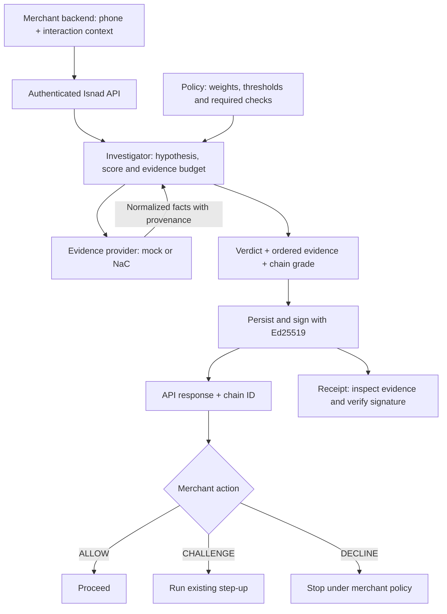
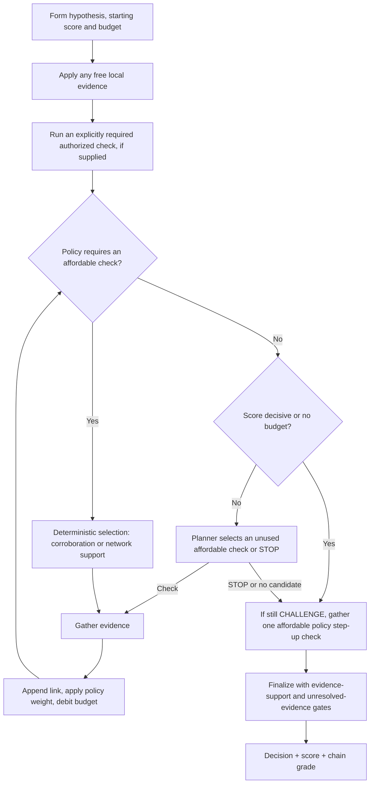
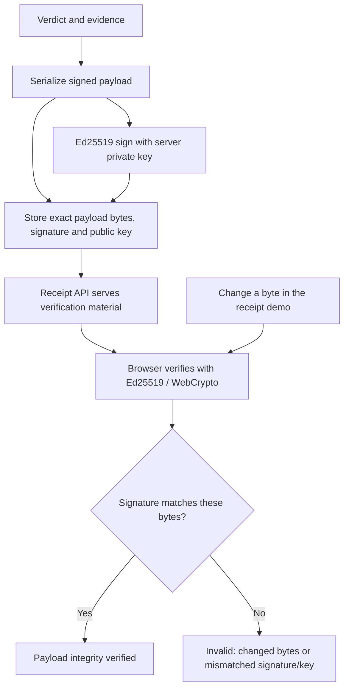
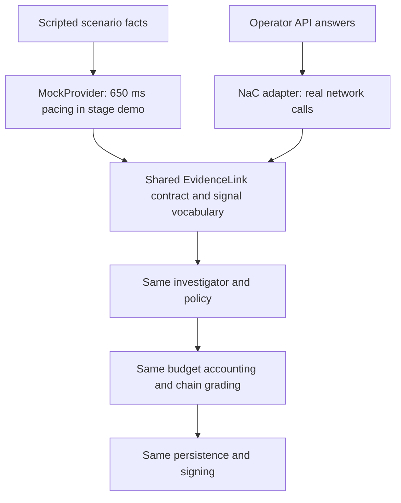
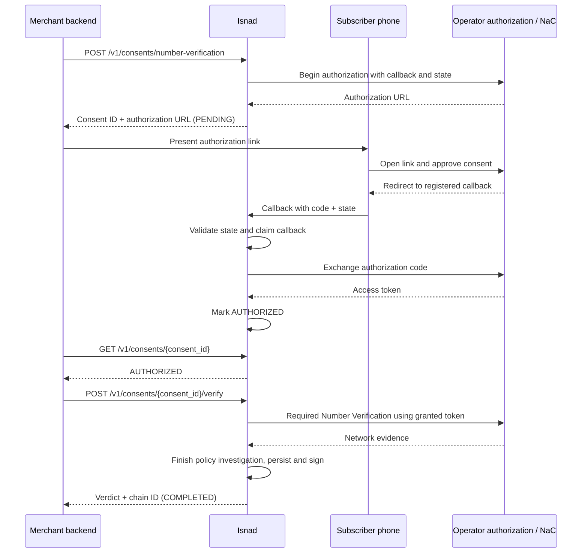

<div align="center">

# Isnad · إسناد

### Investigate the signal. Keep the evidence.

**Mobile-network evidence → a checkout decision → a verifiable receipt.**

A changed SIM should start an investigation, not end a customer relationship.

[](https://github.com/AhmadShadeed32/isnad-private/actions/workflows/ci.yml)


[The customer story](#a-sim-change-starts-the-investigation) · [How it works](#from-checkout-to-a-signed-decision) · [Run locally](#run-the-demo) · [The evidence](#what-we-can-demonstrate-today)

</div>

---

## A SIM change starts the investigation

A customer replaces her SIM and tries to pay. The network sees a change;
the merchant still needs to know whether this is an attacker or a legitimate
customer. A rule that declines every SIM change would reject this order.

**Isnad investigates before the merchant acts.** It gathers mobile-network
facts within a policy budget, then returns ALLOW, CHALLENGE or DECLINE with
a signed record of the evidence behind the decision.

In the lead demo, selected facts from the six-check investigation tell a more
useful story than the first warning alone:

| Network fact | Contribution to the investigation |
| --- | --- |
| SIM changed inside the last 240 hours | An adverse signal worth investigating. |
| No device swap in that window | Supporting evidence of handset stability. |
| Device matches the claimed location | Another fact supports the customer's account. |

The result is **CHALLENGE / DEGRADED**: the merchant runs its existing step-up
instead of automatically declining. The SIM warning remains in the evidence
chain. A second, clean checkout demonstrates **ALLOW after two supporting checks**.

These are repeatable mock scenarios. The fixtures provide the facts; the
investigation engine computes the decisions.

## From checkout to a signed decision

A merchant calls `POST /v1/verify` with the phone number and interaction context. Isnad buys evidence within a
policy budget, then returns a decision the merchant can act on and a receipt
someone else can inspect.



The **decision** tells the merchant what to do. The **chain grade** describes
the strength of the evidence behind it. They travel together; an unresolved
check remains visible even when the investigation can reach a decision.

## Spend evidence where it can change the decision

Calling every available API buys more evidence, but also consumes more budget.
The default demo runs sequentially, so it can stop buying checks once policy
permits a decision. Greedy planning is deterministic; optional LLM planning
selects from affordable actions. Required checks are enforced outside the model.



An adverse signal can trigger corroborating checks before a decline. A low
score still needs the configured supporting network evidence for an allow.
If required support cannot be obtained within budget, the final gates retain
CHALLENGE. The score is an **uncalibrated policy score**, not observed fraud odds.

## A decision someone else can inspect

Customer support and dispute review need the facts behind a result. Isnad
keeps them in an Ed25519-signed receipt that travels with the chain ID.

The receipt verifies the **exact stored payload bytes**, avoiding differences
introduced by rebuilding JSON. Its signed fields include the ordered evidence,
policy snapshot, decision and keyed subject/request commitments.



Signature validity and signer trust are separate questions: the receipt also
reports whether its public key is trusted by this Isnad instance. A valid
signature establishes integrity under that key, not the truth of an operator
answer or production fraud accuracy.

## Why the demo uses mock responses

**The operator answers are simulated. The investigation and signed decision are actually executed.**

A repeatable demo needs to show a legitimate SIM replacement, an adverse case,
and an unavailable check on demand. Mock fixtures let judges run those scenarios
without a supported test SIM, an operator consent setup, or billable network
calls. They also let us test failure cases reliably.

Both `MockProvider` and the Nokia Network as Code adapter return the **same
normalized `EvidenceLink` format**. They share the signal vocabulary and the
functions that describe network facts. Those links pass through the **same
investigator, policy, budget accounting, chain grading, and signing code**.
The mock supplies evidence; it does not supply a prewritten verdict.

The stage route adds a **650 ms pause per check** so you can follow each step.
That is presentation pacing, not a measurement of operator speed. Mock per-link
latency values are scripted too. Responses are not byte-identical to a live
call: source labels, consent metadata, timestamps and timings differ, and live
answers depend on the subscriber and operator.



Only one provider supplies a run. Live failures do not cross over to the mock
branch. Sharing the contract means equivalent facts can be evaluated by the
same policy; it does not mean simulated facts establish a real subscriber's state.

You can inspect the [mock provider](app/providers/mock.py),
[live adapter](app/providers/nac.py), [shared vocabulary](app/providers/vocabulary.py),
and [stage delay](app/api/routes_console.py). Historical adapter captures are in
[`docs/nac/`](docs/nac/). Live-mode failures remain unresolved; they never quietly
turn into fixture answers.

## From a demo phone number to live operator evidence

The Nokia Network as Code adapter and consent APIs are implemented. Live
Number Verification has an extra authorization step. The merchant backend
starts the flow; the subscriber follows the operator authorization URL on their
phone. Credentials and the exchanged access token remain server-side.



This diagram shows the successful path; denied, expired or failed consent does
not become authorization. Additional checks may follow Number Verification.
The local contract tests cover this lifecycle, but a **physical handset/operator
round trip is still to be proven**. See the [live procedure](docs/HANDSET_VALIDATION.md).

## What we can demonstrate today

| Evidence | Result | What it does—and does not—prove |
| --- | --- | --- |
| Latest verified implementation suite | **506 passing tests** | Covers policy gates, consent replay protection and receipt integrity; not production fraud accuracy. |
| Policy-generated synthetic evaluation | **58 checks vs 119** when running every check: **51% fewer** | Zero declines among ten single-adverse/unavailable customer cases; one of seven two-adverse cases still allowed. |
| Separately authored synthetic evaluation | **28 checks vs 78** full-evidence checks | Six disagreements with conservative expectations across 13 cases; early stopping can miss later evidence. |

**These are reproducible policy experiments.** The score is uncalibrated;
real merchant outcomes are still needed to establish accuracy and business impact.

[Inspect the evaluation](docs/INDEPENDENT_EVALUATION.md) · [Understand the score](docs/RISK_SCORE.md)

## Run the demo

Give the demo about 90 seconds:

1. Investigate the SIM replacement and watch each evidence check arrive.
2. Open the receipt, verify it, and change a byte to see verification fail.
3. Try the clean checkout and watch the engine stop after two checks.

The [presenter walkthrough](docs/JUDGE_WALKTHROUGH.md) provides a short script.
No operator credentials are needed. After starting the server below, open
**[Judge Mode](http://127.0.0.1:8010/judge)**. This is a local address, not a hosted demo.

```bash
python3.11 -m venv .venv311
.venv311/bin/pip install -e ".[dev]"
ISNAD_DEMO_MODE=true ISNAD_PROVIDER=mock ISNAD_PLANNER=greedy \
ISNAD_MERCHANT_API_KEYS=demo-merchant-key \
  .venv311/bin/python -m uvicorn app.main:app \
  --host 127.0.0.1 --port 8010 --no-access-log --proxy-headers
```

The [full console](http://127.0.0.1:8010/console) also demonstrates caller
verification and simulated trust-session revocation.

## One call at your existing decision point

Send `POST /v1/verify` at checkout, signup, or a sensitive account action. Act on
`decision`; keep `chain_id` for review. ALLOW proceeds, CHALLENGE invokes the
merchant's step-up, and DECLINE stops the interaction under merchant policy.

<details>
<summary><strong>Example request and response</strong></summary>

With the local demo server running:

```bash
curl http://127.0.0.1:8010/v1/verify \
  -H 'authorization: Bearer demo-merchant-key' \
  -H 'content-type: application/json' \
  -d '{"phone_number":"+962790000006","context":{"event":"checkout","payment_method":"cod","account_age_days":0,"amount":{"value":1500,"currency":"USD"}}}'
```

Selected fields from the mock/greedy replacement scenario:

```json
{
  "decision": "CHALLENGE",
  "chain_grade": "DEGRADED",
  "planner": "greedy",
  "confidence": 0.242,
  "evidence_steps": 6,
  "provider_sources": ["mock"],
  "chain_id": "chn_…"
}
```

`confidence` is the legacy API name for an **uncalibrated policy risk score**,
not a measured fraud probability. [Read the score explanation](docs/RISK_SCORE.md).
Budgets, thresholds and corroboration live in [`policy.yaml`](app/policy/policy.yaml).

The local demo uses deterministic greedy planning. Optional LLM planning chooses
among affordable checks and falls back to greedy on failures; each verdict
records which strategy actually ran. Required policy checks cannot be skipped
by the planner.

</details>

<details>
<summary><strong>Run the tests, evidence pack and evaluations</strong></summary>

```bash
.venv311/bin/python -m pytest -q
.venv311/bin/python -m ruff check app tests scripts demo
.venv311/bin/python scripts/evidence_pack.py
.venv311/bin/python scripts/false_decline_baseline.py --sweep
.venv311/bin/python scripts/independent_evaluation.py
.venv311/bin/python scripts/handset_validation.py contract
```

The evidence pack reruns five scenarios, persists each chain in an isolated
in-memory database, verifies its signature, and writes JSON and Markdown reports.
The consent contract runs locally; it is not proof of an operator handset flow.

</details>

## What comes next

The immediate milestone is **one supported phone completing consent → usable
operator evidence → a verifiable receipt**. A controlled HTTPS deployment needs
operator access, a registered callback, private credentials and persistent
signing keys. The current in-process state requires one worker and one replica.

After that proof, evaluate decisions against real merchant outcomes and calibrate
the score. Operator coverage, commercial API costs and production accuracy are
still unproven. The [compact handoff](docs/PHASE2_HANDOFF.md) records deployment
steps and app improvements; the [handset procedure](docs/HANDSET_VALIDATION.md)
separates local contract testing from live validation.
