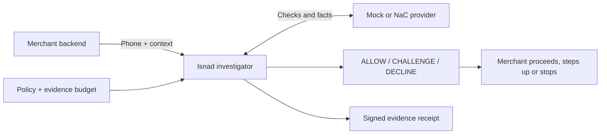
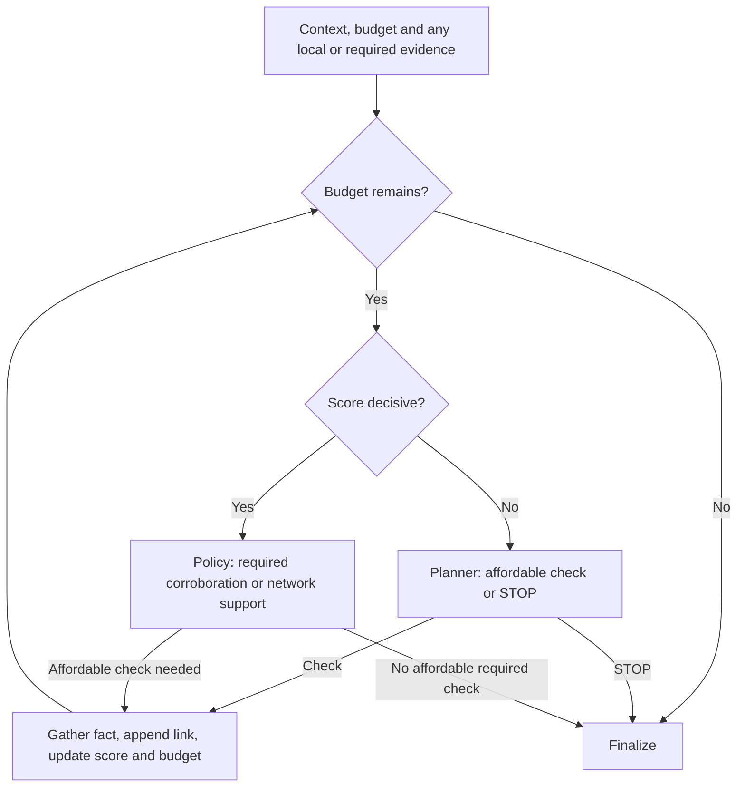
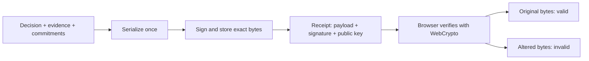
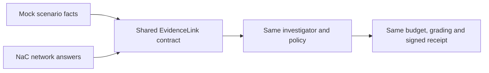
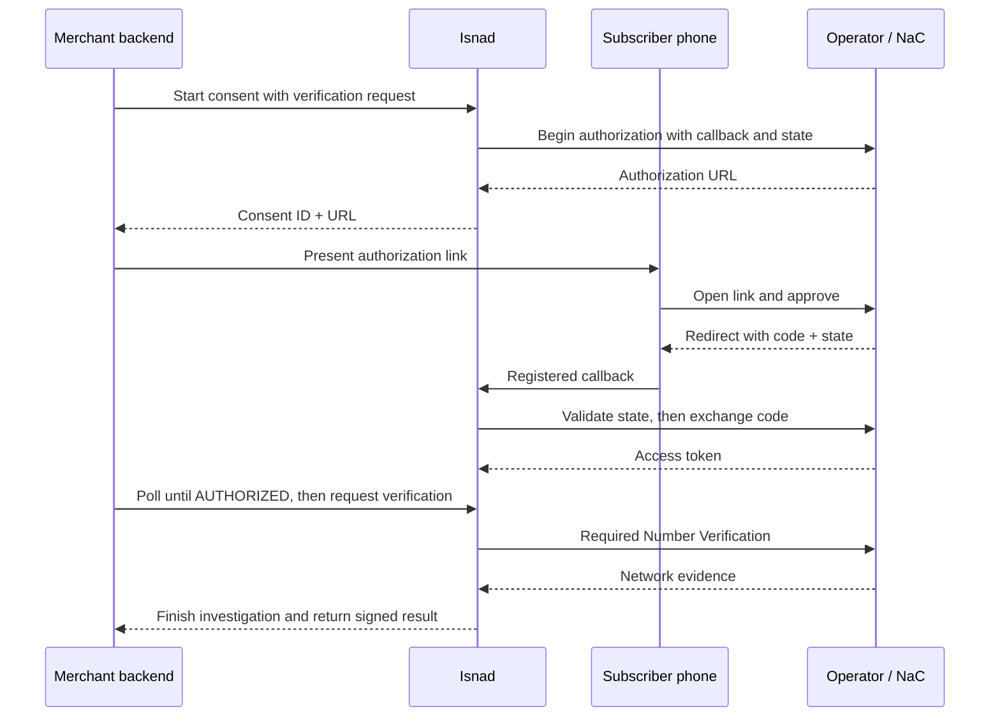

<div align="center">

# Isnad · إسناد

### A changed SIM should start an investigation.

**Isnad turns mobile-network signals into checkout decisions—with the evidence attached.**


[See the product](#one-warning-two-very-different-checkouts) · [Run the demo](#try-it-in-90-seconds) · [Follow the engine](#every-check-has-a-job) · [Inspect the results](#evidence-you-can-rerun)

</div>

---

A customer replaces her SIM, then places a cash-on-delivery order. That SIM
change could signal account takeover. It could also be exactly what it looks
like: a real customer with a replacement SIM.

**The merchant needs a decision. A network API gives it a fact. Isnad connects the two.**

At checkout, Isnad chooses which evidence to gather, applies policy within a
budget, and returns **ALLOW**, **CHALLENGE** or **DECLINE**. Every result comes
with an ordered, signed evidence trail that can be inspected after the decision.

## One warning. Two very different checkouts.


*Captured from the running local demo with simulated operator answers. The investigation
and signature check execute in the app; this is not a product mockup.*

| | SIM-replacement checkout | Clean checkout |
| --- | --- | --- |
| **What arrives** | A new account, a high-value order and a SIM change. | The same checkout context, with supporting network facts. |
| **What Isnad does** | Investigates six checks, retaining adverse and supporting signals. | Gathers two supporting checks and stops. |
| **Merchant action** | **Ask for additional verification.** | **Proceed.** |
| **API result** | `CHALLENGE` · `DEGRADED` | `ALLOW` · `ATTESTED_FULL` |

In the replacement scenario, the number matches and the handset is stable,
but the SIM warning remains. After all six checks, the policy score is **0.242**,
between the allow and decline thresholds. Isnad recommends the merchant's
existing step-up instead of automatically rejecting the order. It does not send
an OTP itself.

The clean scenario reaches **0.096 after two checks**. The same engine stops
early because policy permits an allow. Both scores are policy-derived and
uncalibrated; neither is a measured fraud probability.

## Try it in 90 seconds

Start the local server below, then open **[Judge Mode](http://127.0.0.1:8010/judge)**.
No operator credentials are needed.

1. **Investigate the SIM change.** Follow the evidence as it arrives and see why the result is CHALLENGE.
2. **Open the signed receipt.** Verify it, change a byte, and watch verification fail.
3. **Try a clean checkout.** See the investigation end after two supporting checks.

```bash
python3.11 -m venv .venv311
.venv311/bin/pip install -e ".[dev]"
ISNAD_DEMO_MODE=true ISNAD_PROVIDER=mock ISNAD_PLANNER=greedy \
ISNAD_MERCHANT_API_KEYS=demo-merchant-key \
ISNAD_VAULT_TRUSTED_PUBLIC_KEYS=4034e169495122a893d8fe6738c2b0f54655fdfb6ec3c6d0eeb938d1330e7f9f \
  .venv311/bin/python -m uvicorn app.main:app \
  --host 127.0.0.1 --port 8010 --no-access-log --proxy-headers
```

The public key above pins the bundled demo registry; the app creates a separate
local key for signing receipts. The URL is local to your machine. The [presenter walkthrough](docs/JUDGE_WALKTHROUGH.md)
provides a short script. The [full console](http://127.0.0.1:8010/console) also
covers caller verification and simulated trust-session revocation.

## One integration, an explainable action

A merchant backend sends `POST /v1/verify` with the phone number and interaction
context. Isnad turns the evidence into an action at the merchant's existing
checkout, signup or sensitive-account decision point.



The **decision** answers “what should happen next?” The **chain grade** answers
“how strong was the evidence?” Keeping both prevents an incomplete investigation
from looking like a fully supported result.

For merchants, the useful output is an action plus the facts needed to review
it. For operators, Isnad connects individual network API answers to that action
and preserves which checks contributed.

<details>
<summary><strong>Example request and response</strong></summary>

With the local demo server running:

```bash
curl http://127.0.0.1:8010/v1/verify \
  -H 'authorization: Bearer demo-merchant-key' \
  -H 'content-type: application/json' \
  -d '{"phone_number":"+962790000006","context":{"event":"checkout","payment_method":"cod","account_age_days":0,"amount":{"value":1500,"currency":"USD"}}}'
```

Selected fields from the mock/greedy replacement scenario:

```json
{
  "decision": "CHALLENGE",
  "chain_grade": "DEGRADED",
  "planner": "greedy",
  "confidence": 0.242,
  "evidence_steps": 6,
  "provider_sources": ["mock"],
  "chain_id": "chn_…"
}
```

`confidence` is the legacy API name for an **uncalibrated policy risk score**,
not a measured fraud probability. [Read the score explanation](docs/RISK_SCORE.md).
Budgets, thresholds and corroboration live in [`policy.yaml`](app/policy/policy.yaml).

</details>

## Every check has a job

The investigator starts with checkout context, a policy score and an evidence
budget. Each answer becomes an `EvidenceLink`: the check, normalized signal,
source, consent basis, covered time window and effect on the score. The next
choice uses the evidence already gathered.



Before finalizing, a CHALLENGE may use one remaining affordable evidence check
to resolve doubt. Then evidence-support and availability gates apply. This is
the default sequential path; an optional parallel mode trades more calls for
lower waiting time.

| Boundary | How the implementation enforces it |
| --- | --- |
| **A warning deserves context.** | A decisive SIM-swap decline triggers the configured device/location corroboration when affordable. |
| **An allow needs network support.** | A low starting score or local registry fact alone cannot satisfy the network-evidence minimum. Missing support retains CHALLENGE. |
| **Unavailable is not failed.** | Missing consent and provider errors remain evidence gaps. They cannot produce an unconditional allow. |
| **The planner cannot waive policy.** | Required authorized checks and policy choreography run outside model selection. |

The demo uses deterministic greedy planning. Optional LLM planning can choose
from affordable checks and falls back to greedy on failure; each verdict records
what actually ran. Policy lives in [`policy.yaml`](app/policy/policy.yaml), and
the orchestration is in [`investigator.py`](app/agent/investigator.py).
The current budget uses normalized cost units, not quoted operator prices.

## A receipt that can be challenged, too

A decision is easier to review when its explanation travels with it. Isnad
signs the **decision, ordered evidence, issuing thresholds and keyed subject/request
commitments** with Ed25519. A later policy change cannot rewrite those signed facts.



The receipt checks the stored bytes, rather than rebuilding JSON and hoping it
matches. It also reports whether this Isnad deployment trusts the signing key.
**Integrity and signer trust are separate checks; neither proves an upstream
provider's answer was true.** Each evidence link keeps its source, so a signed
mock result remains visibly mock.

[Receipt implementation](app/api/routes_receipt.py) · [Signing implementation](app/chain/vault.py)

## Simulated answers. The same investigation.

A judge should be able to reproduce a SIM replacement, a clean checkout and an
unavailable check on demand. Mock fixtures make those cases repeatable without
a supported test SIM, operator consent setup or billable API calls.



**The mock supplies evidence, not a prewritten verdict.** Both providers use the
same normalized format and signal vocabulary. The stage route adds a **650 ms
pause per check** so the trace is readable. That delay and the scripted per-link
latency values are presentation data, not measurements of operator performance.

Live responses differ in provenance, consent metadata, timestamps, timings and
subscriber-specific facts. The current replacement fixture also presets a
location-match result without a location claim in its request; a live request
must supply the claim. This fixture gap is recorded in the
[handoff](docs/PHASE2_HANDOFF.md#3-recommended-app-work--not-implemented-in-this-documentation-pass).
A failed live check never silently substitutes a mock answer.

[Mock provider](app/providers/mock.py) · [NaC adapter](app/providers/nac.py) · [Shared vocabulary](app/providers/vocabulary.py) · [Stage pacing](app/api/routes_console.py)

## The bridge to a real phone is already in the code

The NaC adapter and Number Verification consent lifecycle are implemented.
The merchant backend starts authorization; the subscriber approves on the
operator's page; Isnad exchanges the code on the server and uses the granted
token for the required network check.



The success path above is protected by state validation, replay rejection,
merchant ownership checks and cached completion responses. Denied or expired
consent never becomes authorization, and the token stays server-side.
**The local contract is tested; a physical handset/operator round trip is still
the next proof.** [Run the handset procedure](docs/HANDSET_VALIDATION.md).

## Evidence you can rerun

The latest implementation verification recorded **506 passing tests**, including
STOP-capable planner regressions, consent replay protection and receipt checks.
The experiments below test the evidence-spending strategy against explicit baselines.

| Synthetic evaluation | Evidence calls | Decision tradeoff |
| --- | --- | --- |
| Policy-generated cases | **58 vs 119** for running every check: **51% fewer calls**. | Zero declines among ten single-adverse/unavailable customer cases; one of seven two-adverse cases still allowed. |
| Separately authored 13-case set | **28 vs 78** for full-evidence comparators. | Three CHALLENGEs and six disagreements with conservative scenario expectations; early stopping can miss later evidence. |

These results demonstrate testable behavior and a cost/decision tradeoff.
They do not establish production fraud accuracy or saved revenue. The score
needs calibration against real outcomes, and API prices need an operator contract.

[Full evaluation and baselines](docs/INDEPENDENT_EVALUATION.md) · [Score arithmetic and limitations](docs/RISK_SCORE.md)

<details>
<summary><strong>Run the tests, evidence pack and evaluations</strong></summary>

```bash
.venv311/bin/python -m pytest -q
.venv311/bin/python -m ruff check app tests scripts demo
.venv311/bin/python scripts/evidence_pack.py
.venv311/bin/python scripts/false_decline_baseline.py --sweep
.venv311/bin/python scripts/independent_evaluation.py
.venv311/bin/python scripts/handset_validation.py contract
```

The evidence pack reruns five scenarios, persists each chain in an isolated
in-memory database, verifies its signature, and writes JSON and Markdown reports.
The consent contract runs locally; it is not proof of an operator handset flow.

</details>

## What would make this ready for a merchant pilot?

First, complete **consent → usable operator evidence → signed receipt** with a
supported handset. A controlled HTTPS deployment needs operator access, the
registered callback, private credentials and persistent signing keys. The
current in-process state requires one application worker and one replica.

Then test the other available network checks and evaluate against merchant
outcomes. The [compact handoff](docs/PHASE2_HANDOFF.md) tracks the deployment
plan, fixture correction and app improvements. The next useful collaborators
are an operator who can enable a supported test subscriber and a merchant who
can help measure decision quality.
