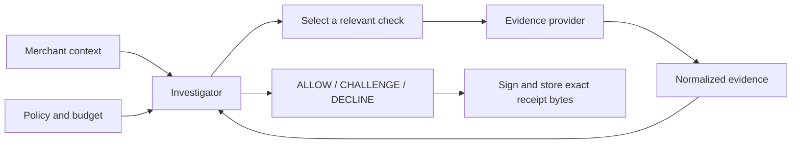

# Isnad · إسناد

**Network evidence, a merchant decision, and a signed explanation.**

Isnad is a Python/FastAPI prototype for investigating suspicious customer
interactions. A recent SIM change starts an investigation: the engine chooses
relevant network checks within a policy budget, weighs the results, and returns
**ALLOW**, **CHALLENGE**, or **DECLINE** with an Ed25519-signed evidence receipt.

The lead demo follows a customer who replaced her SIM before a high-value
cash-on-delivery checkout. Isnad gathers supporting and adverse facts, explains
what remains uncertain, and recommends additional verification. The merchant
performs that verification; Isnad does not send an OTP itself.

[Quick start](#quick-start) · [API example](#api-example) ·
[Testing](#testing-and-reproducible-evidence) ·
[Open issues and handoff](docs/PHASE2_HANDOFF.md)


*Illustrative local capture; the current build and fresh results below are the
reference for behavior. Mock evidence is synthetic.*

## Quick start

Use **Python 3.11** (the CI version). Local mock/greedy operation requires no
Nokia or Gemini credentials. Run these commands from the repository root:

```bash
python3.11 -m venv .venv311
.venv311/bin/python -m pip install -r requirements-dev.txt

ISNAD_DEMO_MODE=true \
ISNAD_PROVIDER=mock \
ISNAD_PLANNER=greedy \
ISNAD_DATABASE_URL=sqlite:///./isnad-demo.db \
ISNAD_VAULT_KEY_PATH=.isnad/demo-vault-key.pem \
ISNAD_MERCHANT_API_KEYS=demo-merchant-key \
ISNAD_VAULT_TRUSTED_PUBLIC_KEYS=4034e169495122a893d8fe6738c2b0f54655fdfb6ec3c6d0eeb938d1330e7f9f \
  .venv311/bin/python -m uvicorn app.main:app \
  --host 127.0.0.1 --port 8010 --workers 1 --no-access-log
```

Open [Judge Mode](http://127.0.0.1:8010/judge). The public-key pin trusts the
bundled signed demo registry; it is not a private credential. The database and
generated signing key persist locally. Keep the key to retain signer trust for
old receipts. Settings also load `.env`; the command explicitly selects the
offline provider and planner so local integration credentials cannot select them.

1. Run **SIM replacement** and inspect the CHALLENGE explanation and evidence.
2. Open its receipt, verify the signature, alter a byte, then restore it.
3. Run **clean checkout** and compare the ALLOW result and shorter investigation.
4. Open the [lab](http://127.0.0.1:8010/lab) to explore recorded cases.
5. Switch English/Arabic to inspect translated results and layout.

The [console](http://127.0.0.1:8010/console) exposes additional demo and integration
controls. [Interactive API docs](http://127.0.0.1:8010/docs) are available in demo
mode. The lab replays a committed synthetic bundle; selecting a recording makes
no operator/model calls. A drift warning means the recording and current code or
policy differ.

## API example

Call Isnad from a merchant backend using a configured Bearer key. This request
uses the same synthetic phone and context as the SIM-replacement fixture:

```bash
curl http://127.0.0.1:8010/v1/verify \
  -H 'Authorization: Bearer demo-merchant-key' \
  -H 'Content-Type: application/json' \
  -H 'Idempotency-Key: readme-replacement-1' \
  -d '{
    "phone_number": "+99999991006",
    "context": {
      "event": "checkout",
      "payment_method": "cod",
      "account_age_days": 0,
      "amount": {"value": 1500, "currency": "USD"},
      "claimed_location": {"lat": 31.9539, "lon": 35.9106, "radius_m": 2000}
    }
  }'
```

Selected fields under the repository's current mock/greedy policy:

```json
{
  "decision": "CHALLENGE",
  "chain_grade": "DEGRADED",
  "confidence": 0.322,
  "planner": "greedy",
  "evidence_steps": 5,
  "evidence_cost": 12.0,
  "provider_sources": ["mock"],
  "chain_id": "chn_…"
}
```

`confidence` is a legacy field name for an **uncalibrated policy risk score**,
not a measured probability of fraud. `chain_grade` describes evidence quality
separately from the decision. [Score interpretation](docs/RISK_SCORE.md).

Coordinates are the caller's claimed area, not a location retrieved from a
handset. Without a claim, Location Verification returns unavailable. Costs are
normalized policy units, not operator prices. Date-enrichment operations consume
budget separately from the evidence-link count.

Repeating an idempotency key with the same body replays a cached result; a changed
body or in-progress request returns 409. **Replay is not crash-safe today**:
the cache and signed chain are committed separately, and the default memory
cache is lost on restart. See handoff R13 before relying on retry-safe paid work.
Keep provider credentials and merchant integration keys on the backend.

## How the engine works



The investigator forms a hypothesis, chooses affordable checks, applies policy
weights and evidence-support requirements, and stops when policy or budget
requires it. Optional SIM/device date enrichment adds temporal context without
applying the same adverse weight again.

Gemini is the configured default planner; the quick start explicitly uses
`greedy`. The model can select a check or STOP, but cannot waive policy gates.
Missing credentials, transport failure or an empty answer can invoke greedy
fallback. Rejected/invalid output and the call ceiling stop model selection;
required policy checks can still run. The result records the selection source
that actually ran, rather than claiming an LLM ran because it was configured.

A receipt verifies the exact stored payload bytes and reports signer trust
separately. A valid signature proves issuance and integrity, not the truth of an
upstream answer. A signed mock receipt remains mock. Full receipt URLs are
public bearer capabilities; expiring shared summaries have a separate lifecycle.

## Features and integration status

| Area | Implemented behavior | Current boundary |
| --- | --- | --- |
| Checkout investigation | Budgeted evidence selection, policy decisions, explanations | Synthetic policy results are not calibrated fraud accuracy. |
| Evidence receipts | Exact-byte signing, browser/offline verification, shared summaries | Shared-summary expiry does not revoke the full original receipt. |
| Consent | Server-side OAuth/OIDC exchange, ownership, replay controls and completion recovery | Local fake-operator coverage is separate from physical handset proof. |
| Merchant pilot | Operator login, consent flow, merchant-reported challenges and outcomes | Separate local/private reference harness, not a production storefront. |
| Caller protection | Registry checks, institution announcements and caller velocity | Depends on configured registry trust and institution/key bindings. |
| Continuity sessions | Polling, revocation and TTL settings | Expiry enforcement and terminal phone retention have open defects (R05/R09). |
| English/Arabic UI | Judge, console, lab, receipt and supporting surfaces | Mobile English lab overflow remains an expected browser failure. |
| Network conditions | Subscription/query/callback code and judge controls | Device binding, callback wiring, quota races, uncertain creates, provenance and input validation repaired 7 Sep (R01–R04, R06, R08). Retention (R07) is still open. **Never exercised against an operator.** |

Provider choices:

| Setting | Meaning |
| --- | --- |
| `mock` | Authored fixtures through the real investigator, policy and vault. Recommended for local exploration. |
| `nac_fake` | Local fake operator for consent and integration testing. |
| `nac` | Nokia Network-as-Code adapter requiring authorized credentials, supported operations and startup configuration. |
| `hybrid` | Selective-live adapter exists, but contradictory startup guards currently prevent a billable hybrid configuration (R12). |

Judge Mode deliberately adds 650 ms per evidence check for readability. That
pacing and mock link timings are not operator-performance measurements. Historical
captures and contract notes live in [docs/nac](docs/nac) and the
[capability matrix](docs/NAC_CONTRACT_MATRIX.md). **A physical handset/operator
consent round trip remains unproven.** This review made no live network/model calls.

## Testing and reproducible evidence

Install Chromium before running the complete suite:

```bash
.venv311/bin/python -m playwright install chromium
# On a fresh Linux runner, use: python -m playwright install --with-deps chromium

.venv311/bin/python -m pytest -q
.venv311/bin/python -m ruff check app tests scripts demo
.venv311/bin/python scripts/verify_runtime_lock.py
```

For a backend-only run use `pytest -q --ignore=tests/browser`; browser tests need
loopback socket and Chromium-launch access and write screenshots under
`docs/ui/release/`. Tests force mock/greedy. `requirements-dev.txt` is the complete
current test setup, and the package's `[dev]` extra now includes Playwright too.
CI installs the Chromium build before running the suite.

**Latest full run, 7 September 2026, after the R01–R04/R06/R08 fixes:**
`pytest -q` → **1,187 passed and 1 xfailed** in 99.7 s, browser tests included in
that single command. Ruff clean; the runtime lock check passed. The one expected
failure is the `/lab` mobile-overflow defect, kept as a strict xfail so it cannot
start passing unnoticed.

(An earlier sandboxed review run on the same day reported 1,105 non-browser
passes with all 61 browser cases blocked by sandbox setup restrictions, then 60
passes and the same xfail on a permitted rerun. That was the state before the
fixes.) See the [handoff](docs/PHASE2_HANDOFF.md) for limits, reproductions and
acceptance tests, and the [test guide](docs/TESTING_GUIDE.md) for what has and
has not actually been validated, feature by feature. These results do not include a fresh
advisory audit, Docker smoke or Postgres integration run.

```bash
.venv311/bin/python scripts/evidence_pack.py --output-dir /tmp/isnad-evidence
.venv311/bin/python scripts/independent_evaluation.py
.venv311/bin/python scripts/handset_validation.py contract --output /tmp/isnad-consent-contract.json
.venv311/bin/python docs/reviews/codebase_review_2026_09_07.py
```

The evidence pack runs five offline scenarios and verifies stored signatures.
The consent `contract` command is local validation, not a handset trial. The
review probe prints known defects using temporary storage and fake providers.

Fresh mock/greedy evidence-pack results:

| Scenario | Decision / grade | Evidence links | Cost units |
| --- | --- | ---: | ---: |
| Clean signup | ALLOW / ATTESTED_FULL | 2 | 3 |
| Account takeover | DECLINE / REFUTED | 4 | 10 |
| Clean checkout | ALLOW / ATTESTED_FULL | 2 | 4 |
| Evidence unavailable | CHALLENGE / UNRESOLVED | 3 | 7 |
| SIM replacement | CHALLENGE / DEGRADED | 5 | 12 |

All five signatures verified. The separately authored 13-case evaluation completed
with zero errors, **49 versus 78 provider operations** — 34 evidence checks plus
15 swap-date enrichments — **6 CHALLENGEs** and **4 authored-expectation
disagreements**. The evaluator undercounted this until 7 September: a swap date
is a second billable call that adds no evidence link, so quote 49, not 34. The evaluation
uses synthetic expectations, not measured fraud outcomes. The older
[evaluation report](docs/INDEPENDENT_EVALUATION.md) explains the method and contains
historical numbers; use fresh command output for the current build.

## Repository and configuration

| Location | Responsibility |
| --- | --- |
| `app/api/` | HTTP routes, authentication, rate/body limits and UI delivery |
| `app/agent/` | Investigator, planners and display explanations |
| `app/providers/` | Mock, NaC and fake-operator adapters and normalization |
| `app/policy/` | Evidence weights, thresholds, relevance and budget |
| `app/chain/`, `app/db/`, `migrations/` | Signatures, persistence and Alembic revisions |
| `app/static/` | Browser pages and locale dictionaries |
| `demo/` | Fake operator, merchant harness, lab runner and recordings |
| `scripts/`, `tests/` | Reproducible experiments and regression coverage |

Configuration is defined in [app/config.py](app/config.py) and illustrated in
[.env.example](.env.example). Useful commands include `make setup`, `make test`,
`make demo`, `make verify-lock` and `make audit`. `make run` serves port 8000 with
reload using your current configuration; use the explicit quick start for the
isolated demo. `make lint` also invokes the dependency advisory audit.

The runtime lock is used by Docker; development requirements use broader version
constraints. The SDK currently declares a conflicting pip pin; the development
requirements document the workaround used by CI. A lock-structure pass does not
establish that installed dependencies are free of advisories.

## Deployment boundaries and next work

Use **one worker and one replica**. Consent, sessions, demo tokens, event fan-out
and rate limiting depend on process-local state; selecting Redis does not make
the application ready for multiple workers. SQLite initializes local tables at
startup. Non-SQLite deployments must apply `alembic upgrade head` before startup
and install the appropriate driver, such as the `[postgres]` extra.

A billable NaC deployment requires private merchant/provider credentials, a
pre-existing persistent signing key, an explicit stable subject pepper, and a
registered HTTPS callback. Preserve prior public-key trust during signing-key
rotation. Demo mode must be off for billable calls. `/health` is liveness;
`/readyz` checks database connectivity. Disable access logging of OAuth query
parameters at both the app server and any reverse proxy.

**This checkout has open release defects.** In particular, repair network-condition
subscription controls, session expiry and durable verification replay before
relying on them. The Docker image currently omits lab runtime files, and CI needs
Chromium installation. All findings, suggested fixes and completion tests are in
the [current handoff review](docs/PHASE2_HANDOFF.md#current-code-review--7-september-2026).

Further integration procedures:
[handset validation](docs/HANDSET_VALIDATION.md) ·
[merchant pilot](docs/P4A_IMPLEMENTATION_RECORD.md) ·
[execution runbook](docs/EXECUTION_RUNBOOK.md).
Older checkpoints in these documents remain historical where they disagree with
the fresh review. Isnad is a prototype; operator coverage, real merchant outcomes
and production decision quality remain validation work.
