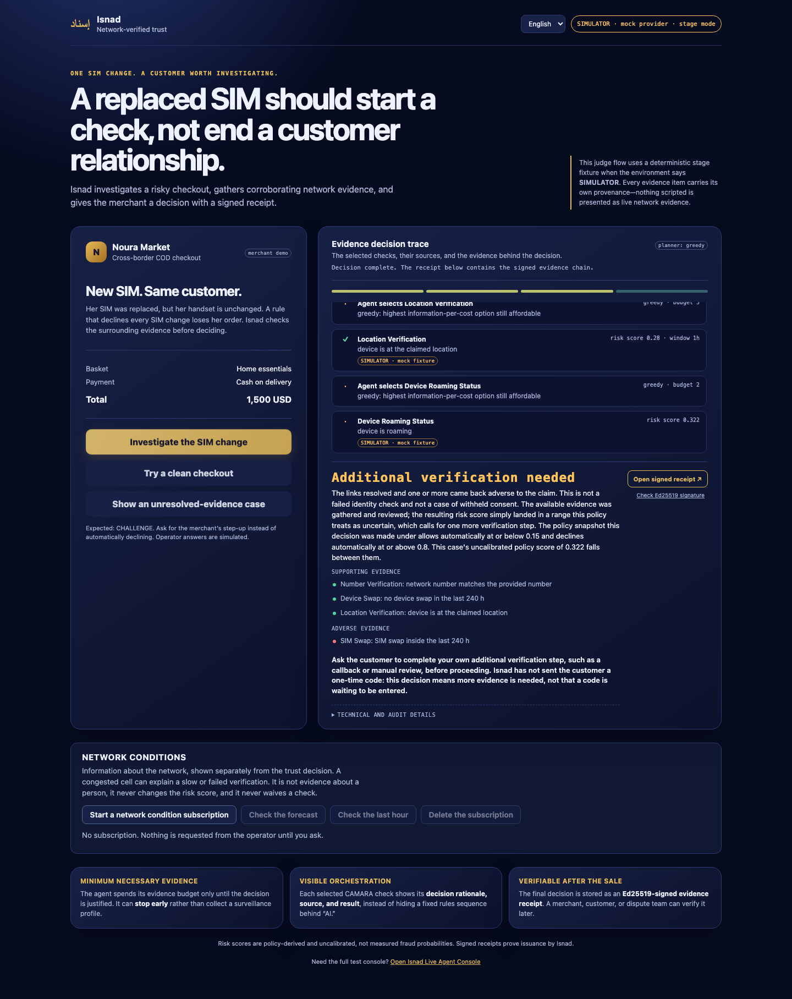
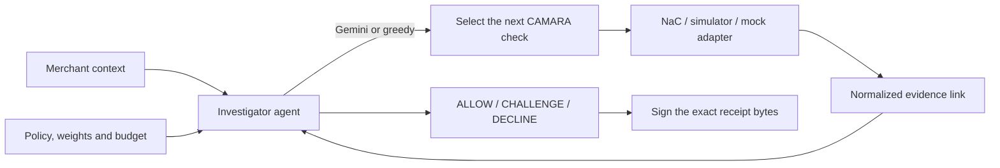

# Isnad · إسناد

### An agentic trust engine that asks the network before a merchant loses a customer.

**GSMA MENA Ignite Hackathon 2026 · Theme 4 — Secure Fintech, Payments & Anti-Fraud Innovation**
Built on GSMA Open Gateway CAMARA APIs via the Nokia Network-as-Code platform.

| | |
| --- | --- |
| **Team** | Ahmad Shadeed (lead) · Yousef Al Masri — Princess Sumaya University for Technology, Amman, Jordan |
| **Judges start here** | **[submission/JUDGE_GUIDE.md](submission/JUDGE_GUIDE.md)** — ten steps, ~20 minutes, one optional key |
| **Run it now** | `make setup && make judge` → <http://127.0.0.1:8010/judge> |
| **CAMARA APIs integrated** | 8 on Nokia Network-as-Code — 4 exercised against Nokia's hosted simulator, the rest against the sandbox, all recorded |
| **AI agent layer** | Gemini chooses which network check to buy next; policy decides what the answer means |
| **Verification** | 1,329 automated tests pass in 153 s, browser tests included |
| **Demo video** | [`submission/isnad-demo.mp4`](submission/isnad-demo.mp4) — 3:39, real application footage |

---

## The problem

Cash on delivery is roughly 70–80% of MENA e-commerce. A COD order carries no
verified commitment at checkout, so a fake order costs a merchant a real
delivery run — the van, the driver, the fuel — and recovers nothing.

The usual defence is a rule: *SIM changed recently → decline*. That rule is
cheap and wrong. Most people who replace a SIM lost a phone. Declining them all
means paying for fraud twice: once in chargebacks, once in the customers you
insulted on their way to a competitor.

Generative AI has broken every soft proof that someone is genuine. Deepfakes
pass liveness checks, voice clones defeat call centres, OTPs are phishable. The
one thing a model still cannot fake is a physical SIM in radio range of a
physical cell tower with years of history behind it. CAMARA is the first time
that truth has been programmable by a third party.

## What Isnad does

A merchant calls one endpoint at a moment of risk. An investigator agent forms
a hypothesis, buys the cheapest useful network evidence until the answer is
justified, and returns **ALLOW**, **CHALLENGE** or **DECLINE** with the full
chain of reasoning attached and an Ed25519 signature over it.

The name is literal. *Isnad* (إسناد) is the classical chain of transmission —
the thousand-year-old method of judging a report by scrutinising every link
that carried it. Every verdict reproduces that structure: Human → SIM → Device
→ Location → History, each link a specific CAMARA call, each shown with its own
provenance. The internet never got its isnad.



*Judge Mode, English. The same page in Arabic is
[here](docs/ui/release/judge-ar-replacement-1440.png) — full RTL layout, with
the composed verdict paragraph still untranslated and a banner on the page
saying so. Both screenshots are regenerated by the browser test suite on every
run, so they cannot drift from the build.*

## Try it in three minutes

Requires **Python 3.11**. No Nokia or Google credentials — this path is fully
offline and deterministic.

```bash
make setup      # creates .venv311, installs dependencies
make judge      # serves the reviewer demo on 127.0.0.1:8010
```

Then open <http://127.0.0.1:8010/judge> and press **Investigate the SIM change**.

Expected: five CAMARA checks, an uncalibrated policy score of **0.322**, a
**CHALLENGE / DEGRADED** verdict, and a signed receipt that verifies in the
browser. `make judge` writes to its own database and its own signing key, so it
cannot disturb anything else on the machine.

Four surfaces are served:

| URL | What it is |
| --- | --- |
| `/judge` | The merchant story: one checkout, the agent's reasoning, the verdict, the receipt |
| `/lab` | Recorded cases replayed side by side against alternative strategies |
| `/console` | The full operator console — live SSE trace, caller screening, session controls |
| `/docs` | OpenAPI, interactive, enabled in demo mode |

The step-by-step verification path, including tampering with a receipt to watch
the signature fail, is in **[submission/JUDGE_GUIDE.md](submission/JUDGE_GUIDE.md)**.

## The AI agent layer

The hackathon requires an AI agent that orchestrates CAMARA APIs as trusted
real-time data sources rather than as buttons. In Isnad the model's job is
**selection under a budget**, and the boundary around it is deliberate.

**What the agent decides.** Given the request context, the hypothesis it has
formed, the evidence gathered so far and the remaining budget, Gemini picks the
next CAMARA action — or STOP. Each selection carries the model's own rationale,
which is displayed in the trace rather than summarised away.

**What the agent cannot decide.** It cannot waive a policy gate, invent
evidence, change a weight, exceed the budget, or reach a verdict. Policy grades
the evidence; the model only chooses what to buy. A model that returns
malformed output is rejected and recorded as rejected, not quietly obeyed.

**How a reviewer runs it without our key.** The `/judge` page has a panel that
takes a Gemini key of your own. It is held in a `ContextVar` for exactly one
request — never written to the database, never into a signed receipt, never to
a log, never echoed back — and any deployment that could spend money refuses
the header outright. Supplying a key also *selects* the model planner, so it
works on the offline demo without a restart. The guarantees are asserted in
[`tests/test_request_supplied_model_key.py`](tests/test_request_supplied_model_key.py),
not just described here.

**What happens when the model is unavailable.** A missing key, a transport
failure, an empty answer or a hit call ceiling falls back to a greedy
information-per-cost planner. The verdict records which strategy actually ran,
so a run never claims an LLM chose when it did not. This is why `make judge`
uses `greedy`: a reviewer gets a byte-identical result every time. `make
judge-ai` runs the same demo with Gemini in the seat.

Here is a real run, recorded at
[`docs/nac/observations/2026-09-07-gemini-judge-run.json`](docs/nac/observations/2026-09-07-gemini-judge-run.json).
Four rows, and the architecture is visible in all four:

| Row | Chosen by | Sentence |
| --- | --- | --- |
| SIM Swap | `llm` | *"Checking for a recent SIM swap provides the highest relevant information value to investigate the account takeover hypothesis."* |
| Device Swap | **`policy`** | *"corroborate before this signal alone can decline"* |
| STOP | `llm` | *"None of the remaining affordable actions are relevant to assessing the account takeover hypothesis."* |
| Number Verification | **`policy`** | *"cheapest step that could resolve the doubt"* |

The model opened with a single adverse signal; policy would not let one signal
carry a decline, so it required corroboration. The model then said stop; policy
overruled it and bought the cheapest check that could resolve the doubt. The
trace names which of the two is speaking on every row.

It reached CHALLENGE / DEGRADED at 0.28 over four links. Greedy reaches
CHALLENGE / DEGRADED at 0.322 over five. Different strategies, different
evidence, same answer.

An earlier bounded rehearsal is at
[`2026-09-07-gemini-rehearsal.json`](docs/nac/observations/2026-09-07-gemini-rehearsal.json).

The agent layer uses exactly one tool from the hackathon's Resource & Tooling
Guide: **Google AI Studio (Gemini)**, which the guide lists as a free-tier
model API. There is no second model provider and no third-party agent
framework — the adapter is a direct REST client in
[`app/agent/gemini.py`](app/agent/gemini.py) over the project's existing
`httpx` dependency, chosen so that a missing SDK can never silently turn an
`llm` run into a greedy one.

## CAMARA APIs integrated

Eight CAMARA APIs have a working Nokia Network-as-Code adapter in
[`app/providers/nac.py`](app/providers/nac.py). The agent chooses which to call
at run time; policy assigns each one a cost and a weight in
[`app/policy/policy.yaml`](app/policy/policy.yaml).

| CAMARA API | Role in the evidence chain | Cost | Recorded against Nokia |
| --- | --- | ---: | --- |
| Number Verification | Proves the number belongs to this device. Replaces the OTP. | 1 | Sandbox, 30 Aug — the `CONSENT_REQUIRED` path |
| SIM Swap | The primary account-takeover signal. | 2 | **Hosted simulator, 6 Sept — 200** |
| Device Swap | The mule-phone signal. | 2 | **Hosted simulator, 6 Sept — 200** |
| Location Verification | Yes/no against an address the customer already claimed. Never a coordinate. | 3 | Sandbox, 30 Aug |
| Device Reachability Status | Bot-farm and burner patterns. | 2 | Sandbox, 30 Aug |
| Device Roaming Status | Impossible travel; also a stability proxy for thin-file approval. | 2 | Sandbox, 30 Aug |
| Number Recycling | Was this number reassigned to someone else? | 1 | **Hosted simulator, 6 Sept — 200, plus a 400 we now prevent** |
| Congestion Insights | Network *information*, never evidence about a person. | — | **Hosted simulator, 6 Sept — 200** |

A ninth, **Device Intelligence**, exists in the policy vocabulary and runs
under the mock provider, but has **no Nokia adapter**: the 30 August sandbox
capture returned `EVIDENCE_UNAVAILABLE`, so the NaC path returns unavailable by
construction rather than pretending to a reputation verdict nobody gave us. It
is listed here because leaving it out of the code would have been tidier than
leaving it in and saying why.

Two design decisions are worth a judge's attention:

**Congestion Insights is quarantined from the verdict.** A congested cell can
explain a slow or failed verification, so the judge page shows it — in a
separate panel that states it never changes the risk score and never waives a
check. Network conditions explain a measurement; they are not a fact about a
human being.

**Location Verification returns a boolean against a claim the customer already
made.** Isnad never receives or stores a coordinate. Without a claim on the
request, the check is skipped and zero SDK calls are made.

### What is real, and what is simulated

Judges should be able to tell these apart without reading code, so the UI
labels every row and this README will not blur them.

- **Real HTTP calls to Nokia's hosted simulator, recorded.** 14 authenticated
  requests on 6 September 2026 against `network-as-code.p-eu.apihub.nokia.io`,
  one line each — including the failures — at
  [`docs/nac/observations/`](docs/nac/observations/). Every request, status,
  duration and normalised result is there; no response bodies, no unmasked
  numbers.
- **Real Gemini calls, recorded.** The rehearsal above.
- **Simulated operator answers in the demo.** `make judge` runs authored
  fixtures through the *real* investigator, policy engine and signing vault.
  Every evidence row on screen is stamped `SIMULATOR · mock fixture`.
- **Not yet proven.** A physical handset completing an operator consent round
  trip. A congestion subscription create/callback cycle, which needs a
  registered public HTTPS callback. Measured fraud accuracy against real
  outcomes. These are named here because a judge who finds them unnamed is
  right to discount everything else.

The observations also record something inconvenient, which is the point of
recording them: for the same subscriber the simulator's `device_swap` boolean
said *swapped* while `device_swap_date` returned a date nineteen days earlier.
Isnad therefore never combines the two as if they described one event; it shows
both with separate provenance and says when they disagree.

## How the engine works



The investigator forms a hypothesis from the request — *new account + high
value + cash on delivery* reads as elevated takeover risk — then spends its
budget on the checks relevant to that hypothesis, stopping as soon as policy is
satisfied. Stopping early is a feature: the engine is built to gather the
minimum necessary evidence, not to assemble a surveillance profile.

A receipt signs the exact stored payload bytes and reports signer trust
separately from signature validity. A valid signature proves what Isnad issued
and that nothing changed since; it does not make an upstream answer true. **A
signed mock receipt is still mock**, and the receipt page says so.

## API example

```bash
curl http://127.0.0.1:8010/v1/verify \
  -H 'Authorization: Bearer demo-merchant-key' \
  -H 'Content-Type: application/json' \
  -H 'Idempotency-Key: readme-replacement-1' \
  -d '{
    "phone_number": "+99999991006",
    "context": {
      "event": "checkout",
      "payment_method": "cod",
      "account_age_days": 0,
      "amount": {"value": 1500, "currency": "USD"},
      "claimed_location": {"lat": 31.9539, "lon": 35.9106, "radius_m": 2000}
    }
  }'
```

```json
{
  "decision": "CHALLENGE",
  "chain_grade": "DEGRADED",
  "confidence": 0.322,
  "planner": "greedy",
  "hypothesis": "account_takeover",
  "reason": "Unresolved doubt — cheapest step-up needed before trusting.",
  "chain_id": "chn_…"
}
```

The full response carries every evidence link with its API, result, signal,
consent basis, source, latency and log-odds contribution.

`confidence` is a legacy field name for an **uncalibrated policy risk score** —
reproducible arithmetic over configured weights, not a measured probability of
fraud. `chain_grade` describes evidence quality separately from the decision,
so "we are confident and the evidence was thin" is expressible instead of being
averaged away. See [docs/RISK_SCORE.md](docs/RISK_SCORE.md).

Repeating an idempotency key with the same body replays the stored result; a
changed body or an in-flight request returns 409. The operation-to-chain
mapping is persisted in the same transaction as the signed receipt, so a crash
that leaves upstream work uncertain refuses the retry rather than paying for a
provider call twice.

## Evidence a judge can reproduce

Every number below comes from a command in this repository, run on 7 September
2026 against this commit.

```bash
make test                                   # 1,329 passed in 153 s
.venv311/bin/python scripts/evidence_pack.py --output-dir /tmp/isnad-evidence
.venv311/bin/python scripts/independent_evaluation.py
```

**Five scenarios, five valid signatures**, from the evidence pack:

| Scenario | Decision / grade | Evidence links | Cost units |
| --- | --- | ---: | ---: |
| Clean signup, no OTP | ALLOW / ATTESTED_FULL | 2 | 3 |
| Corroborated account takeover | DECLINE / REFUTED | 4 | 10 |
| Thin-file customer | ALLOW / ATTESTED_FULL | 2 | 4 |
| Evidence unavailable | CHALLENGE / UNRESOLVED | 3 | 7 |
| SIM replacement | CHALLENGE / DEGRADED | 5 | 12 |

The fourth row is the one worth arguing about. *Evidence unavailable* returns
CHALLENGE, not DECLINE. A customer whose operator did not answer has not failed
a check, and Isnad refuses to say they did.

**Budget discipline**, from the 13-case evaluation against two alternative
strategies: **49 provider operations versus 78** — 34 evidence checks plus 15
swap-date enrichments — for six CHALLENGEs. Selection is not free: on this
authored set the greedy planner disagrees with four of the thirteen authored
expectations, three of them by being less conservative than the rule-based
comparator. Both halves of that trade are reported here because the expectations
are synthetic. Nothing in this repository measures real fraud outcomes.

## Scaling and commercial shape

Isnad is priced against the thing it prevents: a check costs pennies against a
wasted COD delivery run. The unit economics are the reason the agent budgets at
all — a fixed pipeline that runs every API on every request cannot be sold into
a market with thin margins per order.

- **Merchants and couriers** — fewer fake and refused COD orders, and fewer
  vans sent to nobody.
- **Banks and wallets** — takeover defence at payout and password reset that
  does not depend on OTPs, selfies or documents.
- **Customers** — a legitimate SIM replacement gets a step-up instead of a
  decline; a clean signup gets no OTP at all.
- **Financial inclusion** — thin-file customers with no bank record are
  assessed on SIM tenure and location stability. Most fraud tools shrink a
  market. This one is designed to grow one.
- **Operators** — a measurable revenue line for CAMARA, and a recurring reason
  for merchants to consume network capability.

One engine serves the adjacent theme too: Theme 1's cross-border identity
verification is the same evidence chain with a different hypothesis.

## Repository map

| Path | Responsibility |
| --- | --- |
| `app/agent/` | Investigator, Gemini and greedy planners, hypothesis and belief model, explanations |
| `app/policy/` | Evidence weights, thresholds, relevance, budget — `policy.yaml` is the tunable surface |
| `app/providers/` | Nokia NaC, mock and fake-operator adapters, and the normalization between them |
| `app/chain/` | Evidence chain construction, subject binding, Ed25519 vault |
| `app/api/` | HTTP routes, authentication, rate and body limits, UI delivery |
| `app/static/` | Judge, console, lab, receipt and privacy pages, plus English/Arabic dictionaries |
| `app/db/`, `migrations/` | Persistence and Alembic revisions |
| `demo/` | Offline fake operator, merchant pilot harness, lab runner and recordings |
| `scripts/` | Reproducible experiments: evidence pack, evaluation, NaC probe, receipt verification |
| `tests/` | 1,329 tests, including Playwright coverage of both languages |
| `docs/nac/observations/` | Recorded Nokia and Gemini calls — the provenance behind the claims above |
| `submission/` | Judge guide, CAMARA usage detail, Phase 1 idea capture |

Configuration lives in [`app/config.py`](app/config.py), illustrated in
[`.env.example`](.env.example); everything is overridable with an `ISNAD_`
prefix. `make help` lists the available tasks.

## Deployment boundaries

Honest constraints, stated so nobody is surprised by them.

Run **one worker and one replica**. Consent, sessions, demo tokens, event
fan-out and rate limiting are process-local; choosing Redis does not change
that. SQLite creates its tables at startup; any other database needs
`alembic upgrade head` first and the matching driver (`[postgres]` extra).

Billable Nokia calls need private merchant and provider credentials, a
pre-existing persistent signing key, an explicit stable subject pepper and a
registered HTTPS callback — and demo mode off. Preserve prior public-key trust
across a signing-key rotation, or old receipts stop verifying. `/health` is
liveness; `/readyz` checks the database. Disable access logging of OAuth query
parameters at the app server and at any reverse proxy: the authorization code
travels in the query string.

Selective-live evidence is retired: a non-empty `ISNAD_LIVE_EVIDENCE_*`
allowlist is refused at startup, so the `hybrid` test seam can never reach the
network by accident. Live evidence goes through `nac` or not at all.

## Further reading

[Judge guide](submission/JUDGE_GUIDE.md) ·
[CAMARA API usage in detail](submission/CAMARA_API_USAGE.md) ·
[Why the demo runs on mock](submission/MOCK_VS_NAC.md) ·
[Risk score interpretation](docs/RISK_SCORE.md) ·
[Feature-level test guide](docs/TESTING_GUIDE.md) ·
[Synthetic evaluation method](docs/INDEPENDENT_EVALUATION.md) ·
[NaC capability matrix](docs/NAC_CONTRACT_MATRIX.md) ·
[Handset validation procedure](docs/HANDSET_VALIDATION.md)

Isnad is a working prototype. Operator coverage, real merchant outcomes and
production decision quality remain validation work, and this README says so on
purpose: an engine whose entire argument is provenance does not get to be vague
about its own.
