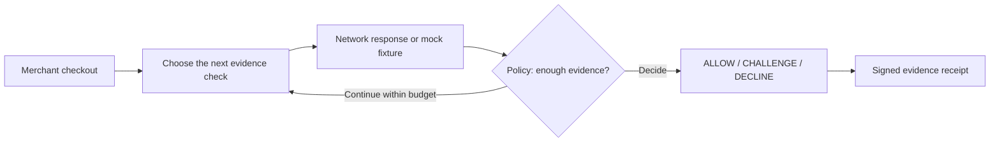

<div align="center">

# Isnad · إسناد

### Trust decisions, with the evidence attached.

**A changed SIM is a signal. Isnad investigates before it becomes a declined order.**

[](https://github.com/AhmadShadeed32/isnad-private/actions/workflows/ci.yml)


[See the story](#one-customer-two-possible-outcomes) · [Run the demo](#try-it-yourself) · [Why mock?](#why-the-demo-uses-mock-responses) · [Check the evidence](#proof-you-can-rerun)

</div>

---

A customer replaces her SIM and tries to pay. That change could mean an account
takeover. It could also mean she needed a new SIM.

**Blocking the attack matters. So does keeping the legitimate customer.**

Isnad helps merchants make that decision using mobile-network evidence. It
chooses which check to buy next, investigates adverse signals, and stops when
policy has enough evidence. One API call returns **ALLOW**, **CHALLENGE**, or
**DECLINE**, together with a signed record of how it got there.

## One customer. Two possible outcomes.

In our replaced-SIM checkout example, a rule that declines every SIM change
would reject the order. Isnad looks further:

| What the network evidence says | What it establishes |
| --- | --- |
| A SIM swap occurred inside the last 240 hours | A risk signal worth investigating. |
| No device swap occurred in the same window | The handset is stable. |
| The device is at the claimed location | Another fact supports the customer's account. |

**The result: CHALLENGE, rather than an automatic decline.** The merchant runs
its existing step-up flow. The adverse SIM result stays in the evidence chain;
Isnad does not turn uncertainty into an unconditional approval.

This is the primary demo. A second, clean checkout shows the other outcome:
**ALLOW after two checks**, with no additional step-up required by Isnad.

## Why this is useful

| For the merchant | For the mobile operator |
| --- | --- |
| Investigate a customer's risk signal before rejecting their order. | Put network API answers into a concrete checkout decision. |
| Control evidence spend with budgets and early stopping. | Show which checks contributed to the decision. |
| Keep an inspectable record for customer support and dispute review. | Preserve the scope and provenance of each network answer. |

The principle behind it is simple: **“We couldn't check” and “the check failed”
are different facts.** Missing consent or an unavailable provider remains an
evidence gap. It does not become a fabricated pass or a fraud finding.

## Try it yourself

No operator credentials are needed for the local demo.

```bash
python3.11 -m venv .venv311
.venv311/bin/pip install -e ".[dev]"
ISNAD_DEMO_MODE=true ISNAD_PROVIDER=mock ISNAD_PLANNER=greedy \
ISNAD_MERCHANT_API_KEYS=demo-merchant-key \
  .venv311/bin/python -m uvicorn app.main:app \
  --host 127.0.0.1 --port 8010 --no-access-log --proxy-headers
```

Open **[Judge Mode](http://127.0.0.1:8010/judge)**:

1. **Investigate the SIM change.** Watch the checks arrive and the result become CHALLENGE.
2. **Open the signed receipt.** Verify its signature, change a byte, and watch verification fail.
3. **Try a clean checkout.** See the engine stop after two supporting checks.

Allow about 90 seconds to explore the story. The [presenter walkthrough](docs/JUDGE_WALKTHROUGH.md)
has a short script and answers to likely questions. The [full console](http://127.0.0.1:8010/console)
also demonstrates caller verification and simulated trust-session revocation.

## Why the demo uses mock responses

**The operator answers are simulated. The investigation and signed decision are actually executed.**

A repeatable demo needs to show a legitimate SIM replacement, an adverse case,
and an unavailable check on demand. Mock fixtures let judges run those scenarios
without a supported test SIM, an operator consent setup, or billable network
calls. They also let us test failure cases reliably.

Both `MockProvider` and the Nokia Network as Code adapter return the **same
normalized `EvidenceLink` format**. They share the signal vocabulary and the
functions that describe network facts. Those links pass through the **same
investigator, policy, budget accounting, chain grading, and signing code**.
The mock supplies evidence; it does not supply a prewritten verdict.

The stage route adds a **650 ms pause per check** so you can follow each step.
That is presentation pacing, not a measurement of operator speed. Mock per-link
latency values are scripted too. Responses are not byte-identical to a live
call: source labels, consent metadata, timestamps and timings differ, and live
answers depend on the subscriber and operator.

You can inspect the [mock provider](app/providers/mock.py),
[live adapter](app/providers/nac.py), [shared vocabulary](app/providers/vocabulary.py),
and [stage delay](app/api/routes_console.py). Historical adapter captures are in
[`docs/nac/`](docs/nac/). Live-mode failures remain unresolved; they never quietly
turn into fixture answers.

## What makes the decision trustworthy?

The planner chooses the route. **Policy sets the boundaries.**

- **Investigate adverse evidence.** Policy attempts the configured corroborating
  checks before a high-risk result can end the investigation, within the evidence budget.
- **Require support for an allow.** A low starting score or local information
  alone cannot satisfy the shipped network-evidence minimum.
- **Keep the explanation attached.** The ordered evidence, decision, policy
  thresholds and subject commitment are stored in an Ed25519-signed receipt.

A receipt proves what the signing Isnad instance issued and whether those bytes
changed. It does not prove that an upstream provider was truthful. Each evidence
link retains its source so a mock answer remains identifiable.



## Proof you can rerun

The latest verified suite has **506 passing tests**, including STOP-capable
planner regressions, consent replay protection and signed-receipt checks.

| Evaluation | What it shows | Tradeoff kept visible |
| --- | --- | --- |
| Policy-generated synthetic cases | **58 checks versus 119** for running every check: 51% fewer. Zero declines among the ten single-adverse/unavailable customer cases. | One of seven two-adverse cases is still allowed at the shipped threshold. |
| Separately authored 13-case synthetic set | **28 checks versus 78** for the full-evidence comparators. | Six disagreements with conservative scenario expectations; early stopping can miss later evidence. |

These are reproducible **policy experiments**, not production fraud-accuracy
claims. The [evaluation report](docs/INDEPENDENT_EVALUATION.md) publishes the
cases, stronger baselines, challenge rates and disagreements.

<details>
<summary><strong>Run the tests, evidence pack and evaluations</strong></summary>

```bash
.venv311/bin/python -m pytest -q
.venv311/bin/python -m ruff check app tests scripts demo
.venv311/bin/python scripts/evidence_pack.py
.venv311/bin/python scripts/false_decline_baseline.py --sweep
.venv311/bin/python scripts/independent_evaluation.py
.venv311/bin/python scripts/handset_validation.py contract
```

The evidence pack reruns five scenarios, persists each chain in an isolated
in-memory database, verifies its signature, and writes JSON and Markdown reports.
The consent contract runs locally; it is not proof of an operator handset flow.

</details>

## One call at your existing decision point

Send `POST /v1/verify` at checkout, signup, or a sensitive account action. Act on
`decision`; keep `chain_id` for review. ALLOW proceeds, CHALLENGE invokes the
merchant's step-up, and DECLINE stops the interaction under merchant policy.

<details>
<summary><strong>Example request and response</strong></summary>

With the local demo server running:

```bash
curl http://127.0.0.1:8010/v1/verify \
  -H 'authorization: Bearer demo-merchant-key' \
  -H 'content-type: application/json' \
  -d '{"phone_number":"+962790000006","context":{"event":"checkout","payment_method":"cod","account_age_days":0,"amount":{"value":1500,"currency":"USD"}}}'
```

Selected fields from the mock/greedy replacement scenario:

```json
{
  "decision": "CHALLENGE",
  "chain_grade": "DEGRADED",
  "planner": "greedy",
  "confidence": 0.242,
  "evidence_steps": 6,
  "provider_sources": ["mock"],
  "chain_id": "chn_…"
}
```

`confidence` is the legacy API name for an **uncalibrated policy risk score**,
not a measured fraud probability. [Read the score explanation](docs/RISK_SCORE.md).
Budgets, thresholds and corroboration live in [`policy.yaml`](app/policy/policy.yaml).

The local demo uses deterministic greedy planning. Optional LLM planning chooses
among affordable checks and falls back to greedy on failures; each verdict
records which strategy actually ran. Required policy checks cannot be skipped
by the planner.

</details>

## The next proof

The NaC adapter and consent flow are implemented. The next milestone is a
**supported handset completing the operator consent round trip**, followed by a
merchant evaluation using real outcomes. The score needs calibration, and API
costs need an operator contract. The [handset procedure](docs/HANDSET_VALIDATION.md)
separates the local proof from the live test still to be completed.

For project status, app improvements and development instructions, start with
the [compact handoff](docs/PHASE2_HANDOFF.md).
