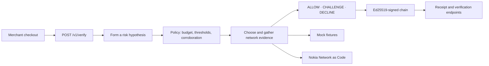

<div align="center">

# Isnad

### Investigate the SIM change before rejecting the customer

[](https://github.com/AhmadShadeed32/isnad/actions/workflows/ci.yml)


**One API call returns `ALLOW`, `CHALLENGE`, or `DECLINE` with the ordered evidence chain behind it.**

[Run the 90-second demo](#the-90-second-judge-path) · [Reproduce the evidence](#reproduce-it) · [Integrate](#integration)

</div>

---

## A SIM change is a reason to investigate

A legitimate customer replaces her SIM and tries to check out.
The SIM-swap signal is real. The takeover conclusion is not.

Isnad treats that signal as the start of an investigation:

```text
NUMBER_MATCH             network number matches the provided number
SIM_SWAPPED              SIM swap inside the last 240 h
DEVICE_STABLE            no device swap in the last 240 h
AT_CLAIMED_LOCATION      device is at the claimed location
ROAMING_NETWORK          device is roaming
REACHABLE_NORMAL         device reachable via SMS

CHALLENGE / DEGRADED     policy risk score 0.242
```

The shipped deterministic policy does not auto-decline her. It also does not
pretend the adverse signal disappeared: the result is a step-up, and the
merchant runs the challenge flow it already owns.

That distinction is the product:

> **“We could not check” and “the check failed” are different facts. A risk
> signal and a fraud verdict are different facts too.**

For a merchant, the value is practical: investigate a legitimate customer's
risk signal, buy only the checks policy needs, and keep a reviewable explanation
when a decision is challenged. For an operator, the chain shows how its API
answers contributed to the decision.

## The 90-second judge path

```bash
python3.11 -m venv .venv311
.venv311/bin/pip install -e ".[dev]"
ISNAD_DEMO_MODE=true ISNAD_PROVIDER=mock ISNAD_PLANNER=greedy \
ISNAD_MERCHANT_API_KEYS=demo-merchant-key \
  .venv311/bin/python -m uvicorn app.main:app \
  --host 127.0.0.1 --port 8010 --no-access-log --proxy-headers
```

Open [Judge Mode](http://127.0.0.1:8010/judge), then:

1. Click **Investigate the SIM change**.
2. Watch the adverse SIM result trigger more evidence instead of an immediate decline.
3. Open the signed receipt and verify its Ed25519 signature.
4. Optionally run **Try a clean checkout** to see early stopping on an `ALLOW`.

Every evidence row says whether it came from the local simulator or Nokia
Network as Code. The judge flow is deliberately deterministic and uses mock
operator answers; it exercises the same investigator, policy, chain builder,
and vault used by the live provider path.

For a terminal-only proof:

```bash
.venv311/bin/python -m demo.run_acts
```

## What the API returns

```bash
curl -X POST http://127.0.0.1:8010/v1/verify \
  -H 'authorization: Bearer demo-merchant-key' \
  -H 'content-type: application/json' \
  -d '{
    "phone_number": "+962790000006",
    "context": {
      "event": "checkout",
      "payment_method": "cod",
      "account_age_days": 0,
      "amount": {"value": 1500, "currency": "USD"}
    }
  }'
```

The response contains the action to take, the evidence quality, the actual
planner used, the ordered evidence links, their provenance and policy effects,
and the receipt identifier:

```json
{
  "decision": "CHALLENGE",
  "planner": "greedy",
  "chain_grade": "DEGRADED",
  "confidence": 0.242,
  "reason": "Unresolved doubt — cheapest step-up needed before trusting.",
  "evidence_steps": 6,
  "evidence_cost": 12.0,
  "provider_sources": ["mock"],
  "chain_id": "chn_…"
}
```

`confidence` keeps its API name for compatibility. It is a **policy-derived
risk score**, calculated from configured priors and log-odds weights. It is not
a calibrated probability that fraud occurred. See
[`docs/RISK_SCORE.md`](docs/RISK_SCORE.md) for the arithmetic and limits.

## Why the chain matters

The planner can choose the next affordable check or stop. Policy keeps the
safety decisions outside that planner:

1. **Corroborate before declining.** If belief turns adverse, policy attempts
   the configured exculpatory checks before one adverse signal can carry a decline.
2. **Ground an allow in network evidence.** Local state alone cannot produce an
   `ALLOW`; at least one supporting network fact must be in the chain.
3. **Keep uncertainty explicit.** Missing consent, unavailable providers, and
   unanswerable checks remain unresolved rather than becoming fabricated failures.

Evidence quality is separate from the action:

| Chain grade | Meaning |
| --- | --- |
| `ATTESTED_FULL` | Enough resolved, supporting evidence was gathered. |
| `ATTESTED_PARTIAL` | Resolved evidence supports the claim, with thin corroboration. |
| `UNRESOLVED` | A required fact could not be obtained. |
| `DEGRADED` | The chain resolved but includes adverse evidence. |
| `REFUTED` | Evidence directly contradicts the subject’s claim. |

## Reproduce it

```bash
.venv311/bin/python -m pytest -q
.venv311/bin/python -m ruff check app tests scripts demo
.venv311/bin/python scripts/evidence_pack.py
.venv311/bin/python scripts/false_decline_baseline.py --sweep
.venv311/bin/python scripts/independent_evaluation.py
.venv311/bin/python scripts/handset_validation.py contract
```

The false-decline harness generates cases from the policy’s own signal
vocabulary and compares three decision rules over synthetic fixtures:

| Decision rule | False declines in the generated single-adverse / unavailable set |
| --- | ---: |
| Any flagged check means decline | 5 / 10 |
| Any flagged or unanswered check means decline | 10 / 10 |
| **Isnad’s shipped policy** | **0 / 10** |

The run-everything baseline buys **119** checks; Isnad buys **58**. At the
shipped `allow_below: 0.15`, Isnad allows **1 of 7** generated cases that contain
two adverse signals. Tightening the threshold to `0.05` closes that case and
raises the checks bought to **82**.

These are deterministic, policy-derived measurements over synthetic fixtures.
They compare explicit rules and evidence spend; they do not measure production
accuracy, a population fraud rate, or a calibrated model. A [separately authored, fixed synthetic evaluation](docs/INDEPENDENT_EVALUATION.md)
adds 13 cases and two full-evidence comparators. Isnad buys 28 checks versus 78,
but disagrees with six conservative scenario expectations. Those disagreements
are published alongside the savings: early stopping has a cost. This is further
policy stress testing, not independent real-world validation.

`scripts/planner_divergence.py` is a separate strategy experiment. Its recorded
fixture run found the LLM and greedy planners took different paths in four of
five scenarios, with no verdict or chain-grade difference, and 17 versus 14
paid checks. It is one synthetic run, not an accuracy claim.

## Signed receipts, precisely stated

Each stored verdict binds the decision, policy snapshot, ordered evidence,
planner label, subject commitment, owner commitment, and request commitment in
an Ed25519-signed payload.

- `GET /v1/receipts/{chain_id}` exposes the exact signed bytes, signature, and
  public key for independent verification. It contains no phone number.
- `GET /r/{chain_id}` renders the public receipt and verifies it in the browser.
- `GET /v1/chains/{chain_id}/verification` recomputes validity for an
  authenticated merchant.
- `POST /v1/chains/{chain_id}/verification` also checks a supplied phone number
  against the signed subject binding.

A valid receipt proves that an Isnad instance holding the signing key issued
that payload and that the payload has not changed. It does **not** prove that an
upstream provider told the truth, that a mock fixture was live network evidence,
or that the decision was correct.

## Integration

Call `POST /v1/verify` at an existing decision point:

| Result | Merchant action |
| --- | --- |
| `ALLOW` | Continue. |
| `CHALLENGE` | Run the merchant’s existing step-up flow. Isnad does not send an OTP. |
| `DECLINE` | Stop the interaction under the merchant’s policy. |

Tune budgets, signal weights, thresholds, corroboration, and evidence costs in
[`app/policy/policy.yaml`](app/policy/policy.yaml). No retraining is required.
Sequential gathering is the default because it is reproducible and can stop
before buying unnecessary checks. Per-request parallel gathering is available
through `options.parallel` when latency matters more than evidence spend.

The default planner is `greedy`: deterministic, offline, and suitable for the
demo. `ISNAD_PLANNER=llm` enables the optional model planner when a Gemini key is
configured. Timeouts, malformed answers, unavailable models, and invalid choices
fall back to greedy; the response records the planner that actually supplied
each choice (`greedy`, `llm`, or a mixed run), rather than the requested label.
A run handled entirely by required policy checks is labelled `policy`; `none`
means no selection occurred, for example when the budget cannot buy a check.



## Live provider mode

`ISNAD_PROVIDER=nac` routes supported evidence actions to Nokia Network as Code.
Production posture requires a non-demo process, a private merchant key, a
persisted vault key, a persisted subject pepper, the provider credential, and a
registered HTTPS consent callback:

```bash
ISNAD_DEMO_MODE=false \
ISNAD_PROVIDER=nac \
ISNAD_NAC_API_KEY='<provider key>' \
ISNAD_MERCHANT_API_KEYS='<private merchant key>' \
ISNAD_SUBJECT_PEPPER='<persisted secret>' \
ISNAD_VAULT_KEY_PATH=/absolute/persistent/vault-key.pem \
ISNAD_NAC_REDIRECT_URI=https://merchant.example/v1/consents/number-verification/callback \
  .venv311/bin/python -m uvicorn app.main:app \
  --host 127.0.0.1 --port 8000 --no-access-log --proxy-headers
```

Provider failures become unresolved evidence. The live path never substitutes a
fixture answer. Captures in [`docs/nac/`](docs/nac/) record earlier adapter
probes; they are historical evidence, not live calls made by the judge demo.

## Prototype boundaries

- The stage demo uses deterministic mock operator responses and labels them `mock`.
- The policy score is not calibrated against real fraud outcomes.
- The synthetic benchmarks are policy tests, not production validation.
- The Number Verification consent round trip is implemented but has not yet
  been exercised on a real handset. The [local contract and handset procedure](docs/HANDSET_VALIDATION.md) cover the remaining proof.
- Nokia Network as Code exposes no device-reputation product used here, so the
  planner cannot select Device Intelligence and no chain claims a reputation verdict.
- SIM Swap and Device Swap answers are booleans over the requested window. Isnad
  reports “inside the last 240 h”; it does not invent an event timestamp.
- CAMARA call prices and merchant-specific false-decline costs remain unpriced
  until an operator contract and merchant data supply them.

## Useful routes and docs

| Resource | Purpose |
| --- | --- |
| [`/judge`](http://127.0.0.1:8010/judge) | Focused replaced-SIM checkout demo. |
| [`/console`](http://127.0.0.1:8010/console) | Full staged scenario console. |
| `POST /v1/verify` | Forward trust investigation. |
| `POST /v1/reverse-verify` | Inbound caller investigation. |
| `POST /v1/sessions` | Time-limited trust session with revocation. |
| [Judge walkthrough](docs/JUDGE_WALKTHROUGH.md) | A short, rehearsable demo and prepared answers. |
| [Current state](docs/CURRENT_STATE.md) | Compact handoff and code navigation. |
| [Evaluation](docs/INDEPENDENT_EVALUATION.md) | Stronger baselines, results and disagreements. |
| [Handset validation](docs/HANDSET_VALIDATION.md) | Local consent proof and the remaining live test. |

---

<div align="center">

**Trust the interaction with the minimum necessary network evidence.**

</div>
