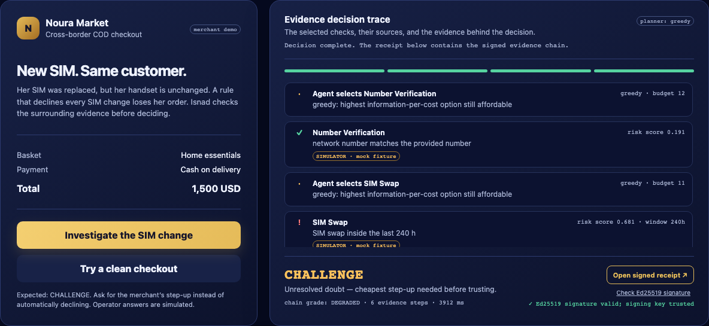
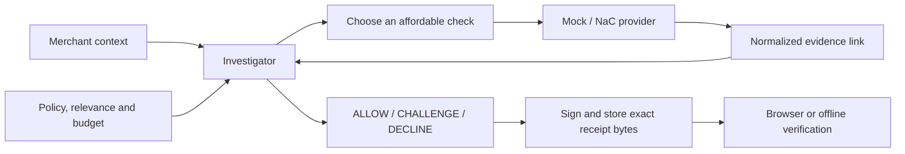

<div align="center">

# Isnad · إسناد

### A changed SIM should start an investigation.

**Network evidence → a checkout decision → a signed explanation.**

Built for the [MENA Ignite Hackathon](https://www.hackerearth.com/community/challenges/hackathon/mena-ignite-hackathon/)
using GSMA Open Gateway / CAMARA concepts and Nokia Network-as-Code.

[Run locally](#run-locally) · [How it works](#how-it-works) · [Evidence](#results-you-can-reproduce) · [Hackathon readiness](#hackathon-readiness) · [Developer guide](#developer-guide)

</div>

A customer replaces her SIM and places a high-value cash-on-delivery order.
A recent SIM change is a useful warning, but it does not tell the merchant
whether to reject a fraudster or inconvenience a legitimate customer.

**Isnad investigates that warning.** It selects relevant network checks within
a policy budget, combines adverse and supporting facts, and returns an action
with an Ed25519-signed evidence receipt. The merchant can inspect what was checked,
what remained unknown, and why the investigation stopped.



*Local product capture with simulated operator answers. The investigation and
receipt verification execute in the app. See the current build for the latest UI.*

## What the merchant receives

| Decision | Merchant action | What it means |
| --- | --- | --- |
| **ALLOW** | Proceed | The issuing policy permits the interaction on the gathered evidence. |
| **CHALLENGE** | Ask for additional verification | Evidence is incomplete, conflicting, or between decision thresholds. |
| **DECLINE** | Do not proceed | The gathered evidence meets the issuing policy's decline conditions. |

The **chain grade** describes evidence quality separately from the action.
An unavailable check is an evidence gap, not a failed identity check.
`confidence` is the API's legacy name for an **uncalibrated policy risk score**;
it is not a measured probability of fraud. [Score interpretation](docs/RISK_SCORE.md).

In the lead demo, the legitimate replacement yields **CHALLENGE / DEGRADED**:
six checks, score **0.242**, and a recommendation to use the merchant's existing
step-up process. The clean checkout yields **ALLOW / ATTESTED_FULL** after two
checks, score **0.096**. Isnad does not send an OTP itself.

## Run locally

**Requirements:** Python 3.11 or newer; Python 3.11 is the tested CI version.
No Nokia or model credentials are needed for the local demo.

```bash
python3.11 -m venv .venv311
.venv311/bin/python -m pip install -r requirements-dev.txt

ISNAD_DEMO_MODE=true ISNAD_PROVIDER=mock ISNAD_PLANNER=greedy \
ISNAD_DATABASE_URL=sqlite:///./isnad-demo.db \
ISNAD_VAULT_KEY_PATH=.isnad/demo-vault-key.pem \
ISNAD_MERCHANT_API_KEYS=demo-merchant-key \
ISNAD_VAULT_TRUSTED_PUBLIC_KEYS=4034e169495122a893d8fe6738c2b0f54655fdfb6ec3c6d0eeb938d1330e7f9f \
  .venv311/bin/python -m uvicorn app.main:app \
  --host 127.0.0.1 --port 8010 --workers 1 --no-access-log
```

Open **[Judge Mode](http://127.0.0.1:8010/judge)**. The command uses a separate
demo database and signing key. The long public key trusts the bundled demo
registry; it is not a private signing credential. Keep the generated signing key
if you want receipts to retain signer trust across restarts.

### The 90-second walkthrough

1. Run the **SIM replacement** scenario. Follow six checks to CHALLENGE.
2. Open its **signed receipt**. Verify it, alter a byte, and restore the original.
3. Run the **clean checkout**. Watch policy stop after two supporting checks.
4. Open the **[lab](http://127.0.0.1:8010/lab)** to explore recorded outage and
   counterfactual cases without buying additional checks.

[Presenter script](docs/JUDGE_WALKTHROUGH.md) ·
[Advanced console](http://127.0.0.1:8010/console) ·
[API documentation](http://127.0.0.1:8010/docs)

The lab replays versioned synthetic recordings. It reports drift between the
recording and the current policy/code; selecting a case does not run a model
or contact an operator.

## Integrate from a merchant backend

```bash
curl http://127.0.0.1:8010/v1/verify \
  -H 'Authorization: Bearer demo-merchant-key' \
  -H 'Content-Type: application/json' \
  -d '{
    "phone_number": "+962790000006",
    "context": {
      "event": "checkout",
      "payment_method": "cod",
      "account_age_days": 0,
      "amount": {"value": 1500, "currency": "USD"},
      "claimed_location": {"lat": 31.9539, "lon": 35.9106, "radius_m": 2000}
    }
  }'
```

Selected response fields for that mock/greedy fixture:

```json
{
  "decision": "CHALLENGE",
  "chain_grade": "DEGRADED",
  "confidence": 0.242,
  "planner": "greedy",
  "evidence_steps": 6,
  "provider_sources": ["mock"],
  "chain_id": "chn_…"
}
```

The coordinates are a **claim supplied by the caller**, not a retrieved handset
location. Without a claim, Location Verification returns `EVIDENCE_UNAVAILABLE`
in both mock and NaC adapters. Keep merchant and provider credentials on the
backend; the browser should receive only the result and authorized flow data.

## How it works



1. **Form a hypothesis** from the interaction context.
2. **Select evidence** using Gemini by default, or explicitly selected offline greedy planning.
3. **Normalize provider answers** into the same `EvidenceLink` vocabulary.
4. **Apply policy** to update the score, account for cost, and require relevant
   supporting evidence before allowing a suspicious interaction.
5. **Stop or corroborate** according to the score, remaining budget, and evidence gaps.
6. **Sign the result**, including ordered evidence, issuing thresholds, and keyed
   subject/request commitments.

| Responsibility | Implementation |
| --- | --- |
| Evidence selection and stopping | [Investigator](app/agent/investigator.py), [planners](app/agent/planner.py) |
| Weights, thresholds, relevance and normalized costs | [Policy](app/policy/policy.yaml) |
| Mock/live normalization | [Providers](app/providers), [shared vocabulary](app/providers/vocabulary.py) |
| Merchant-facing explanation | [Presentation](app/presentation.py) |
| Exact-byte signing and receipt retrieval | [Vault](app/chain/vault.py), [receipt API](app/api/routes_receipt.py) |
| Consent ownership, replay and cached completion | [Consent routes](app/api/routes_consent.py) |
| Merchant challenge/outcome reference integration | [Pilot harness](demo/merchant_pilot/app.py) |

The model can choose checks or STOP; it cannot waive policy gates. Greedy takes over only when no model answer is available (missing key,
transport failure, or empty candidate). Returned invalid output, explicit
rejection, and the model call limit stop selection. Output records the source
that actually ran. Required checks can still be selected by policy. Costs are
normalized units, not quoted operator prices.

### What a signature proves

The browser and offline verifier check the **exact stored payload bytes** with
Ed25519. They separately report signature validity and trust in the issuing key.
Changing a signed byte invalidates the signature. A later policy change does
not rewrite an issued receipt.

A valid signature proves issuance/integrity. It does **not** establish the truth
of an upstream answer. A signed mock receipt stays visibly mock. Expiring shared
summaries are separately signed attestations, not the original full receipt.

## What is simulated, and what is connected?

| Mode | Source | Suitable use |
| --- | --- | --- |
| `mock` | Authored network-answer fixtures | Repeatable local demo, tests, evaluations |
| `nac_fake` | Local fake operator and OAuth/OIDC lifecycle | Consent and merchant integration testing |
| `nac` | Nokia Network-as-Code adapter | Configured, authorized operator/simulator trials |
| `hybrid` | Explicitly allowlisted NaC checks plus mock checks | A mixed-provenance demo, labeled per link |

Mock answers go through the real investigator, grading, budget, and signing
code. They are not prewritten verdicts. Judge Mode adds **650 ms per check** for
readability; neither that pacing nor the scripted link timings measures operator
performance. Failed live checks never silently become successful mock answers.

**Implemented:** NaC adapter, server-side code exchange, OIDC validation,
merchant-scoped consent, cached result recovery, merchant-reported challenges
and outcomes, and trust-session continuity controls.

**Still unproven:** a physical handset/operator consent round trip. Historical
NaC captures are available in [docs/nac](docs/nac); the
[capability manifest](app/nac_capabilities.json) records their limitations.
A fresh hosted-simulator run is a separate milestone from physical handset proof.

## Results you can reproduce

The **6 September 2026** review passes **886 tests**, Ruff, the runtime lock
check, and a standalone wheel smoke test. See the
[review record](docs/REVIEW_2026-09-06.md) for fixes and verification limits.

| Synthetic evaluation | Calls | Decision tradeoff |
| --- | --- | --- |
| Policy-generated cases | **58 vs 119** when checking every fact; 51% fewer | 0/10 customer-case declines; 1/7 two-adverse cases allowed |
| Fixed, separately authored 13-case set | **38 vs 78**; 51% fewer | 5/13 CHALLENGE; 3 disagreements with conservative authored expectations |

These are fixture results, not measured fraud accuracy or saved revenue.
The current relevance gate buys more evidence than the earlier 28-call result,
while reducing authored-expectation disagreements from six to three. No fixture
labels were retuned for this review. [Methods, cases and limitations](docs/INDEPENDENT_EVALUATION.md).

```bash
.venv311/bin/python -m pytest -q
.venv311/bin/python -m ruff check app tests scripts demo
.venv311/bin/python scripts/verify_runtime_lock.py
.venv311/bin/python scripts/evidence_pack.py --output-dir /tmp/isnad-evidence
.venv311/bin/python scripts/independent_evaluation.py
.venv311/bin/python scripts/false_decline_baseline.py --sweep
.venv311/bin/python scripts/handset_validation.py contract
```

The evidence pack runs five scenarios, persists chains in an isolated in-memory
database, and verifies their signatures. Tests pin mock/greedy settings. JavaScript
poll-loop regression coverage runs when Node.js is available. The handset
`contract` command is local validation, not an operator trial.

## Hackathon readiness

GSMA's [official challenge overview](https://www.gsma.com/solutions-and-impact/gsma-open-gateway/gsma_events/gsma-mena-ignite-open-gateway-hackathon/)
requires CAMARA network APIs **and AI** to address regional problems. Isnad's
checkout investigation fits digital identity and fintech anti-fraud themes.
The deterministic demo alone does not demonstrate a live AI model or live network.

The highest-value next steps are:

1. **Capture one bounded model-planner run.** Show selected checks, STOP/fallback,
   actual model configuration, and the final policy-controlled receipt.
2. **Capture a fresh Nokia hosted-simulator run.** Label subscriber answers as
   synthetic; record each action's supported/unsupported status and provenance.
3. **Tell one complete merchant story.** Replacement → CHALLENGE → merchant-reported
   verification → order decision. Keep the original signed verdict unchanged.
4. **Package a short demo video and reproducible evidence.** Explain both the call
   savings and the remaining expectation disagreements.
5. **Validate a supported handset** when operator access and consent prerequisites
   are available. This is the next integration proof, not an accomplished milestone.

[Detailed priorities and review](docs/REVIEW_2026-09-06.md) ·
[Current state](docs/CURRENT_STATE.md) ·
[Implementation handoff](docs/PHASE2_HANDOFF.md) ·
[Handset procedure](docs/HANDSET_VALIDATION.md)

## Developer guide

| Task | Command / reference |
| --- | --- |
| Bootstrap the environment used by Make | `make setup` (defaults to `python3.11`; override with `PYTHON`) |
| Run tests / scenarios | `make test` / `make demo` |
| Serve configured API | `make run` (port 8000; set demo variables explicitly for judge scenarios) |
| Refresh recorded lab bundle | `.venv311/bin/python scripts/build_lab_artifacts.py` |
| Build an installable wheel | `.venv311/bin/python -m pip wheel . --no-deps -w /tmp/isnad-wheels` |
| Audit installed dependencies | `make audit` |
| Configure integrations | [.env.example](.env.example), [handset guide](docs/HANDSET_VALIDATION.md) |
| Run the separate merchant harness | [P4a integration record](docs/P4A_IMPLEMENTATION_RECORD.md) |

Application code lives in `app/`, scenario tooling in `demo/`, reproducible
experiments in `scripts/`, and regression coverage in `tests/`. The package
includes its UI, policy, signed demo registry, locale dictionaries, and lab recordings.

### Operational boundaries

Use **one worker and one replica**: consent, sessions, event fan-out and parts of
idempotency are process-local. A reachable deployment needs HTTPS, private
credentials, a registered consent callback, persistent signing material, and
appropriate migrations. The merchant harness is a local/private reference app,
not a production storefront.

The harness purges idle flows and sessions every 30 seconds by default. Terminal
flows discard authorization links and QR data. A completed flow retains its
phone server-side for at most five minutes to open a continuity session, then
clears it; opening the session clears it immediately. Existing order sessions
cannot be replaced by repeatedly pressing the button.

| Symptom | Check |
| --- | --- |
| Demo routes are unavailable | Restart with `ISNAD_DEMO_MODE=true`. |
| API returns 401 | Match the Bearer key to `ISNAD_MERCHANT_API_KEYS`. |
| Registry signer is untrusted | Use the bundled public-key pin from the local command, or your own signed registry and trust configuration. |
| Lab says its recording is stale | Regenerate the bundle; inspect its policy/code identity before presenting it. |
| Location check is unavailable | Supply a valid claimed area; no claim means there is nothing to verify. |
| Model label says greedy/policy | Inspect the recorded selection source and fallback diagnostic; configuration alone does not prove an LLM ran. |

This repository is a hackathon prototype. Production decision quality, operator
coverage, Arabic wording review, and real merchant impact remain validation work.
