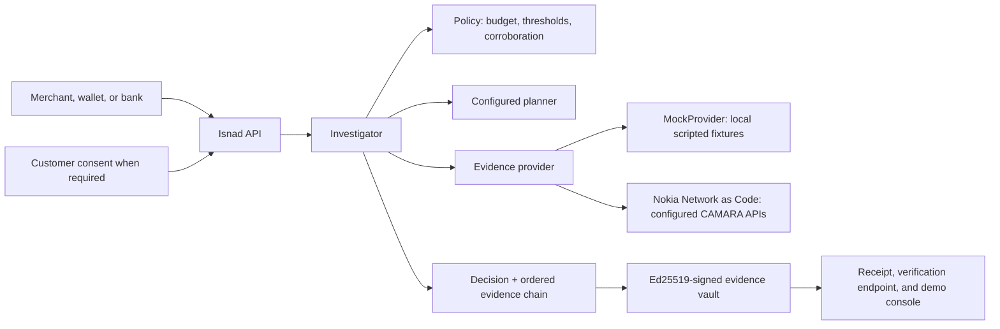

<div align="center">

# Isnad

### Network-verified trust decisions, with the chain of evidence attached

[](https://github.com/AhmadShadeed32/isnad/actions/workflows/ci.yml)


</div>

## The customer this is built for

She loses her phone and replaces her SIM. Her bank sees a SIM change, the card
network sees a new device, the merchant sees a first-time customer paying on
delivery — and every one of those systems does the safe thing and says no.
**The signal that catches an account takeover is the same signal a stolen phone
produces.**

Isnad decides how much network evidence a risky interaction actually needs,
buys only that much, and returns `ALLOW` / `CHALLENGE` / `DECLINE` together with
the ordered, signed chain of evidence that produced it.

This is a hackathon prototype, and the README is written to be *checked*: every
claim below names the script that reproduces it, and every surface labels where
its evidence came from.

---

## Quick start

```bash
pip install -e ".[dev]"
pytest -q
python scripts/evidence_pack.py     # writes JSON + Markdown reports to .isnad/
```

Then open the console:

```bash
ISNAD_DEMO_MODE=true ISNAD_MERCHANT_API_KEYS=demo-merchant-key \
  uvicorn app.main:app --host 127.0.0.1 --port 8010 --proxy-headers
```

[Judge Mode](http://127.0.0.1:8010/judge) runs the 90-second customer checkout —
evidence trace, signed receipt, and the simulator-only trust-revocation beat.
[The full console](http://127.0.0.1:8010/console) plays every stage act. Both
surfaces show which provider is answering.

---

## The idea, in one line

**"We could not check" and "the check failed" are two different facts** — and
every stack that collapses them into one score manufactures false declines.
Merchants falsely decline **2–10% of all eCommerce orders, and one in five
decline more than 10%** (Merchant Risk Council, *Global eCommerce Payments &
Fraud Report* 2024/25 — an industry body surveying merchants, not a vendor
selling the fix).

So Isnad grades every chain on what it could actually establish:

| Grade | Means |
| --- | --- |
| `ATTESTED_FULL` / `ATTESTED_PARTIAL` | The network answered. |
| `UNRESOLVED` | The network could not be asked, or consent was withheld. |
| `DEGRADED` | Answered, but with evidence missing or stale. |
| `REFUTED` | The network answered against the subject. |

An `UNRESOLVED` link stays unresolved. It can never later be read as a pass.

## Two invariants the decision flow always holds

Evidence selection is free to choose the route. It gets no vote on these:

1. **Corroborate before declining.** When belief turns adverse, an exculpatory
   check named by policy is attempted first. One adverse signal never carries a
   decline alone. *(This is the gate that saves the customer above.)*
2. **An allow rests on a network fact.** Local evidence alone cannot buy an
   `ALLOW`; the chain must hold a supporting fact the network returned. *(This
   is the gate that stops a stolen API key talking its way to an instant pass.)*

---

## Measured, not asserted

### Same verdicts, shorter route

`scripts/planner_divergence.py` reproduces this. Across the scripted scenarios,
comparing the two available decision strategies:

| Measure | Result |
| --- | --- |
| Same decision state, both planners | **12/12 chose a different next check** |
| Different evidence path | **4/5 scenarios** |
| Different verdict or chain grade | **0/5** |
| Paid network checks to reach them | **17 → 14 (−18%)** |

Policy owns the verdict; evidence selection owns the route. Five scripted
scenarios and one run — a strategy comparison, not an accuracy study.

### Against the decision rules it replaces

`scripts/false_decline_baseline.py` compares Isnad with the two rules real
systems use, on a population generated from `policy.yaml`'s own signal
vocabulary — one case per adverse signal, one per unanswerable check, every pair
of strong adverse signals, and a multi-adverse control. Both baselines are given
the **full** evidence set, not the subset Isnad chose to buy.

| Rule | False declines |
| --- | --- |
| `single-signal` — any flagged check, decline | 5 of 10 |
| `collapse-unknowns` — any flagged *or unanswered* check, decline | 10 of 10 |
| **Isnad** | **0 of 10** |

Network checks bought: run-everything **119**, Isnad **58** — **51% fewer**.

**Against a stack that scores a missing check as a failed one, Isnad avoids
ten of ten false declines while buying half the network calls.**

### The dial, and where it is set

The same harness reports the other side of the trade. Of 7 cases where two
independent checks disagree with the customer, Isnad **allows 1** at the shipped
threshold: it had already formed a confident-clean belief on cheaper evidence
and stopped, and an unbought signal cannot move a verdict. That is the budget
working as designed — and it is a dial. `--sweep` prints the curve:

| `allow_below` | false declines | corroborated-adverse allowed | checks |
| --- | --- | --- | --- |
| 0.15 (shipped) | 0/10 | 1/7 | 58 |
| 0.10 | 0/10 | 1/7 | 59 |
| 0.05 | 0/10 | 0/7 | 82 |

One line in `policy.yaml` per row — no code, no retraining. A merchant picks the
point that matches what a lost customer costs them: tightening to 0.05 closes
the last corroborated-adverse allow and buys 24 more network checks to do it.

> [!NOTE]
> Scripted fixtures over a generated population, one run. These figures compare
> decision policy against stated baselines. They are not an accuracy study and
> claim no real-world decline rate.

---

## What you get back

Isnad is an HTTP API; the console is a client of it. This is Act VI — a customer
who really did replace a SIM — captured verbatim from a local run rather than
written by hand:

```bash
curl -X POST http://127.0.0.1:8010/v1/verify \
  -H 'authorization: Bearer <your merchant key>' \
  -H 'content-type: application/json' \
  -d '{"phone_number":"+962790000006",
       "context":{"event":"checkout","payment_method":"cod",
                  "account_age_days":0,"amount":{"value":1500}}}'
```

```json
{
  "decision": "CHALLENGE",
  "planner": "llm",
  "chain_grade": "DEGRADED",
  "confidence": 0.28,
  "hypothesis": "account_takeover",
  "reason": "Unresolved doubt — cheapest step-up needed before trusting.",
  "chain_id": "chn_0adbfd38b72e4589a682",
  "chain": [
    {
      "step": 1,
      "action": "sim_swap",
      "api": "SIM Swap",
      "result": "FLAG",
      "signal": "SIM_SWAPPED",
      "detail": "SIM swap inside the last 240 h",
      "consent_basis": "3-legged CIBA token",
      "source": "mock",
      "requires_consent": false,
      "latency_ms": 90,
      "max_age_hours": 240.0,
      "delta_logodds": 2.2
    },
    {
      "step": 2,
      "action": "device_swap",
      "api": "Device Swap",
      "result": "PASS",
      "signal": "DEVICE_STABLE",
      "detail": "no device swap in the last 240 h",
      "consent_basis": "3-legged CIBA token",
      "source": "mock",
      "requires_consent": false,
      "latency_ms": 135,
      "max_age_hours": 240.0,
      "delta_logodds": -0.5
    },
    {
      "step": 3,
      "action": "location_verify",
      "api": "Location Verification",
      "result": "PASS",
      "signal": "AT_CLAIMED_LOCATION",
      "detail": "device is at the claimed location",
      "consent_basis": "3-legged CIBA token",
      "source": "mock",
      "requires_consent": false,
      "latency_ms": 45,
      "max_age_hours": 1.0,
      "delta_logodds": -1.2
    },
    {
      "step": 4,
      "action": "number_verify",
      "api": "Number Verification",
      "result": "PASS",
      "signal": "NUMBER_MATCH",
      "detail": "network number matches the provided number",
      "consent_basis": "simulator authorization",
      "source": "mock",
      "requires_consent": false,
      "latency_ms": 45,
      "max_age_hours": null,
      "delta_logodds": -1.2
    }
  ],
  "evidence_cost": 8.0,
  "latency_ms": 4983,
  "evidence_steps": 4,
  "provider_sources": [
    "mock"
  ],
  "alternative": {
    "isnad_calls": {
      "value": 4.0,
      "basis": "measured",
      "source": "this chain"
    },
    "otp_cost_usd": {
      "value": 0.4429,
      "basis": "list_price",
      "source": "Twilio published SMS list price for JO"
    },
    "false_decline_cost_usd": {
      "value": null,
      "basis": "unpriced",
      "source": "Merchant-specific and not publicly sourceable; set pricing.false_decline_cost_usd in policy.yaml from your own basket value, margin and lifetime value."
    }
  }
}
```

A rules engine sees `SIM_SWAPPED` and declines. Isnad keeps going, finds the
handset unchanged and the device where the customer says it is, and steps up
instead of losing them. Note the order: it opened on the check that could
settle the hypothesis, not the cheapest one, and stopped after four. The
fields that carry all that:

| Field | What it is for |
| --- | --- |
| `decision` | `ALLOW` / `CHALLENGE` / `DECLINE` — the only field you have to act on |
| `planner` | Which strategy chose the route, `llm` or `greedy`. Recorded per verdict, because a planner call that timed out and fell back is greedy answering in the model's name |
| `chain_grade` | What the evidence could establish, kept separate from the decision. `DEGRADED` here: answered, but adverse |
| `confidence` | P(fraud) after the chain, against the `allow_below` / `decline_above` you set |
| `chain[]` | Every check in order — signal, sentence, cost, and how far it moved belief |
| `max_age_hours` | The window the question actually covered. "SIM swap inside the last 240 h" is bounded, not dated, because CAMARA returns a boolean against that window |
| `delta_logodds` | How much this one link moved belief. The verdict is re-derivable from these |
| `source` | `mock` or `nac`, per link, so a scripted link can never be read as a network one |
| `evidence_cost` | Spend against the budget in `policy.yaml` |
| `alternative` | The OTP path this replaced, each figure labelled `measured`, `list_price`, `estimate` or `unpriced`. Merchant-specific numbers stay `null` rather than guessed |

`chain_id` is the receipt. `GET /v1/chains/{id}/verification` recomputes the
Ed25519 signature over the stored chain and `GET /v1/receipts/{id}` renders it
for a phone — neither needs your API key, so anyone you hand the link to can
check the verdict was not edited afterwards.

## Demo scenarios

| Scenario | What it demonstrates | Intended decision |
| --- | --- | --- |
| Act I — clean signup | A supporting network fact can avoid OTP friction. | `ALLOW` |
| Act II — takeover risk | Multiple adverse facts are corroborated before stopping a high-risk checkout. | `DECLINE` |
| Act III — thin-file customer | Stable network evidence can support a low-friction decision. | `ALLOW` |
| Act V — evidence gap | Missing consent or provider evidence is uncertainty, not a false decline. | `CHALLENGE` / `UNRESOLVED` |
| Act VI — recent SIM change | A risk signal is investigated and stepped up rather than auto-rejected. | `CHALLENGE` / `DEGRADED` |

## What makes it different

- **Evidence-aware orchestration** — Isnad chooses the next affordable, relevant
  check and stops once policy has enough. A recent SIM change gets corroborated,
  not auto-declined.
- **Honest uncertainty** — unavailable evidence or withheld consent produces
  `CHALLENGE` / `UNRESOLVED`, never a fabricated pass or failure.
- **Verifiable receipts** — chain, decision, planner label, and subject binding
  are signed with Ed25519 and can be re-checked later.
- **Trust that can expire** — an accepted session can be rechecked and revoked
  when a scripted SIM or device change occurs.

---

## Architecture



Both providers travel the same investigator path. `MockProvider` gives
repeatable local demonstrations; `NacProvider` runs against sandbox credentials
and the applicable user consent.

### The evidence pack

`python scripts/evidence_pack.py` forces the local mock provider and the
deterministic planner before application code loads, runs five scripted cases,
persists each chain, recomputes its signature, and writes:

- `.isnad/evidence-pack/evidence-pack.json` — machine-readable scenario,
  evidence, provenance, signature, and counterfactual fields.
- `.isnad/evidence-pack/evidence-pack.md` — a concise review table.

The report states on its face that it contains local fixtures only. It calls
neither Nokia Network as Code nor an external decision service.

---

## Running against the live network

`ISNAD_PROVIDER=nac` reaches Nokia Network as Code from a non-demo deployment
with generated merchant credentials, a mounted vault key, a persisted pepper,
and an HTTPS consent callback. It is billable, and it carries no public demo
token and no scripted fallback by design:

```bash
export ISNAD_MERCHANT_API_KEYS=$(python3 -c 'import secrets; print(secrets.token_urlsafe(32))')
export ISNAD_SUBJECT_PEPPER=$(python3 -c 'import secrets; print(secrets.token_urlsafe(32))')
ISNAD_DEMO_MODE=false ISNAD_PROVIDER=nac \
  ISNAD_VAULT_KEY_PATH=/absolute/persistent/vault-key.pem \
  ISNAD_NAC_REDIRECT_URI=https://isnad.example/v1/consents/number-verification/callback \
  uvicorn app.main:app --host 127.0.0.1 --port 8000 --no-access-log --proxy-headers
```

A provider failure becomes unresolved evidence — it never becomes a fixture
result. The stage console stays fully scripted, so a public demo control can
never authorize live spend; recorded NaC captures may be shown beside it as
historical evidence.

## What is real

Everything that reaches a decision is real code, running under 493 tests: the
evidence-selection loop, the policy engine, the budget and early stopping, chain
grading, Ed25519 signing and verification, the signed institution registry,
Tier 1 screening, and session revocation. The Nokia Network as Code adapter is
real too — `docs/nac/` holds eight captured CAMARA responses it produced.

The one thing a demo supplies locally is the operator's answer. **The
investigator path is identical either way**: the same planner, the same policy,
the same signed chain. Switching `ISNAD_PROVIDER=mock` to `nac` changes where an
evidence link comes from and nothing about how the decision is reached — which
is why a fixture run is worth watching. You are watching the production code.

| | |
| --- | --- |
| **The engine** | Real, and the same in both modes. Nothing in the decision path is stubbed. |
| **The network** | The NaC adapter is real and exercised. `ISNAD_PROVIDER=nac` calls Nokia live from a non-demo deployment; a provider failure becomes unresolved evidence, never a fixture result. |
| **The evidence, on stage** | Deterministic local fixtures, so an act replays identically in front of a judge. Every link carries its own `source`, so a scripted link cannot be read as a network one. |
| **Deliberately not claimed** | Accuracy, latency, production coverage, an operator contract. The figures above are decision-policy measurements and are labelled as such. |

CAMARA maturity, read from the specification repositories rather than recalled:
SIM Swap and Number Verification are **Incubating** (both v2.1.0, Number
Insights sub-project); VerifiedCaller is **Sandbox**, 0.1.0 in its current
release with a 0.2.0 alpha in pre-release, and does not yet belong to a
sub-project. Building on a Sandbox API is a position, not an accident: we are
early to that one, not late.

## Boundaries

- **Deterministic first.** The optional remote decision service answers about
  half the time under bursty sequential calls; every failure falls back to the
  deterministic strategy, and the verdict records which strategy ran. Demos use
  the deterministic path.
- **Sourced figures only.** No MENA-specific fraud figure appears anywhere,
  because none is published. US and UK regulator data is used only where it can
  be labelled a proxy.
- **Unpriced beats guessed.** Counterfactual pricing is `null` where no
  defensible public figure exists, and renders as "not priced —
  merchant-specific".
- **A link can only say what the network said.** Every evidence sentence comes
  from one table, `app/providers/vocabulary.py`, shared by the mock and the live
  NaC adapter. CAMARA SIM Swap and Device Swap answer a boolean against the
  `max_age` we send, so a link says "SIM swap inside the last 240 h" and never
  "the swap was 41 minutes ago". A test fails the build if a fixture invents one.
- **Device Intelligence is unresolved, not trusted.** Nokia Network as Code
  exposes no device-reputation product, so the agent cannot buy that check and
  no chain carries a reputation verdict. It stays priced in `policy.yaml` for the
  provider that could one day answer it.
- **Next: consent on a handset.** Number Verification's consent round trip is
  built but not yet exercised on real hardware, so it is not presented as
  working.
- **Receipts prove issuance.** A signed receipt shows that this Isnad instance
  issued the stored chain; fixture data stays fixture data.
- **Live deployments bring their own keys.** Generate merchant keys and mount a
  persisted signing-key volume (see the command above); the sample demo key is
  public and belongs to the demo. A production consent callback needs a public
  HTTPS URL registered with the provider — localhost is for local development.

---

## Useful endpoints

| Endpoint | Purpose |
| --- | --- |
| `POST /v1/verify` | Run a forward trust investigation. |
| `GET /v1/chains/{id}/verification` | Recompute the stored chain signature. |
| `POST /v1/reverse-verify` | Check an incoming caller's claimed identity. |
| `POST /v1/sessions` | Create a time-limited trust session that can be revoked. |
| `GET /console` | Open the local stage console. |
