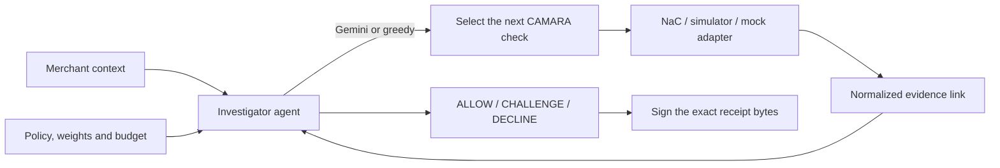

# Isnad · إسناد

### An agentic trust engine that asks the network before a merchant loses a customer.

**GSMA MENA Ignite Hackathon 2026 · Theme 4 — Secure Fintech, Payments & Anti-Fraud Innovation**
Built on GSMA Open Gateway CAMARA APIs via the Nokia Network-as-Code platform.

| | |
| --- | --- |
| **Team** | Ahmad Shadeed (lead) · Yousef Al Masri — Princess Sumaya University for Technology, Amman, Jordan |
| **Judges start here** | **[submission/JUDGE_GUIDE.md](submission/JUDGE_GUIDE.md)** — ten steps, ~20 minutes, one optional key |
| **Try it live** | **<https://ahmadshadeed32-isnad-trust-engine.hf.space/judge>** — no install or sign-in. Mock evidence by default; an organizer code unlocks real Nokia simulator calls. A site Gemini key is configured; select **Greedy** for deterministic runs |
| **Run it now** | `make setup && make judge` → <http://127.0.0.1:8010/judge> |
| **CAMARA APIs integrated** | 8 on Nokia Network-as-Code — 4 exercised against Nokia's hosted simulator, the rest against the sandbox, all recorded |
| **AI agent layer** | Gemini chooses which network check to buy next; policy decides what the answer means |
| **Verification** | 1,458 non-browser checks and 147 browser checks passed on 11 September 2026 (1,442 and 135 in the 9 September release review); deployed mock and real Nokia browser smoke checks also passed. Scope and results: [`docs/RELEASE_VALIDATION_2026-09-09.md`](docs/RELEASE_VALIDATION_2026-09-09.md), with its 11 September addendum |
| **Submission package** | [`submission/`](submission/) — idea capture, pitch deck and virtual demo, all regenerated 11 September 2026 against the deployed build. Index: [`submission/README.md`](submission/README.md) |
| **Demo video** | [`submission/isnad-demo.mp4`](submission/isnad-demo.mp4) — 2:55, rebuilt 11 September 2026. Real screen capture of this build at natural speed: the checkout, a receipt whose signature visibly fails after one byte is changed, and a judge minting a merchant API key on `/api-keys`. The **narration is synthesised speech**, disclosed on screen in every frame. How it was made, and what the 3:39 cut it replaced got wrong: [`docs/VIDEO_REBUILD.md`](docs/VIDEO_REBUILD.md) |

---

## The problem

Fake orders can waste delivery costs. Automatically declining legitimate
customers loses sales. Isnad investigates a SIM change before deciding whether
to allow, challenge, or decline a checkout.

Cash on delivery makes both sides of that expensive: the order carries no
verified commitment at checkout, so a fake one costs a real delivery run — the
van, the driver, the fuel — and a wrongly declined one costs a real sale.

The usual defence is a rule: *SIM changed recently → decline*. A SIM change on
its own does not distinguish a takeover from a customer who replaced a lost
phone: the same signal is produced by both. A rule that declines on it alone
therefore pays twice — once for the fraud it misses on other paths, once for
the legitimate customers it turns away.

What a network check can contribute that a soft proof cannot is a physical
constraint: whether this SIM is in this handset, reachable on this network, in
this place, right now. Isnad's claim is narrow and is the one it can
demonstrate — that a SIM change is worth *investigating* with those checks
before it is acted on, and that the investigation should be inspectable and
signed.

> **On numbers.** Earlier drafts of this README carried a market statistic for
> cash-on-delivery share, and several categorical claims about what generative
> AI has broken, what most SIM replacements are, and what CAMARA is first to
> do. None of them had a dated primary source in this repository, so they have
> been removed rather than restated. Every quantitative claim that remains
> below names the command that produces it.

## What Isnad does

A merchant calls one endpoint at a moment of risk. An investigator agent forms
a hypothesis, buys the cheapest useful network evidence until the answer is
justified, and returns **ALLOW**, **CHALLENGE** or **DECLINE** with the full
chain of reasoning attached and an Ed25519 signature over it.

The name is literal. *Isnad* (إسناد) is the classical chain of transmission —
the thousand-year-old method of judging a report by scrutinising every link
that carried it. Every verdict reproduces that structure: Human → SIM → Device
→ Location → History, each link a specific CAMARA call, each shown with its own
provenance. The internet never got its isnad.


*Judge Mode, English. The same page in Arabic is
[here](docs/ui/release/judge-ar-replacement-1440.png) — full RTL layout, with
the composed verdict paragraph still untranslated and a banner on the page
saying so. Both screenshots are regenerated by the browser test suite on every
run, so they cannot drift from the build.*

## Try it in three minutes

Requires **Python 3.11**. No Nokia or Google credentials — this path is fully
offline and deterministic.

```bash
make setup      # creates .venv311, installs dependencies
make judge      # serves the reviewer demo on 127.0.0.1:8010
```

Then open <http://127.0.0.1:8010/judge> and press **Investigate the SIM change**.

Expected: five CAMARA checks, an uncalibrated policy score of **0.322**, a
**CHALLENGE / DEGRADED** verdict, and a signed receipt that verifies in the
browser. `make judge` writes to its own database and its own signing key, so it
cannot disturb anything else on the machine.

Five surfaces are served:

| URL | What it is |
| --- | --- |
| `/judge` | The merchant story: one checkout, the agent's reasoning, the verdict, the receipt |
| `/api-keys` | Mint a merchant API key behind the organizer's access code and call `/v1/verify` from a terminal |
| `/lab` | Recorded cases replayed side by side against alternative strategies |
| `/console` | The full operator console — live SSE trace, caller screening, session controls |
| `/docs` | OpenAPI, interactive, enabled in demo mode |

The step-by-step verification path, including tampering with a receipt to watch
the signature fail, is in **[submission/JUDGE_GUIDE.md](submission/JUDGE_GUIDE.md)**.

## The AI agent layer

The hackathon requires an AI agent that orchestrates CAMARA APIs as trusted
real-time data sources rather than as buttons. In Isnad the model's job is
**selection under a budget**, and the boundary around it is deliberate.

**What the agent decides.** Given the request context, the hypothesis it has
formed, the evidence gathered so far and the remaining budget, Gemini picks the
next CAMARA action — or STOP. Each selection carries the model's own rationale,
which is displayed in the trace rather than summarised away.

**What the agent cannot decide.** It cannot waive a policy gate, invent
evidence, change a weight, exceed the budget, or reach a verdict. Policy grades
the evidence; the model only chooses what to buy. A model that returns
malformed output is rejected and recorded as rejected, not quietly obeyed.

**How a reviewer runs it without our key.** The `/judge` page's **Demo
settings** disclosure holds a panel that takes a Gemini key of your own. Two
storage locations, with different lifetimes: the **browser** keeps it in that
tab's `sessionStorage`, so it survives a reload and is shared with the Console
and Lab in the same tab until the tab closes or you press *Forget key*; the
**server** keeps it nowhere at
all — it arrives as one request header, lives in a `ContextVar` reset in a
`finally`, and is never written to the database, into a signed receipt, to a
log, or echoed back. Any deployment that could spend money refuses the header
outright. Supplying a key also *selects* the model planner, so it
works on the offline demo without a restart. The guarantees are asserted in
[`tests/test_request_supplied_model_key.py`](tests/test_request_supplied_model_key.py),
not just described here.

**What happens when the model is unavailable.** Two distinct outcomes, and the
code keeps them apart. When *no answer arrived* — a missing key, a transport
failure, an empty response, or the shared hourly model quota exhausted — a
greedy information-per-cost planner selects, and the row names the condition
that allowed it. When *an answer arrived and was not usable* — output that
failed the schema, an explicit rejection, an unaffordable action, or the
per-investigation model call ceiling — model selection **stops** instead;
greedy does not substitute, because something did answer. The verdict records
which strategy actually ran, so a run never claims an LLM chose when it did
not. This is why `make judge`
uses `greedy`: a reviewer gets a byte-identical result every time. `make
judge-ai` runs the same demo with Gemini in the seat.

Here is a real run, recorded at
[`docs/nac/observations/2026-09-07-gemini-judge-run.json`](docs/nac/observations/2026-09-07-gemini-judge-run.json).
Four rows, and the architecture is visible in all four:

| Row | Chosen by | Sentence |
| --- | --- | --- |
| SIM Swap | `llm` | *"Checking for a recent SIM swap provides the highest relevant information value to investigate the account takeover hypothesis."* |
| Device Swap | **`policy`** | *"corroborate before this signal alone can decline"* |
| STOP | `llm` | *"None of the remaining affordable actions are relevant to assessing the account takeover hypothesis."* |
| Number Verification | **`policy`** | *"cheapest step that could resolve the doubt"* |

The model opened with a single adverse signal; policy would not let one signal
carry a decline, so it required corroboration. The model then said stop; policy
overruled it and bought the cheapest check that could resolve the doubt. The
trace names which of the two is speaking on every row.

It reached CHALLENGE / DEGRADED at 0.28 over four links. Greedy reaches
CHALLENGE / DEGRADED at 0.322 over five. Different strategies, different
evidence, same answer.

An earlier bounded rehearsal is at
[`2026-09-07-gemini-rehearsal.json`](docs/nac/observations/2026-09-07-gemini-rehearsal.json).

The agent layer uses exactly one tool from the hackathon's Resource & Tooling
Guide: **Google AI Studio (Gemini)**, which the guide lists as a free-tier
model API. There is no second model provider and no third-party agent
framework — the adapter is a direct REST client in
[`app/agent/gemini.py`](app/agent/gemini.py) over the project's existing
`httpx` dependency, chosen so that a missing SDK can never silently turn an
`llm` run into a greedy one.

## CAMARA APIs integrated

Eight CAMARA APIs have a working Nokia Network-as-Code adapter in
[`app/providers/nac.py`](app/providers/nac.py). The agent chooses which to call
at run time; policy assigns each one a cost and a weight in
[`app/policy/policy.yaml`](app/policy/policy.yaml).

| CAMARA API | Role in the evidence chain | Cost | Recorded against Nokia |
| --- | --- | ---: | --- |
| Number Verification | Proves the number belongs to this device. Replaces the OTP. | 1 | Sandbox, 30 Aug — the `CONSENT_REQUIRED` path |
| SIM Swap | The primary account-takeover signal. | 2 | **Hosted simulator, 6 Sept — 200** |
| Device Swap | The mule-phone signal. | 2 | **Hosted simulator, 6 Sept — 200** |
| Location Verification | Yes/no against an address the customer already claimed. Never a coordinate. | 3 | Sandbox, 30 Aug |
| Device Reachability Status | Bot-farm and burner patterns. | 2 | Sandbox, 30 Aug |
| Device Roaming Status | Impossible travel; also a stability proxy for thin-file approval. | 2 | Sandbox, 30 Aug |
| Number Recycling | Was this number reassigned to someone else? | 1 | **Hosted simulator, 6 Sept — 200, plus a 400 we now prevent** |
| Congestion Insights | Network *information*, never evidence about a person. | — | **Hosted simulator, 6 Sept — 200** |

A ninth, **Device Intelligence**, exists in the policy vocabulary and runs
under the mock provider, but has **no Nokia adapter**: the 30 August sandbox
capture returned `EVIDENCE_UNAVAILABLE`, so the NaC path returns unavailable by
construction rather than pretending to a reputation verdict nobody gave us. It
is listed here because leaving it out of the code would have been tidier than
leaving it in and saying why.

Two design decisions are worth a judge's attention:

**Congestion Insights is quarantined from the verdict.** A congested cell can
explain a slow or failed verification, so the judge page shows it — in a
separate panel that states it never changes the risk score and never waives a
check. Network conditions explain a measurement; they are not a fact about a
human being.

**Location Verification returns a boolean against a claim the customer already
made.** Isnad never receives or stores a coordinate. Without a claim on the
request, the check is skipped and zero SDK calls are made.

### What is real, and what is simulated

Judges should be able to tell these apart without reading code, so the UI
labels every row and this README will not blur them.

- **Real HTTP calls to Nokia's hosted simulator, recorded.** 14 authenticated
  requests on 6 September 2026 against `network-as-code.p-eu.apihub.nokia.io`,
  one line each — including the failures — at
  [`docs/nac/observations/`](docs/nac/observations/). Every request, status,
  duration and normalised result is there; no response bodies, no unmasked
  numbers.
- **Real Gemini calls, recorded.** The rehearsal above.
- **Simulated operator answers in the demo.** `make judge` runs authored
  fixtures through the *real* investigator, policy engine and signing vault.
  Every evidence row on screen is stamped `SIMULATOR · mock fixture`.
- **Not yet proven.** A physical handset completing an operator consent round
  trip. A congestion subscription create/callback cycle, which needs a
  registered public HTTPS callback. Measured fraud accuracy against real
  outcomes. These are named here because a judge who finds them unnamed is
  right to discount everything else.

The observations also record something inconvenient, which is the point of
recording them: for the same subscriber the simulator's `device_swap` boolean
said *swapped* while `device_swap_date` returned a date nineteen days earlier.
Isnad therefore never combines the two as if they described one event; it shows
both with separate provenance and says when they disagree.

### Judge-selectable mock and real NaC

**Deployed and checked on 9 September 2026.** The Hugging Face demo linked above
now serves the judge-selectable source. A project-agent browser walkthrough
completed both real Nokia simulator scenarios on that deployed URL, with
Gemini selections, signed receipts and zero-call replay. This is deployed
verification by the project's agent; an independent judge review remains pending.

On `/judge` a reviewer chooses an **Evidence source** before running:

| Choice | What happens | What it means |
| --- | --- | --- |
| **Mock — Nokia-compatible demo** (default) | The real Nokia SDK builds the request; a local transport answers with the pinned Nokia-shaped response; the shared adapter parses it. | Nokia-compatible responses simulated locally for demonstration. **No requests are sent to Nokia.** Gemini may still be used if selected. |
| **Real NaC — Nokia hosted simulator** | The same SDK and adapter send actual HTTPS requests to Nokia. | Actual requests to Nokia's hosted simulator using test numbers. Not a physical-handset verification. |

Both use the same investigator, policy, journal, receipt and signature. Every
result identifies its own source, and that source is **inside** the signed
bytes — not a label beside them.

**Why mock mode exists.** Repeatable judging and development without a Nokia
credential, network availability, or consuming Nokia allowance; controlled
failure rehearsal; and custom educational scenarios kept clearly separate from
the paired Nokia cases. It sends nothing to Nokia. Gemini is a separate choice
in either mode — **only mock evidence plus the Greedy planner is independent of
both services.**

**What the parity claim covers, exactly.** Two operations — SIM Swap `check`
and Device Swap `check` — at their pinned versions, for the two documented
simulator subscribers, both `true` and `false`. Coverage, sources, permitted
differences and the authored fault cases are in
[`docs/NAC_MOCK_PARITY.md`](docs/NAC_MOCK_PARITY.md). The adapter implements
eight actions; this demonstration exposes two; parity is verified for those two.
Those are different numbers and this README does not add them up.

**What was actually observed, on 9 September 2026.** Both paired scenarios ran
through the judge endpoint on a local instance: HTTP 200 from
`network-as-code.p-eu.apihub.nokia.io` for both swap checks, in the same run as
a genuine Gemini selection, with a signed receipt whose exact bytes verify and
whose tampered copy does not. Sanitized record:
[`docs/nac/observations/2026-09-09-judge-paired-rehearsal.json`](docs/nac/observations/2026-09-09-judge-paired-rehearsal.json).
Gemini chose the first check; policy choreography required the corroborating
second one — the run journal shows which was which, and neither is described
here as the other. Three further real runs were driven from the page itself
during the README-only walkthrough, recorded — with what is and is not provable
about each — in
[`…-judge-browser-real-runs.json`](docs/nac/observations/2026-09-09-judge-browser-real-runs.json).
**Five local rehearsal runs, ten outbound attempts** are recorded across those
two files.

**Deployed verification, separately recorded.** The reviewed release then ran
one contract-mock case and **two real Nokia cases, four HTTP 200 responses**, from
the Hugging Face `/judge` page. Both real cases recorded Gemini selections;
the adverse case's second check was required by policy. All three receipts
verified independently, rejected tampering, and replayed with no new transport
attempt or allowance consumption. The mock's two transport attempts were local
simulations and sent nothing to Nokia. Exact signed payloads, sanitized attempts
and journal selections are in
[`…-deployed-judge-smoke.json`](docs/nac/observations/2026-09-09-deployed-judge-smoke.json).
The signing identity is restored from a private Space Secret on restart;
the demonstration database and sessions remain ephemeral, so download receipts
you want to retain. Deployment and review details:
[`docs/RELEASE_VALIDATION_2026-09-09.md`](docs/RELEASE_VALIDATION_2026-09-09.md).

**What is still pending.**

- A physical handset completing an operator consent round trip.
- Any live-network (non-simulator) subscriber. The Nokia account is in
  Simulator mode; catalog visibility is not entitlement.
- An independent walkthrough of the deployed URL by someone other than this
  project's own agent.

Setup, limits and recovery: [`docs/NAC_SIMULATOR_SETUP.md`](docs/NAC_SIMULATOR_SETUP.md).

The guide also includes Nokia setup, merchant review after CHALLENGE, a fair
Gemini/Greedy comparison, failure recovery, a fresh judge walkthrough, and a
final consistency check across the app, documentation, deck, and video.

The [full documentation review](docs/NAC_DOCUMENTATION_REVIEW.md) covers all 50
public Nokia documentation pages, including consent, identity, callbacks, and
the API families beyond Getting Started. Extending the paired demo requires
verified schemas, SDK serialization, and independent contract tests for each
additional operation. The current parity report separates verified responses
from authored fault cases and documents permitted differences. Live failures
remain visible; switching to mock starts a separate labelled run.

Today's authored `MockProvider` fixtures demonstrate Isnad's behavior; they have
not been established as an exact copy of Nokia's HTTP responses. Custom stories,
including “new SIM, same handset,” remain explicitly labelled local
scenarios unless Nokia documents an equivalent. Neither a local mock nor a
hosted-simulator response is proof of a physical handset's network state.

## How the engine works



The investigator forms a hypothesis from the request — *new account + high
value + cash on delivery* reads as elevated takeover risk — then spends its
budget on the checks relevant to that hypothesis, stopping as soon as policy is
satisfied. Stopping early is a feature: the engine is built to gather the
minimum necessary evidence, not to assemble a surveillance profile.

A receipt signs the exact stored payload bytes and reports signer trust
separately from signature validity. A valid signature proves what Isnad issued
and that nothing changed since; it does not make an upstream answer true. **A
signed mock receipt is still mock**, and the receipt page says so.

## API example

```bash
curl http://127.0.0.1:8010/v1/verify \
  -H 'Authorization: Bearer demo-merchant-key' \
  -H 'Content-Type: application/json' \
  -H 'Idempotency-Key: readme-replacement-1' \
  -d '{
    "phone_number": "+99999991006",
    "context": {
      "event": "checkout",
      "payment_method": "cod",
      "account_age_days": 0,
      "amount": {"value": 1500, "currency": "USD"},
      "claimed_location": {"lat": 31.9539, "lon": 35.9106, "radius_m": 2000}
    }
  }'
```

```json
{
  "decision": "CHALLENGE",
  "chain_grade": "DEGRADED",
  "confidence": 0.322,
  "planner": "greedy",
  "hypothesis": "account_takeover",
  "reason": "Unresolved doubt — cheapest step-up needed before trusting.",
  "chain_id": "chn_…"
}
```

The full response carries every evidence link with its API, result, signal,
consent basis, source, latency and log-odds contribution.

`confidence` is a legacy field name for an **uncalibrated policy risk score** —
reproducible arithmetic over configured weights, not a measured probability of
fraud. `chain_grade` describes evidence quality separately from the decision,
so "we are confident and the evidence was thin" is expressible instead of being
averaged away. See [docs/RISK_SCORE.md](docs/RISK_SCORE.md).

Repeating an idempotency key with the same body replays the stored result; a
changed body or an in-flight request returns 409. The operation-to-chain
mapping is persisted in the same transaction as the signed receipt, so a crash
that leaves upstream work uncertain refuses the retry rather than paying for a
provider call twice.

## Evidence a judge can reproduce

Every number below comes from a command in this repository, run on 7 September
2026 against this commit.

```bash
make test                                   # includes backend and browser checks
.venv311/bin/python scripts/evidence_pack.py --output-dir /tmp/isnad-evidence
.venv311/bin/python scripts/independent_evaluation.py
```

**Five scenarios, five valid signatures**, from the evidence pack:

| Scenario | Decision / grade | Evidence links | Cost units |
| --- | --- | ---: | ---: |
| Clean signup, no OTP | ALLOW / ATTESTED_FULL | 2 | 3 |
| Corroborated account takeover | DECLINE / REFUTED | 4 | 10 |
| Thin-file customer | ALLOW / ATTESTED_FULL | 2 | 4 |
| Evidence unavailable | CHALLENGE / UNRESOLVED | 3 | 7 |
| SIM replacement | CHALLENGE / DEGRADED | 5 | 12 |

The fourth row is the one worth arguing about. *Evidence unavailable* returns
CHALLENGE, not DECLINE. A customer whose operator did not answer has not failed
a check, and Isnad refuses to say they did.

**Budget discipline**, from the 13-case evaluation against two alternative
strategies: **49 provider operations versus 78** — 34 evidence checks plus 15
swap-date enrichments — for six CHALLENGEs. Selection is not free: on this
authored set the greedy planner disagrees with four of the thirteen authored
expectations, three of them by being less conservative than the rule-based
comparator. Both halves of that trade are reported here because the expectations
are synthetic. Nothing in this repository measures real fraud outcomes.

## Scaling and commercial shape

**Nothing in this section is measured.** It is the intended shape of the
business, and it stays a hypothesis until the pilot in
[`docs/MERCHANT_PILOT_PLAN.md`](docs/MERCHANT_PILOT_PLAN.md) produces outcome
and cost data. In particular: **the 49-versus-78 figure is not money.** Those
are *provider operations* on a 13-case authored set, and the `cost` numbers in
`policy.yaml` are normalized budget units the policy uses to rank checks — not
Nokia's prices, not an invoice, and not convertible to one from anything in
this repository. No operator price list has been applied here.

The argument the budget rests on is structural rather than numeric: a fixed
pipeline that runs every API on every request spends the same on a clean
checkout as on a suspicious one, and an agent that stops when the answer is
justified does not. Whether the resulting difference is worth paying for is a
question for a merchant with real prices, and it has not been asked yet.

- **Merchants and couriers** — fewer fake and refused COD orders, and fewer
  vans sent to nobody.
- **Banks and wallets** — takeover defence at payout and password reset that
  does not depend on OTPs, selfies or documents.
- **Customers** — a legitimate SIM replacement gets a step-up instead of a
  decline; a clean signup gets no OTP at all.
- **Financial inclusion** — thin-file customers with no bank record are
  assessed on SIM tenure and location stability. Most fraud tools shrink a
  market. This one is designed to grow one.
- **Operators** — a measurable revenue line for CAMARA, and a recurring reason
  for merchants to consume network capability.

One engine serves the adjacent theme too: Theme 1's cross-border identity
verification is the same evidence chain with a different hypothesis.

## Repository map

| Path | Responsibility |
| --- | --- |
| `app/agent/` | Investigator, Gemini and greedy planners, hypothesis and belief model, explanations |
| `app/policy/` | Evidence weights, thresholds, relevance, budget — `policy.yaml` is the tunable surface |
| `app/providers/` | Nokia NaC, mock and fake-operator adapters, and the normalization between them |
| `app/chain/` | Evidence chain construction, subject binding, Ed25519 vault |
| `app/api/` | HTTP routes, authentication, rate and body limits, UI delivery |
| `app/static/` | Judge, console, lab, receipt and privacy pages, plus English/Arabic dictionaries |
| `app/db/`, `migrations/` | Persistence and Alembic revisions |
| `demo/` | Offline fake operator, merchant pilot harness, lab runner and recordings |
| `scripts/` | Reproducible experiments: evidence pack, evaluation, NaC probe, receipt verification |
| `tests/` | 1,605 checks passed on 11 September 2026, including Playwright coverage of both languages |
| `docs/nac/observations/` | Recorded Nokia and Gemini calls — the provenance behind the claims above |
| `submission/` | The three deliverables — idea capture, pitch deck, virtual demo — plus the judge guide and CAMARA usage detail |

Configuration lives in [`app/config.py`](app/config.py), illustrated in
[`.env.example`](.env.example); everything is overridable with an `ISNAD_`
prefix. `make help` lists the available tasks.

## Deployment boundaries

Honest constraints, stated so nobody is surprised by them.

Run **one worker and one replica**. Consent, sessions, demo tokens, event
fan-out and rate limiting are process-local; choosing Redis does not change
that. SQLite creates its tables at startup; any other database needs
`alembic upgrade head` first and the matching driver (`[postgres]` extra).

Billable Nokia calls need private merchant and provider credentials, a
pre-existing persistent signing key, an explicit stable subject pepper and a
registered HTTPS callback — and demo mode off. Preserve prior public-key trust
across a signing-key rotation, or old receipts stop verifying. `/health` is
liveness; `/readyz` checks the database. Disable access logging of OAuth query
parameters at the app server and at any reverse proxy: the authorization code
travels in the query string.

Selective-live evidence is retired: a non-empty `ISNAD_LIVE_EVIDENCE_*`
allowlist is refused at startup, so the `hybrid` test seam can never reach the
network by accident. Live evidence goes through `nac` or not at all.

## Further reading

[Judge guide](submission/JUDGE_GUIDE.md) ·
[CAMARA API usage in detail](submission/CAMARA_API_USAGE.md) ·
[Why the demo runs on mock](submission/MOCK_VS_NAC.md) ·
[Risk score interpretation](docs/RISK_SCORE.md) ·
[Feature-level test guide](docs/TESTING_GUIDE.md) ·
[Synthetic evaluation method](docs/INDEPENDENT_EVALUATION.md) ·
[NaC capability matrix](docs/NAC_CONTRACT_MATRIX.md) ·
[Nokia simulator setup](docs/NAC_SIMULATOR_SETUP.md) ·
[Mock parity scope](docs/NAC_MOCK_PARITY.md) ·
[Greedy vs Gemini](docs/PLANNER_COMPARISON.md) ·
[Judge walkthrough report](docs/JUDGE_WALKTHROUGH_REPORT.md) ·
[Handset validation procedure](docs/HANDSET_VALIDATION.md)

Isnad is a working prototype. Operator coverage, real merchant outcomes and
production decision quality remain validation work, and this README says so on
purpose: an engine whose entire argument is provenance does not get to be vague
about its own.
