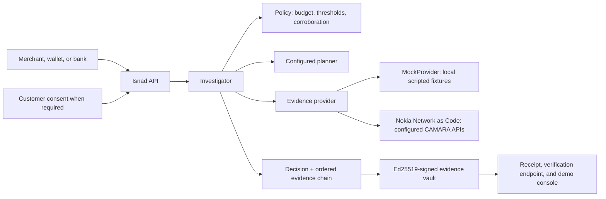

# Isnad — network-verified trust decisions

> *Isnad* is the chain of transmission that authenticates a narration. You do
> not accept the report; you accept the chain behind it, narrator by narrator,
> and you can name every link.

A customer replaces a SIM after losing her phone. Her bank sees a SIM change,
the card network sees a new device, the merchant sees a first-time customer
paying on delivery — and every one of those systems does the safe thing and
says no. **The signal that catches an account takeover is the same signal a
stolen phone produces.**

Isnad decides how much network evidence a risky interaction
actually needs, buys only that much, and returns `ALLOW` / `CHALLENGE` /
`DECLINE` with the ordered, signed chain of evidence that produced it.

It is a hackathon prototype, and this README is written to be checked rather
than believed: what is real is marked real, what is scripted is marked
scripted, and what is not known is left unmeasured rather than estimated.

## The thesis, in one line

**"We could not check" and "the check failed" are not the same fact** — and
every stack that collapses them into one score manufactures false declines.
Merchants falsely decline **2–10% of all eCommerce orders, and one in five
decline more than 10%** (Merchant Risk Council, *Global eCommerce Payments &
Fraud Report* 2024/25 — an industry body surveying merchants, not a vendor
selling the fix).

So Isnad grades every chain on what it could actually establish:

| Grade | Means |
| --- | --- |
| `ATTESTED_FULL` / `ATTESTED_PARTIAL` | The network answered. |
| `UNRESOLVED` | The network could not be asked, or consent was withheld. |
| `DEGRADED` | Answered, but with evidence missing or stale. |
| `REFUTED` | The network answered against the subject. |

An `UNRESOLVED` link can never later be read as a pass.

## Two rules the decision flow never overrides

The evidence-selection step does **not** get a vote on the invariants:

1. **Corroborate before declining.** When belief turns adverse, an exculpatory
   check named by policy must be attempted first. One adverse signal never
   carries a decline alone. *(This is the gate that would have saved the
   customer above.)*
2. **An allow rests on a network fact.** Local evidence alone cannot buy an
   `ALLOW`; the chain must hold a supporting fact the network returned. *(This
   is the gate that stops a stolen API key talking its way to an instant pass.)*

## Measured, not asserted

Run `scripts/planner_divergence.py` to reproduce. Against the scripted
scenarios, comparing the two available decision strategies:

| Measure | Result |
| --- | --- |
| Same decision state, both planners | **12/12 chose a different next check** |
| Different evidence path | **4/5 scenarios** |
| Different verdict or chain grade | **0/5** |
| Paid network checks to reach them | **17 → 14 (−18%)** |

**Same verdicts, by a shorter route.** Policy owns the verdict; evidence
selection owns the route. Five scripted scenarios and one run — a strategy comparison, not an
accuracy study.

## What it saves, against the stack it replaces

`scripts/false_decline_baseline.py` compares Isnad with the two decision rules
real systems use, on a population generated from `policy.yaml`'s own signal
vocabulary — one case per adverse signal, one per unanswerable check, every
pair of strong adverse signals, and a multi-adverse control. Both baselines are
given the **full** evidence set, not the subset Isnad chose to buy.

| | Result |
| --- | --- |
| `single-signal` — any flagged check, decline | **7 of 12** false declines |
| `collapse-unknowns` — any flagged *or unanswered* check, decline | **12 of 12** false declines |
| **Isnad** | **0 of 12** |
| Network checks bought | run-everything **196**, Isnad **96** — **51% fewer** |

**Against a stack that scores a missing check as a failed one, Isnad avoids
twelve of twelve false declines while buying half the network calls.**

The same harness reports the cost of that, and we would rather state it than be
asked: of 16 cases where two independent checks disagree with the customer,
Isnad **allows 8** at the shipped threshold, because it had already formed a
confident-clean belief on cheaper evidence and stopped — an unbought signal
cannot move a verdict. That is the budget working as designed, and it is a
dial, not a defect. `--sweep` prints the curve:

| `allow_below` | false declines | corroborated-adverse allowed | checks |
| --- | --- | --- | --- |
| 0.15 (shipped) | 0/12 | 8/16 | 96 |
| 0.05 | 0/12 | 1/16 | 142 |

One line in `policy.yaml` per row — no code, no retraining. A merchant picks
the point that matches what a lost customer costs them. The shipped default
stays at 0.15 because tightening it makes `ATTESTED_PARTIAL` unreachable in the
demo, and a grade nothing can produce is worse than a dial nobody moved.

Scripted fixtures over a generated population, one run. This compares decision
policy against stated baselines; it is not an accuracy study and claims no
real-world decline rate.

## What is real, and what is scripted

| | |
| --- | --- |
| **Real** | The evidence-selection loop, policy engine, budget and early stopping, chain grading, Ed25519 signing and verification, the signed institution registry, Tier 1 screening, session revocation, and the Nokia Network as Code adapter. |
| **Real, on request** | `ISNAD_PROVIDER=nac` uses Nokia NaC only in a non-demo deployment with generated merchant credentials, a mounted vault key, persisted pepper, and an HTTPS consent callback. Provider failures become unresolved evidence; they never become a fixture result. |
| **Scripted** | Everything else in the demo comes from deterministic local fixtures. Every surface labels its source. |
| **Not claimed** | No accuracy study, no latency benchmark, no production coverage, no operator contract. |

CAMARA maturity, read from the specification repositories rather than recalled:
SIM Swap and Number Verification are **Incubating** (both v2.1.0, Number
Insights sub-project); VerifiedCaller is **Sandbox**, 0.1.0 in its current
release with a 0.2.0 alpha in pre-release, and does not yet belong to a
sub-project. We are early to that one, not late.

## Known limitations, named rather than buried

- **The optional remote decision service answers about half the time** under
  bursty sequential calls. Every failure uses the deterministic strategy and
  the verdict records which strategy was used. Do not rely on that service in a demo.
- **No MENA-specific fraud figure is quoted anywhere**, because none is
  published. US and UK regulator data is used only where it can be labelled a
  proxy.
- **Counterfactual pricing is deliberately `null`** where no defensible public
  figure exists, and renders as "not priced — merchant-specific" rather than a
  guess.
- **CAMARA SIM Swap returns a boolean against a window**, not a timestamp. So
  "the swap was four hours ago" is not a statement this system can make; "no
  swap in the last 240 hours" is.
- **Number Verification's consent round trip has not been exercised** on a real
  handset, and is not presented as working.

## What makes it different

- **Evidence-aware orchestration:** Isnad chooses the next affordable,
  relevant check and stops when policy has enough evidence. A recent SIM change
  is corroborated rather than treated as an automatic decline.
- **Honest uncertainty:** unavailable evidence or withheld consent results in
  `CHALLENGE` / `UNRESOLVED`, not a fabricated pass or failure.
- **Verifiable receipts:** the chain, decision, planner label, and subject
  binding are signed with Ed25519 and can be checked later.
- **Trust that can expire:** an accepted session can be rechecked and revoked
  when a scripted SIM/device change occurs.

## Architecture



The same investigator path is used for both providers. `MockProvider` is for
repeatable local demonstrations only; `NacProvider` requires sandbox
credentials and the applicable user consent.

## Run locally

Use Python 3.11+ and install the development dependencies:

```bash
pip install -e ".[dev]"
pytest -q

# Produces JSON and Markdown reports under the ignored .isnad/ directory.
python scripts/evidence_pack.py
```

The evidence-pack command forces the local mock provider and deterministic
planner before application code loads. It runs five scripted cases, persists
each chain, recomputes its signature, and writes:

- `.isnad/evidence-pack/evidence-pack.json` — machine-readable scenario,
  evidence, provenance, signature, and counterfactual fields.
- `.isnad/evidence-pack/evidence-pack.md` — a concise review table.

The report explicitly says that it contains local fixtures only. It does not
call Nokia Network as Code or an external decision service.

### Open the demo console

```bash
ISNAD_DEMO_MODE=true ISNAD_MERCHANT_API_KEYS=demo-merchant-key \
  uvicorn app.main:app --host 127.0.0.1 --port 8010 --proxy-headers
```

For a genuinely live CAMARA verification, run a separate non-demo deployment
(billable; needs NaC credentials). It deliberately has no public demo token or
scripted fallback:

```bash
export ISNAD_MERCHANT_API_KEYS=$(python3 -c 'import secrets; print(secrets.token_urlsafe(32))')
export ISNAD_SUBJECT_PEPPER=$(python3 -c 'import secrets; print(secrets.token_urlsafe(32))')
ISNAD_DEMO_MODE=false ISNAD_PROVIDER=nac \
  ISNAD_VAULT_KEY_PATH=/absolute/persistent/vault-key.pem \
  ISNAD_NAC_REDIRECT_URI=https://isnad.example/v1/consents/number-verification/callback \
  uvicorn app.main:app --host 127.0.0.1 --port 8000 --no-access-log --proxy-headers
```

The stage console stays fully scripted. Recorded NaC captures may be shown as
historical evidence, but a public demo control can never authorize live spend.

Open [Judge Mode](http://127.0.0.1:8010/judge) for the 90-second customer
checkout, evidence trace, signed receipt, and simulator-only trust-revocation
beat. Open [the full console](http://127.0.0.1:8010/console) for every stage
act. Both surfaces make provider mode visible. Do not present an act as a live
operator response when it is running on the mock provider.

The stage console is designed for a concise judge flow from evidence to a
signed verdict.

## Demo scenarios

| Scenario | What it demonstrates | Intended decision |
| --- | --- | --- |
| Act I — clean signup | A supporting network fact can avoid OTP friction. | `ALLOW` |
| Act II — takeover risk | Multiple adverse facts are corroborated before stopping a high-risk checkout. | `DECLINE` |
| Act III — thin-file customer | Stable network evidence can support a low-friction decision. | `ALLOW` |
| Act V — evidence gap | Missing consent/provider evidence is uncertainty, not a false decline. | `CHALLENGE` / `UNRESOLVED` |
| Act VI — recent SIM change | A risk signal can be investigated and stepped up instead of automatically rejected. | `CHALLENGE` / `DEGRADED` |

## Trust and deployment boundaries

- The signed receipt proves that this Isnad instance issued the stored chain; it
  does not turn fixture data into an operator attestation.
- Number Verification is consent-gated. A production callback must use a public
  HTTPS URL registered with the provider; localhost is for local development.
- Use real, secret merchant keys and a persisted signing-key volume for a live
  provider. The sample demo key is public and must never protect a billable
  deployment.
- Counterfactual values retain a source and basis. Unpriced merchant-specific
  fields intentionally remain unpriced rather than guessed.

## Useful endpoints

| Endpoint | Purpose |
| --- | --- |
| `POST /v1/verify` | Run a forward trust investigation. |
| `GET /v1/chains/{id}/verification` | Recompute the stored chain signature. |
| `POST /v1/reverse-verify` | Check an incoming caller's claimed identity. |
| `POST /v1/sessions` | Create a time-limited trust session that can be revoked. |
| `GET /console` | Open the local stage console. |

The local console keeps the full flow in one place: investigation, evidence,
and a signed result.
