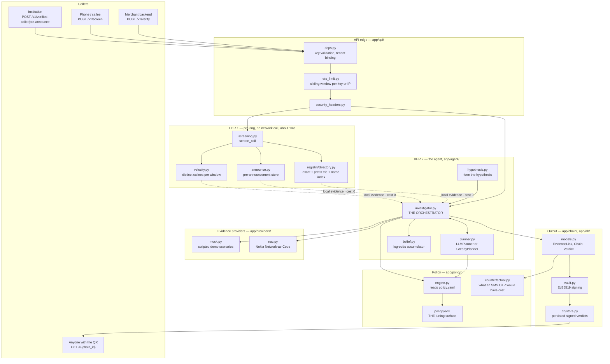
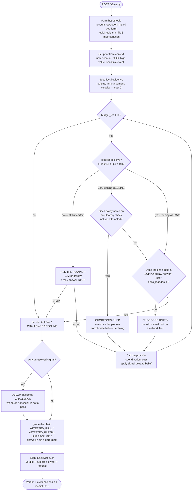
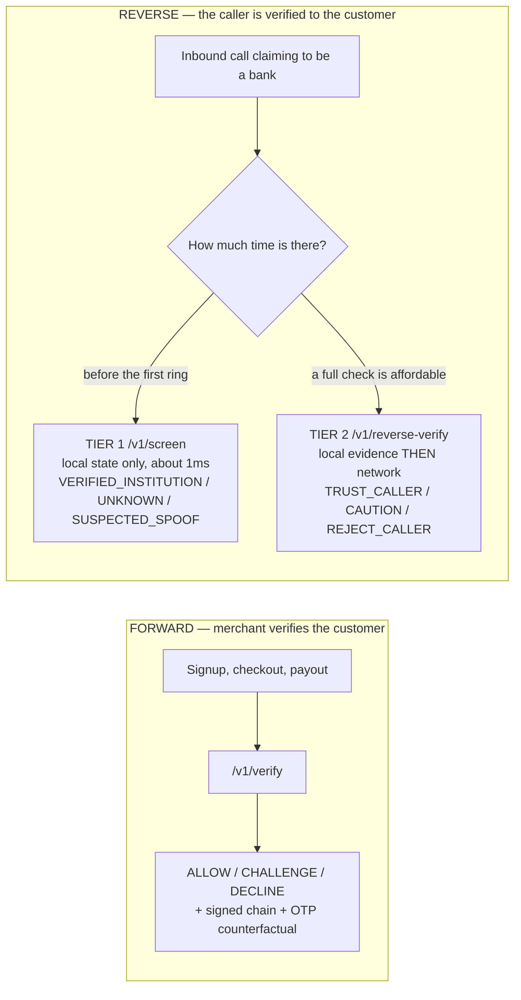

# Phase 2 — session handoff (current-state update 5 Sep 2026)

Start with [CURRENT_STATE.md](CURRENT_STATE.md) for the compact, current map.
The dated entries below preserve history; current configuration and claims are
in that entry point and the README. Read §0 before changes, then
`docs/PHASE2_AUDIT.md` for the historical per-item compliance matrix.

**If you are an AI agent picking this up cold: read section 0 below, in full,
before you touch any file.** It is a step-by-step working procedure, a system
map, and the list of traps that have already cost this project five identical
bugs. Section 0 is not background reading; it is the procedure.

---

## 0. READ THIS FIRST — how to work on Isnad without breaking it

**Audience: an AI agent (or a human) picking this repo up cold.** Follow this
section literally. It exists because five separate bugs in this repo were caused
by skipping one of the steps below, and every one of them passed the test suite.

### 0.1 The ten non-negotiables

Violating any of these has already caused a real bug here. They are ordered by
how much damage the violation did.

1. **Tests pin `greedy`; the console uses configured planning. A green suite
   alone is WEAK evidence for optional LLM behavior.** Defaults and the current
   README demo explicitly use mock/greedy; a developer's `.env` can select LLM.
   The LLM may STOP early, so every policy invariant must also be exercised with
   a STOP-capable stub. Historical entries saying the console always runs LLM
   describe that session's configuration, not a requirement.

2. **An invariant the investigator must enforce is NEVER a question to a
   planner.** `LLMPlanner.next_best()` is `self.choose().action` — it asks the
   model. Use `self._choreography` (a `GreedyPlanner`, deterministic) for every
   choreographed step. **Grep for `self.planner.` before adding one.** This trap
   has been walked into FIVE times. It is the single most expensive mistake
   available in this codebase.

3. **A test of a choreographed invariant that runs only under greedy is not
   testing it.** Give it a STOP-capable planner stub — one whose `choose()`
   returns `Choice(None, ...)`. See `_StopsImmediately` in
   `tests/test_verified_caller.py`. Writing that stub is what found the fifth
   instance of trap 2.

4. **Prove every new test fails against the old code.** Restore the bug, watch
   the test go red, then put the fix back. A test that never failed is a test
   that asserts nothing — the audit found six of those, and one of them was in
   a *rewrite of a test flagged for asserting nothing*.

5. **Re-run `scripts/sign_registry.py` after ANY edit to
   `app/registry/registry.yaml`, or the app stops booting.** The signature is
   verified at startup. This is the fastest way to break the demo.

6. **Signed-field vocabularies are not widened casually.** `Decision`,
   `ChainGrade`, the `planner` label and `Action` all sit inside the Ed25519
   signature. Adding a value means every already-signed receipt was signed under
   a different vocabulary. Reuse an existing value and document why.

7. **Never invent a number.** Where no defensible public figure exists, the
   house style is `null` plus a comment saying why — see `pricing` in
   `policy.yaml`. An invented figure on stage is a disqualifying answer to
   "where did that come from?".

8. **Local evidence is free; network evidence costs budget.** `REGISTRY_CHECK`
   and `CALL_ANNOUNCEMENT` are answered from local state in microseconds, are
   priced at 0.0, and are never offered to the planner. Do not add them to the
   candidate set.

9. **Declare before, record after — two entries per change, never one.**
   Before you touch a file, append a session-log entry saying **what you are
   about to add and why**. When it lands, append a second saying **what you
   actually finished**, where (file:line), what you verified, and what you
   deliberately did NOT do. Only one agent works this repo at a time, so the
   log is a strict sequence: an intent entry with no completion entry under it
   means the previous agent stopped mid-change, and that is the first thing the
   next one needs to know. Never batch either entry to the end of a session.

10. **Use `.venv311`.** `.venv` is a stale Python 3.9 and will fail in
    confusing ways.

### 0.2 The loop — follow this for every single change

```
STEP 0  ORIENT     Read §0.1, then the last three entries of the session log.
                   If the last entry declares an intent with no completion under
                   it, the previous change is unfinished — resolve that first.
                   Read the file you are about to change, in full.

STEP 0b DECLARE    Append a session-log entry stating what you are about to add
                   and why, BEFORE you edit anything (§0.1 rule 9).

STEP 1  LOCATE     grep -rn "<the thing>" app tests | grep -v pyc
                   Never guess a file path. The module map is §0.4.

STEP 2  REPRODUCE  Write the FAILING test first. Run it. Watch it fail.
                   If you cannot make it fail, you do not understand the bug yet
                   — stop and go back to STEP 1.

STEP 3  CHANGE     Smallest edit that turns the test green. Match the
                   surrounding comment density: this codebase explains WHY in
                   prose above non-obvious code, and that is deliberate.

STEP 4  VERIFY     .venv311/bin/python -m pytest -q          # latest review: 506 passing
                   .venv311/bin/python -m ruff check app tests scripts

STEP 5  FALSIFY    Temporarily restore the old behaviour. Confirm your new test
                   goes RED. Put the fix back. Re-run the suite.
                   Skipping this step is how the vacuous tests got written.

STEP 6  RUN IT     Start the server and exercise the real path (§0.5).
                   A green suite does not mean the console works — see §0.1.1.

STEP 7  RECORD     Append the completion entry that closes your STEP 0b intent:
                   what changed, where (file:line), WHY, what you verified,
                   and what you deliberately did NOT do. An intent entry left
                   without a completion entry reads as an abandoned change.
```

**If a step fails, stop and report. Do not improvise around a red test, and do
not "fix" a test to make it pass — the test is usually right.**

### 0.3 The system, in one diagram



### 0.3.1 The agent's decision loop — the heart of the product

This is what makes it *agentic* rather than a script. Read
`app/agent/investigator.py:investigate` alongside it.



**The two choreographed gates are the product's thesis in code.** One stops a
single adverse signal from carrying a decline on its own — that is the false
decline this system exists to prevent. The other stops local evidence (or a
contradicting network fact) from buying an allow — that is the stolen-key
instant pass. Neither may ever be expressed as a question to a planner.

### 0.3.2 The two directions



### 0.4 Module map — what lives where

| Path | Responsibility | Touch it when |
|---|---|---|
| `app/main.py` | app assembly, `lifespan`: startup posture, `init_db`, registry signature check, retention sweeper | adding a router or a startup task |
| `app/config.py` | every setting, `check_startup_posture` | adding configuration — mirror it into `.env.example` |
| `app/api/deps.py` | key validation, tenant binding (`current_owner`) | auth |
| `app/api/rate_limit.py` | sliding-window limiters: `per_key`, `per_ip`, `per_screen` | throttling |
| `app/api/routes_verify.py` | `/v1/verify` — forward verification, idempotency | the merchant path |
| `app/api/routes_reverse.py` | `/v1/reverse-verify` — Tier 2 | the caller path |
| `app/api/routes_verified_caller.py` | `/v1/screen` (Tier 1), `/v1/verified-caller/pre-announce` | screening / announcements |
| `app/api/routes_console.py` | SSE demo bus, Acts VII and VIII, demo tokens | the demo |
| `app/api/routes_receipt.py` | public receipt JSON; `PUBLIC_FIELDS` is the signed surface | the receipt |
| `app/api/routes_registry.py` | registry lookup and institution search | registry API |
| `app/api/routes_judge.py` | `GET /judge` — the presenter surface (demo-mode gated, fixed fixture) | the judge demo |
| `app/api/routes_privacy.py` | `GET /privacy` + `/v1/privacy/posture` — consent, retention and subject binding, read from live settings | the Q9 answer |
| `app/static/privacy.html` | the disclosure page; holds no numbers of its own | the Q9 answer |
| `app/static/judge.html` | Judge Mode page: trace, provenance badges, receipt, revocation beat | the judge demo |
| `scripts/evidence_pack.py` | reruns Acts I/II/III/V/VI, verifies each signature, writes the JSON + Markdown report | reproducible proof |
| `scripts/planner_divergence.py` | LLM vs greedy: choice divergence, verdict divergence, checks bought | answering §0.8.5 Q1 |
| `scripts/false_decline_baseline.py` | Isnad vs two real-world decision rules over a generated population; `--sweep` prints the operating curve | the Impact / Commercial number |
| `app/agent/investigator.py` | **the orchestrator** — the loop in §0.3.1 | agent behaviour |
| `app/agent/planner.py` | `GreedyPlanner`, `LLMPlanner`, `effective_planner`, prompt-injection boundary | evidence selection |
| `app/agent/gemini.py` | the one model adapter (Gemini REST over `httpx`); thinking disabled, every failure raises so callers fall back | model provider work |
| `app/agent/explain.py` | `/v1/chains/{id}/explain` — the console's *Ask the agent* beat | T4 |
| `app/agent/narrative.py` | post-verdict prose. Was an orphan; now on the Gemini adapter | narrative copy |
| `app/agent/belief.py` | log-odds accumulation | belief maths |
| `app/agent/hypothesis.py` | context → hypothesis | new hypotheses |
| `app/policy/engine.py` | every question asked of policy | new policy question |
| `app/policy/policy.yaml` | **the tuning surface**: signals, costs, thresholds, budgets, grading, velocity, pricing | tuning — no code change needed |
| `app/policy/counterfactual.py` | the SMS OTP comparison (T5) | the cost story |
| `app/providers/mock.py` | scripted demo scenarios keyed by phone number | demo scenarios |
| `app/providers/hybrid.py` | scripted evidence EXCEPT the action/number pairs named in config, which are real NaC calls; falls back to the fixture on any live failure | the live demo link |
| `app/providers/nac.py` | real Nokia NaC adapter + normalisation | real API work |
| `app/chain/models.py` | `EvidenceLink`, `Chain`, `Verdict` — **the signed payload** | schema changes (careful) |
| `app/chain/vault.py` | Ed25519 keys and signing | crypto |
| `app/chain/subject.py` | subject HMAC binding (S5) | subject binding |
| `app/registry/directory.py` | the three indexes, `check_claim`, conflict rejection | registry logic |
| `app/registry/evidence.py` | local evidence links for Tier 2 | local evidence |
| `app/registry/signing.py` | registry signature | registry integrity |
| `app/screening.py` | Tier 1 decision — **must never touch a provider** | Tier 1 |
| `app/announce.py` | pre-announcements, per-reader uses, purge | Verified Caller |
| `app/velocity.py` | distinct-callee counting, per tenant | the campaign signal |
| `app/retention.py` | the sweeper that calls the purges | retention |
| `app/static/console.html` | the live demo console | the demo UI |
| `app/static/receipt.html` | the public receipt page | the receipt UI |

### 0.5 Commands — copy these exactly

```bash
cd ~/dev/isnad

# the suite and the linter — both must be clean before you claim anything
.venv311/bin/python -m pytest -q
.venv311/bin/python -m ruff check app tests scripts

# one test, verbosely, while iterating
.venv311/bin/python -m pytest -q tests/test_registry.py -k claim -x

# the offline demo server, overriding local .env planning/provider settings
ISNAD_DEMO_MODE=true ISNAD_PROVIDER=mock ISNAD_PLANNER=greedy \
ISNAD_MERCHANT_API_KEYS=demo-merchant-key .venv311/bin/python -m uvicorn app.main:app \
  --host 127.0.0.1 --port 8010 --no-access-log --proxy-headers

# after ANY edit to app/registry/registry.yaml — or the app will not boot.
# ALSO required if the vault key ever changes: the registry signature is bound
# to that key, and a fresh key means RegistryTampered at startup.
.venv311/bin/python scripts/sign_registry.py

# the two measurement scripts (both need ISNAD_GEMINI_API_KEY for the first)
.venv311/bin/python scripts/planner_divergence.py
.venv311/bin/python scripts/false_decline_baseline.py --sweep

# the container gate, which asserts both SDKs import
docker build -t isnad:phase2 .
```

### 0.6 Recipes

**Add a CAMARA API as a new evidence action**
1. `Action` + `API_LABEL` in `app/domain/enums.py`.
2. Signals it can emit, with deltas, under `signals:` in `policy.yaml`.
3. An `actions:` entry with `cost`, `gain`, `friction`.
4. Add it to the relevant `hypotheses: relevant:` lists.
5. Handle it in `app/providers/nac.py` (real) and `app/providers/mock.py` (every
   scenario, or it falls to the catch-all).
6. If it can come back "could not check", add that signal to
   `_UNRESOLVED_SIGNALS` in `investigator.py` — otherwise a hole in the chain
   reads as a pass.
7. Tests: a contract test against a recorded fixture, and one end-to-end.

**Change a threshold or a weight** — `policy.yaml` only. No code. Then run the
suite: several tests pin behaviour that these numbers drive.

**Add a demo Act** — a scenario in `mock.py` keyed by a NEW number (a duplicate
key in a dict literal silently wins, and `tests/test_mock_scenarios.py` parses
the source with `ast` to catch exactly that), a button plus `data-act` in
`console.html`, and a test asserting the Act is registered.

**Add an institution to the registry** — an entry in `registry.yaml` with `id`,
`name`, `country`, `basis`, `source`, `verified_on`; then **re-sign**. `basis`
must be `published_by_institution` or `published_by_regulator` for anything
claimed as real; `demo_fixture` otherwise. The loader refuses duplicate numbers,
duplicate ids, and blocks nested across institutions.

### 0.7 The traps, as a table

| Trap | What it looks like | How to avoid it |
|---|---|---|
| The planner trap (**5 occurrences**) | Holds under greedy, gone in the console | `self._choreography`, never `self.planner`; test with a STOP stub |
| Unsigned registry | App will not boot | `scripts/sign_registry.py` after every edit |
| Duplicate dict key in `mock.py` | Whole scenario silently dead | New number per Act; `test_mock_scenarios.py` catches it |
| Cached singletons | `get_engine` / `get_directory` are `lru_cache`d and shared by the whole suite | Build your own instance in a test that mutates config |
| Vacuous test | Passes before and after the fix | STEP 5 of §0.2 — always falsify |
| Naive/aware datetimes | `TypeError` subtracting a stored time from `now` | `UtcDateTime` column type handles it; do not add a bare `DateTime` |
| Demo token expiry | Console 401s mid-demo | 900s TTL — reload the page; restart invalidates all |
| Act ordering | Velocity burst poisons Act VII | Run Act VII first, or `scripts/velocity_demo.py --reset` |

## 0.8 The Phase 2 push — ranked plan, stage hazards, and prepared answers

Written 31 Aug 2026 from four independent reviews: a strategic read, a simulated
judging panel, a read-only demo-readiness audit of this repo, and sourced market
research. Where they disagreed, the disagreement is recorded in §0.8.7 rather
than resolved silently.

### 0.8.0 The verdict, in one place

**Simulated panel score: 37/60 — shortlist, ~70% confidence. Realistic ceiling
with two weeks of the right work: 47–49/60, which is podium contention.**

| Criterion | Score | The panel's own words |
|---|---|---|
| Agentic AI & Multi-API Orchestration | **9/10** | "the strongest agentic entry I expect to see" |
| Innovation & Originality | 8/10 | "the first genuinely new idea I've heard in this round" |
| Technical Feasibility & API Usage | 7/10 | "I respect that you refused to quote a p95 off five samples" |
| Impact | 6/10 | "asserted, not evidenced" |
| Scalability & Commercial Viability | **4/10** | "I cannot score commercial readiness on invented fixtures" |
| Presentation & Pitch | **3/10** | "on stage this becomes a terminal window and an engineer explaining log-odds to an MNO CFO" |

**The finding all four reviews reached independently: the engineering is done and
the remaining points are not in the code.** Or, most bluntly: *this is a
submission optimised for a judge who reads code, and no judge in a live demo
round reads code.*

The competitor that beats this build has one shallow SIM Swap call, a phone held
up on stage, three slides and a rehearsed founder. They lose on criteria 4 and 5
and win on 1, 2, 3 and 6. **Four criteria beats two.**

### 0.8.1 TIER 0 — do these first; each is cheap and one is existential

| # | Task | Why it is Tier 0 |
|---|---|---|
| 0.1 | ~~Read the organiser's Resource & Tooling Guide~~ — **guide read 31 Aug (§0.9.1a). Risk narrowed, NOT closed.** Anthropic *is* listed, but under §6 *Coding and AI pair-programming*, not §3 *LLMs and Model APIs*. The guide itself carries **no exclusivity clause** — it calls itself a "companion reference" with "suggested" stacks. The **only**-clause is on the HackerEarth rules page, still unretrieved | What remains is one question to the organisers, and it rides along with 0.2's email. **Fallback corrected — see §0.9.1a Finding 4:** keyless means unsetting `ISNAD_ANTHROPIC_API_KEY`, not `ISNAD_PLANNER=greedy`, and it costs the T4 *Ask the agent* beat. Still no code |
| 0.2 | ~~Confirm the real deadline~~ — **CONFIRMED by the user 31 Aug 2026: the submission deadline is 11 September 2026.** Eleven days | The two-week assumption behind every estimate below is now eleven days, and the §0.8.4 plan is over-subscribed against it. See §0.8.1a for the re-ranking. **Still unasked and still worth one sentence in the same email: what is actually submitted on 11 Sep?** Nothing in this document has ever checked whether that gate is a live pitch or an upload |
| 0.3 | **Work the eight quick wins in §0.8.3.** | About four hours total, and they remove most of the ways the live demo can visibly fail |
| 0.4 | **Read §0.9 and strike the unsourceable figures from the pitch.** | Three numbers currently in circulation are vendor-only or a decade old. One caught on stage discounts everything else said that day |

### 0.8.1a The eleven-day re-ranking (31 Aug, after the deadline was confirmed)

§0.8.4 was costed against two weeks and a live stage. Eleven days, one person,
and an unverified submission format change the allocation:

- **Cut §0.8.4 #7** (Number Verification consent round trip). It was already
  contested in §0.8.7; at eleven days it loses on every reading.
- **Demote #3 (LOI) from a workstream to a two-hour task on day 1.** A reply
  inside eleven days is a lottery ticket — buy it cheaply, budget no further days.
- **Promote #4 (the LLM-vs-greedy divergence benchmark) to days 1–2**, fused
  with the first live Gemini call. It gates the pitch's central claim and it
  cannot start until a key exists.
- **#1's "recorded backup video" is probably the primary artifact, not a
  backup.** If 11 Sep is a HackerEarth upload rather than a stage, then H1–H11
  are November problems, edit quality matters more than rehearsal count, and the
  five-minute path in §0.8.6 is not what gets submitted. **This is unverified.
  Verify it before spending five days on stagecraft.**
- **Keep days 10–11 unallocated.** A solo eleven-day plan with no slack is a
  plan to miss.

### 0.8.1b The ten-day plan, rebuilt from verified evidence (31 Aug)

§0.8.4 was ranked before four things were known: the deadline is **11 Sep**, the
Ignite podium is **entirely trust and fraud** (§0.9.6), the LLM planner's
behaviour is now **measured** rather than feared, and the closest winner
published **an architecture case study, not an application**. That changes the
order.

**The strategic reframe, first, because it inverts a fear this document has been
carrying since 13:40.** §0.8.0 concluded "the engineering is done and the
remaining points are not in the code", and every plan since has treated candour
about simulated evidence as a liability to be managed. The winner of the nearest
comparable event published a candid architecture case study with three code
snippets, stand-in coefficients declared as stand-ins, deferred features named,
and a pre-committed escape hatch. **The posture this project keeps apologising
for is the posture that won.** Stop hedging it and lead with it.

**The one gap that is genuinely disqualifying, and it is closeable.** Every
winner found demoed on a **live network**. Isnad's demo makes **zero** live
calls. But `app/providers/nac.py` works and commit `1bb90f2` recorded five real
CAMARA responses (346–863ms) on a *simulator* account that needed no paid org.
**One genuinely live SIM Swap call, labelled `live` beside scripted links in the
same signed chain, is the highest-leverage day available in this plan.** It also
makes the provenance badges mean something instead of all reading `simulator`.

| # | Do this | Why it outranks what it displaces |
|---|---|---|
| 1 | **Email the organisers today: what does 11 Sep take delivery of?** | Still unasked. If it is an upload, the repo and video are the submission and five days of stagecraft is misallocated. Costs one sentence |
| 2 | **Test whether the T1 NaC simulator credentials still work; if alive, put ONE live call in the flagship act** | Closes the only gap shared by every winner in the record. Timebox to one day; if the credentials are dead, drop it without mourning |
| 3 | **Pick ONE vertical and tell that story.** | See below — this is the pattern in the podium and Isnad is currently on the wrong side of it |
| 4 | **Rewrite the README as the deliverable, not as documentation** | If 11 Sep is an upload, this *is* the pitch. TrustScore's was a case study; Isnad's is 116 functional lines |
| 5 | **Lead the agentic claim with the measured divergence** | Same verdicts, **−18% paid checks**. It answers Q1 pre-emptively and it is the only *commercial* number in the build that is ours and measured |
| 6 | **Demo the degrade on purpose** | The provider answers ~half the time. Organiser tip §11: "agents that gracefully degrade demo much better." Nobody else will show their own failure path working |
| 7 | Deck, rehearsal, recorded run | Still real work, but sized against whatever #1 answers |
| 8 | LOI — two hours on day 1, then stop | A reply inside ten days is a lottery ticket. Buy it, do not budget days for it |

**Cut:** Number Verification consent (§0.8.7, already contested — at ten days it
loses on every reading). **Demote:** the phone-shaped Reverse screen — it is
below the live-call item now, and reverse carries the cold start (H5) and the
Sandbox-maturity exposure (Q10).

**#3 deserves its own paragraph, because it is the least obvious finding here.**
Every entry on the Ignite podium is **vertical and concrete**: informal lending
in Uganda, ride-hailing, transformer theft. Isnad pitches **horizontally** — "a
decision layer for merchants, wallets and banks." That is the more valuable
product and the weaker three-minute story, and this judge pool has now chosen
the concrete one three times out of three. **Pick one vertical for the
narrative** — the false-decline story on slide one already implies it — and let
the horizontal architecture be what a judge discovers underneath, rather than
the opening claim. Nothing in the code changes; only what is said first.

### 0.8.2 Stage hazards — what can break live

Audited against the code. **H-numbers are cited so they can be closed one by one.**

| # | Hazard | Trigger | What the audience sees | Fix |
|---|---|---|---|---|
| **H1** | **Public URL + demo mode = a shared console.** `demo_token.py:26` maps every minted token to one owner, `"console"`. Anyone loading a public `/console` mints a valid token and joins the presenter's SSE stream | A judge or passer-by opens the public URL | Rows appearing in an idle console, mid-pitch | **Present from `localhost`.** Use the public URL for the QR/receipt only |
| **H2** | `.env` as checked in has `ISNAD_DEMO_MODE=false` → the page carries an empty token, prompts for a key, and every Act button is disabled | Launching without the env var | A dead console and a `window.prompt` | The handoff's launch command is **mandatory** (§0.5) |
| **H3** | `mock.trip_swap()` writes a module-global set cleared only by a new session on the same number or a restart. The session demo uses `+99999991001` — **Act I's number** | Running the stage suite twice | Act I, the flagship clean ALLOW, turns into a CHALLENGE or DECLINE | 3 lines: call `untrip_swap` on session end/revoke. *Audit verified Act I is immune under greedy and infers — did not verify — that it is reachable under `llm`* |
| **H4** | LLM dead air. `llm_timeout_seconds: 8.0`, up to 6 calls per investigation, `max_retries=0`; every failure degrades silently to greedy | Conference Wi-Fi | **8–24 seconds of no UI at all** between the start row and the first decision row | **This row's numbers were measured against Anthropic and no longer describe the runtime.** Gemini has never been called live (E1). Measure first, then set the timeout — a 3s cap against an unmeasured provider risks a 100% fallback rate, which is an all-greedy run wearing an `llm` label |
| **H5** | Tier 1 cold start. Measured **14,468µs first ever screen**, then 849–1,249µs. The console prints `elapsed_us` verbatim | Act VII is the first screen after a restart | The screen says **14ms** while the presenter says "a millisecond" | One throwaway screen off-stage before presenting. Zero code |
| **H6** | The velocity demo bursts Demo Bank's switchboard — Act VII's number. Events are in SQLite and **survive a restart** | Running `velocity_demo.py` before Act VII | Act VII's first beat reads `caller_velocity` instead of `registry_match_unannounced` | `scripts/velocity_demo.py --reset`, or Act VII first. **The single most likely on-stage regression** |
| **H7** | Console token TTL 900s, in memory | Restart, or a tab open >15 min | Handled well — the console says "demo session expired — reload" | Reload the page |
| **H8** | Session TTL **120s**, in memory, does not survive restart | Narrating for two minutes before injecting the swap | Grey EXPIRED instead of the red REVOKED beat | Inject the swap immediately after starting the session |
| **H9** | QR/receipt over plain HTTP. `receipt_qr` builds from `request.url_for`; the Makefile and the handoff command omit `--proxy-headers`, so behind a tunnel the QR encodes `http://` | Scanning the QR from a phone | "cannot verify here — WebCrypto needs HTTPS" | Add `--proxy-headers`, and **test the QR on the actual phone before stage** |
| **H10** | Three of six counterfactual rows render "—" because `camara_call_usd` and `false_decline_cost_usd` are `null` on purpose, and country reads `DEFAULT` for the `+9999…` demo numbers | Any Act with the counterfactual shown | Deliberate honesty that **reads as a bug** | Label them "not priced — merchant-specific" (§0.8.3 #6), and say why before a judge asks |
| **H12** | **Live evidence does not follow the script.** Nokia's simulator returns `SIM_SWAPPED` + `DEVICE_SWAPPED` for every demo number except `…1001`, so the scripted nuance three acts depend on does not exist live | Running an act other than II with `ISNAD_PROVIDER=hybrid` and that act's number in `ISNAD_LIVE_EVIDENCE_NUMBERS` | **Act III `ALLOW/ATTESTED_FULL` → `CHALLENGE/DEGRADED`. Act V `CHALLENGE` → `DECLINE`. Act VI `CHALLENGE/DEGRADED` → `DECLINE/REFUTED` under the `llm` planner** — the false-decline thesis beat becomes a false decline, on stage, in front of the judges | **Only `+99999991000` (Act II) may appear in `ISNAD_LIVE_EVIDENCE_NUMBERS`.** Measured 31 Aug across all five acts and both planners; the shipped `.env` is already restricted to it |
| **H11** | `.dockerignore` excludes `app/registry/*.sig`, so **in a container the registry is unsigned** and startup logs a warning | Running from the image | A warning in the log; harmless — **unless** `ISNAD_REGISTRY_SIGNATURE_REQUIRED=true`, when it will not boot | Leave `required=false` in the container, or sign with the deployment key at build time. *Note: the registry IS correctly signed for local runs — `verify()` returns `None`* |

### 0.8.3 The eight quick wins — each an hour or less, ranked by visible impact

Work them top-down. Each follows the loop in §0.2, including STEP 5.

1. **A warm-up screen before going on stage.** Zero code. Closes H5.
2. **`untrip_swap` on session end/revoke** in `app/session/manager.py`, ~3 lines. Closes H3.
3. **Set the planner pill at page load.** `/v1/console/mode` already returns
   `planner`; `configureMode()` in `console.html` ignores it, so the pill reads
   `planner: —` until the first verdict. One line — and the pill is the thing
   that proves the agent is real.
4. **`--proxy-headers`** in the `Makefile` serve target and in §0.5. Closes H9.
5. **Call `renderCounterfactual(data.alternative)` from the Act path**, not only
   from `runForwardCheck`. Today **the whole cost story is invisible during the
   Act sequence** — which is the part of the demo a judge actually watches.
6. **Label the null rows** "not priced — merchant-specific" instead of "—", and
   map country `DEFAULT` to a real label. Closes H10.
7. **A "reset stage state" button**: `velocity.purge_older_than(0)` + untrip.
   Removes the Act-ordering trap (H6) entirely.
8. **A caller-velocity runbook button.** Caller velocity is the one signal in the
   system that no per-call check can produce, and it is **currently invisible in
   the UI** — terminal-only, via `scripts/velocity_demo.py`. It is also the whole
   network-effect argument for commercial viability.

### 0.8.4 TIER 1 — the score movers, ranked by points per day

| # | Task | Lifts | Estimate |
|---|---|---|---|
| 1 | **Deck + ten timed rehearsals + a recorded 4-minute backup video.** Open on the false-decline story — a customer who lost a phone — not on architecture | Presentation 3→7+, Impact +1 | 5 days, one person |
| 2 | **A phone-shaped screen for Reverse Isnad**, wired to the real Tier 1 endpoint. A browser mockup is fine; nobody expects a shipped app | Impact, Presentation | 1–2 days |
| 3 | **One signed LOI or design-partner letter** — any regional bank, fintech, or telco innovation unit. Non-binding is fine | Commercial 4→6, Impact +1 | 2 weeks of email, start today |
| 4 | **The LLM-vs-greedy disagreement benchmark.** Run the whole scenario suite under both planners and count verdict divergence | Agentic AI, and it **disarms the single most damaging question** (§0.8.5 Q1) | 2 days |
| 5 | **Public HTTPS deployment + a rehearsed failure path** | Feasibility, Presentation | 1 day |
| 6 | **A costed false-decline model** built from the MRC 2–10% figure in §0.9 | Impact, Commercial | 1 day |
| 7 | **Close the Number Verification consent round trip** on one real handset | Feasibility, Impact | Contested — see §0.8.7 |

### 0.8.5 The ten hardest questions, with prepared answers

Ordered by how much damage they do. **Q1 is the one to prepare hardest.**

1. **"Switch the LLM off. How often does greedy reach a different verdict?"**
   The most dangerous question asked, because it attacks the strongest category.
   If the answer is "rarely", the agent is decorative and 9/10 becomes 5/10.
   **Do not answer this from intuition — measure it (Tier 1 #4).** If the
   planners genuinely diverge, that slide wins the category outright. If they do
   not, that must be known in private, not discovered on stage.
2. **"Which of these APIs can I buy from an operator in Doha today, at what price?"**
   Answer: SIM Swap and Number Verify are live — **Ooredoo and Vodafone Qatar,
   26 Nov 2025**. Tier 1 and the registry need no network API at all and deploy
   with a bank tomorrow. Then pivot: *"this is exactly why chain grading exists —
   Isnad never pretends an unavailable API answered. It returns UNRESOLVED and
   decides on what it can verify, so it is useful on day one and improves
   monotonically as operators light APIs up. We didn't build for the network of
   2026; we built the commercial reason to launch these APIs — which is why we
   are pitching it to you."*
3. **"Who writes the cheque, for what line item, and what do you displace?"**
   Weakest area. Needs a real answer before stage, not an improvised one.
4. **"What stops Nokia or the operator shipping this themselves next quarter?"**
   The honest answer is the evidence chain and the accumulated policy, not the
   engine. Prepare it.
5. **"Your thesis is that collapsing UNRESOLVED and DEGRADED manufactures false
   declines. What is the number?"** Use the MRC 2–10% figure (§0.9), labelled.
6. **"Both your differentiating signals are empty at launch. Why does bank one sign?"**
   Cold start. The honest answer is Tier 1 + registry work from day one without
   either signal.
7. **"Number Verification returned CONSENT_REQUIRED. Without possession proof,
   what stops an attacker who has the number but not the SIM?"**
   The sharpest technical question for a *Trusted Digital Identity* entry.
8. **"Median 438ms per call, several calls per investigation, five samples. What
   is end-to-end p95 against a bank's 2-second authorisation timeout?"**
9. **"You HMAC MSISDNs and query subscriber location. Which MENA regulator
   permits that without per-query consent, and who carries the exposure?"**
   Regional executives will not nod past this. The consent ledger is built —
   know where it is and be ready to show it.
10. **"VerifiedCaller is sandbox, not on NaC, and you implemented it yourself.
    Isn't half your demo built on an API nobody can buy?"**
    Answer: *"CAMARA VerifiedCaller is a sandbox repository at v0.1.0 with no
    sub-project status and no commercial launch anywhere. We implemented the
    published contract so we are ready the day operators launch it. We are not
    late to this. We are early."*

### 0.8.6 The five-minute path — lowest risk, highest impact

Run **locally**, demo mode on, `--proxy-headers`, browser on `localhost`.
**Before the room:** reload `/console` for a fresh token and stream, fire one
throwaway `/v1/screen` (H5), and confirm `velocity_demo.py --reset` has run (H6).

**Two demo paths now exist and only one can be canonical.** This five-minute
console path opens on Act VII (reverse); `docs/DEMO_SCRIPT.md` is a 90-second
`/judge` path that opens on the forward COD checkout. **Pick the forward spine:**
it carries the false-decline thesis, every sourced figure in §0.9.2, and the
SAMA/Ooredoo commercial hooks, and it avoids reverse's cold-start (H5) and the
VerifiedCaller sandbox exposure (§0.8.5 Q10). Keep **Act VII as the visual
climax, not the opening.** Whichever is chosen, demote the other in writing —
two authoritative run orders is how a presenter freezes.

| Time | Beat | Why |
|---|---|---|
| 0:00 | **Act VII — "the bank that wasn't"** | Same number, three answers; only the announced call verifies. Registry hit ≠ trust. The strongest 60 seconds in the build |
| 1:15 | **Act II** | The chain builds to `DECLINE / REFUTED` |
| 2:15 | **Act VI** | The same SIM swap, the opposite verdict: `CHALLENGE / DEGRADED`. The false-decline argument, and the deepest chain — 6 links |
| 3:15 | **QR → the receipt on a judge's phone, then press tamper** | The highest-credibility 45 seconds available, and the only judge-participation moment |
| 4:15 | **Trust session** — start, inject the swap **immediately** (TTL 120s), close on live REVOKED | Ends on motion |

**Never on stage:** live NaC consent (the redirect URI is dead); the full stage
suite (five minutes, and it ends with the session that trips Act I); and
`velocity_demo.py` before Act VII.

### 0.8.7 Where the reviews disagreed — recorded, not resolved

- **Number Verification consent.** The strategic read says **skip it**: a judge
  cannot tell `CONSENT_REQUIRED` from a completed round trip on stage, so it
  moves no points. The judging panel ranks it **fifth**, worth roughly +1 on two
  criteria, and notes it disarms Q7. **Resolution to make deliberately:** it is
  cheap and this is a *Trusted Digital Identity* entry, where Q7 is otherwise
  unanswerable — but it is Tier 1, not Tier 0, and must not displace the deck.
- **The phone mockup.** The strategic read calls it the single most valuable
  change available. The panel does not list it in the top five, but describes
  the competitor who beats Isnad as *having exactly that*. Both are consistent
  with building it — the panel simply scores the deck higher.
- **The audit was wrong once.** It reported the registry as unsigned. It is
  signed for local runs — `verify()` returns `None`. The real, narrower finding
  is H11: `.dockerignore` excludes the `.sig`, so it is unsigned **in a
  container**. Recorded because an agent report is evidence, not truth — check
  the claim before acting on it.

## 0.9 Evidence file — what may be said on stage, and what may not

Researched 31 Aug 2026 with sources retrieved, not recalled. **The house rule
from `policy.yaml` applies to the pitch as much as to the code: never state a
figure you cannot source.** A judge who catches one invented number discounts
everything else said that day.

### 0.9.1 URGENT — two facts to confirm with the organisers before anything else

1. **ANSWERED 31 Aug 2026 — the deadline is 11 September 2026**, confirmed by
   the user. Eleven days from the date of this entry. GSMA's page describing
   MENA Ignite as running **July–October 2026** with winners at **MWC Doha,
   8–10 Nov 2026** is consistent with this: 11 Sep is a submission gate, and
   Doha in November is where a shortlisted entry presents.
   `https://www.gsma.com/solutions-and-impact/gsma-open-gateway/gsma_events/gsma-mena-ignite-open-gateway-hackathon/`
   **What is still unasked: what does 11 Sep actually take delivery of?** A
   live pitch and an uploaded video are different products, and every hazard in
   §0.8.2 assumes the former. See §0.8.1a.
2. **The Resource & Tooling Guide — READ 31 Aug. Risk narrowed, not closed.**
   The guide contains **no exclusivity clause of its own**, and Anthropic **is**
   on it — though in the coding-assistant section, not the model-API section.
   The full reading is §0.9.1a below. The residual question goes to the
   organisers alongside the deadline question in item 1.

### 0.9.1a The Resource & Tooling Guide, read in full (31 Aug 2026)

Source: `~/Downloads/MENA Resource Guide.pdf`, 9 pages, "AI-Led Hackathon —
Resource & Tooling Guide · Build AI Agents Powered by Telecom Network
Intelligence · Companion reference for GSMA MENA — Regional Edition".
Text extracted and read end to end; every claim below is quoted from it.

**Finding 1 — the guide carries no exclusivity clause.** The words *mandatory*,
*must*, *required*, *permitted*, *eligible* and *disqualify* do not appear in any
restrictive sense anywhere in the nine pages. It self-describes as a **"companion
reference"** that **"expands on the proposed hackathon direction"**; §10 is
**"Suggested Starter Architectures"** ("three reference combinations participants
*can* pick"), §11 is **"Tips for Participants"**. Its own framing is a menu, not
a fence.

**Finding 2 — Anthropic is on the guide, but in the wrong section for us.**
Two appearances, both verbatim:

| Where | Entry | Description as printed |
|---|---|---|
| §6 *Development and Deployment → Coding and AI pair-programming* | **Claude (Anthropic)** | "Conversational AI assistant for coding, design and writing — free plan available." Freemium |
| §8 *Learning Resources* | **Anthropic Courses** | "Free Claude prompting and tool-use courses on GitHub." Free |

**§3 — *LLMs and Model APIs (Free Access)*, the section that covers an agent's
brain — does not list Anthropic.** It lists Google AI Studio (Gemini), Groq,
OpenRouter, Cohere, Mistral La Plateforme, Together AI, Hugging Face Inference,
Cerebras; and for local models Ollama, LM Studio, vLLM, llama.cpp.

**So the honest reading is two readings, and they are recorded rather than
resolved** (§0.8.7 house rule):

- *Permissive.* "Claude (Anthropic)" is a listed tool. Even a strict listed-only
  rule is satisfied by the plain text of the list.
- *Strict.* The guide categorises Claude as a **coding assistant**, and an
  assessor applying the rule to "the AI agent layer" may read §3 as the
  exhaustive list of sanctioned agent brains. On that reading `LLMPlanner` is
  outside it.

**Finding 3 — the only-clause is not in this document.** The handoff has been
attributing it to the guide; it is on the **HackerEarth rules page**, which still
500s. This PDF therefore *cannot* close the risk on its own. **One email to the
organisers settles both this and the deadline (§0.9.1 item 1).** Suggested
wording: *"Does the requirement to build the agent layer with tools from the
Resource & Tooling Guide treat Claude (Anthropic) — listed in §6 — as an
eligible model provider for the agent itself?"*

> **SUPERSEDED 31 Aug, later the same day — read this before Finding 4 or the
> contingency below.** P0 migrated every runtime model call from Anthropic to
> Google Gemini (`app/agent/gemini.py`); `ISNAD_ANTHROPIC_API_KEY` no longer
> exists and `tests/test_gemini.py` asserts no Anthropic dependency can return.
> The eligibility question in Finding 3 is therefore **closed by construction**
> rather than by an organiser's answer — Gemini is explicitly in §3 of the
> guide. Findings 1–3 and 5 stand as read. Finding 4 below is kept as the
> record of why the migration happened; **its instructions are dead** — the
> keyless posture is now unsetting `ISNAD_GEMINI_API_KEY`, and it still costs
> the T4 *Ask the agent* beat. The contingency at the end of this section was
> written as "do NOT build this now"; it was built, deliberately, with the
> user's explicit approval.

**Finding 4 — "demo on greedy" does not remove Anthropic from the demo.**
Verified in the code today, and this is a correction to how the fallback has been
described since 13:40:

| Surface | Gate | Under `ISNAD_PLANNER=greedy` |
|---|---|---|
| `app/agent/planner.py:202` `LLMPlanner._maybe_client` | planner mode **and** key | Not constructed. Clean degrade — and with no key it falls to `self._greedy.choose` even in `llm` mode |
| `app/agent/explain.py:106` `_maybe_client` | **key presence only** | **Still calls Anthropic.** `/v1/chains/{id}/explain` is wired to the console's *Ask the agent* box (`console.html:388`) — a live demo beat |
| `app/agent/narrative.py:110` | planner `== "llm"` **and** key | Dark. Note: the module is imported by nothing — it is currently an orphan |

The keyless posture is therefore **unset `ISNAD_ANTHROPIC_API_KEY`**, not
`ISNAD_PLANNER=greedy` — and it costs the T4 *Ask the agent* beat, which becomes
an `ExplainUnavailable` error in the console. Decide that deliberately; do not
discover it on stage.

**Contingency, if the organisers answer "listed only" (do NOT build this now).**
Gemini via Google AI Studio is explicitly in §3 and free. The three clients are
`anthropic.Anthropic(...)` constructions behind three `_maybe_client` functions,
so a provider swap is contained. Also note the inversion it creates: demoing on
greedy means demoing **the configuration Q1 attacks** ("switch the LLM off — how
often does greedy differ?"), which makes the Tier 1 divergence benchmark
(§0.8.4 #4) more urgent, not less.

**Finding 5 — the guide is pitch ammunition, and this is the upside nobody
expected.** Quotable from the organisers' own document:

- **The first listed focus area is "AI for Fraud Detection and Digital
  Identity."** Isnad is not adjacent to what was asked for; it is the first
  thing on the list.
- §11: *"Treat each CAMARA API as a tool the agent decides when to call, not a
  button the user presses. **That is what makes a solution 'agentic'.**"* That is
  a one-sentence description of `investigator.investigate` — cost-budgeted
  selection with early stopping — written by the organisers.
- §11: *"Show the agent's reasoning trace on screen during the demo — judges
  love seeing the 'thinking'."* The console is exactly this. It also **confirms
  the §0.8 finding that presentation is where the remaining points are.**
- §11: *"Have a clear fallback when an API or model is rate-limited — agents
  that gracefully degrade demo much better."* Chain grading is that, formalised:
  UNRESOLVED ≠ REFUTED.
- §5 lists **Nokia Network as Code** as the CAMARA data layer — the provider
  already implemented in `app/providers/nac.py`.

Nothing in the guide contradicts the build. Three of its six tips are theses
this repo already implements, and they should be **quoted back on stage**.

### 0.9.2 Cleared for stage — independent sources

| Claim | Source | Why it is safe |
|---|---|---|
| Merchants falsely decline **2–10% of all eCommerce orders; one in five decline more than 10%** | Merchant Risk Council, *Global eCommerce Payments & Fraud Report* 2024/2025 | An industry body surveying merchants — **not** a vendor selling the fix. This is the strongest number available for the false-decline thesis |
| **Artificially inflated traffic cost enterprises $8.5bn in 2023 — 18% of all international A2P SMS** | Juniper Research with VOX Solutions, Apr 2024 | Turns the OTP counterfactual from "friction" into "a fraud surface with a metered bill" |
| **$3.5bn lost to imposter scams in 2025**, 1 in 3 fraud reports, bank impersonation the largest business-impersonation component | US FTC, Jun 2026 | Regulator data. Label it clearly as a **US proxy** |
| **17% of UK APP fraud originates through telecommunications channels**; APP fraud £576.4m, up 19% | UK Finance Annual Fraud Report 2026 | Regulator-adjacent. **Also say impersonation losses FELL 12%** — quoting the fall alongside the rise is exactly this project's posture, and it buys credibility for everything else |
| **Ooredoo and Vodafone Qatar launched CAMARA SIM Swap and Number Verify on 26 Nov 2025, explicitly for anti-fraud** | Ooredoo press release | The region's first verified anti-fraud network-API launch — **and it is a pipe with no decision layer on top.** This is the single best positioning fact in the file |
| **SAMA requires full compliance with its Counter-Fraud Fundamental Requirements by 13 Apr 2026** | SAMA Rulebook | A dated, live mandate creating demand for auditable fraud controls in the largest target market |
| **Saudi's CST mandated caller name and identity display from 1 Oct 2023**; no Arab League or Gulf regulator mandates cryptographic caller attestation, while the US, Canada and France do | CST / FCC / CRTC | **Know this before going on stage.** It is display-layer, not attestation — which makes the argument stronger, not weaker: the regulator has already called this a priority, with a blunt instrument |
| **CAMARA VerifiedCaller is a sandbox repo at v0.1.0 that does not yet belong to a sub-project; no commercial launch anywhere** | CAMARA GitHub | Precision here reads as credibility. *"We are not late to this. We are early."* |
| Open Gateway: **80+ operator groups, 292 networks, 80%+ of global mobile connections** | GSMA | Programme scale |
| **Malaysia's five operators federated Number Verification for banks and retailers, Sept 2025** | GSMA | The precedent a MENA operator judge may want to copy |

### 0.9.3 DO NOT SAY — these will not survive a judge who knows the field

| Do not say | Why |
|---|---|
| "$118bn in false declines versus $9bn in card fraud" / the 13:1 ratio, undated | It is **Javelin, 2015**, requoted everywhere as if current. Either say **"Javelin, 2015"** out loud — being the team that dates it correctly is worth more than the number — or drop it |
| "$443bn in false declines (2025)" or "60–65% of declines are legitimate" | Vendor blogs only. No independent origin exists |
| Any OTP delivery-failure rate (15–20%) or abandonment rate (20–30%) | **Every** such figure traces to a company selling an OTP replacement. No independent study found. Use the system's **own measured counterfactual** instead — that is a differentiator, not a gap |
| "Cash on delivery is how MENA shops" | **COD preference halved from 41% to 20% in four years and is ~10% in Saudi, UAE and Kuwait** (Checkout.com, May 2024). A judge from stc or e& will know this. Reframe the COD demo scenario as **Egypt/Levant-relevant and declining** |
| "Location Verification is available from operators in the region" | No MENA commercial availability found. CAMARA has it at v1.0.0; that is a spec, not a service |
| Any MENA-specific fraud loss total | See below — none exists |

### 0.9.4 Where no public figure exists — and how to use that

Searched and genuinely absent: Egypt or Jordan phone-fraud totals; MENA-wide APP
fraud; MENA SIM-swap incidence; regional false-decline rates; MENA bank
impersonation losses.

**This is a stage asset, not a hole.** The line to use:

> "There is no published figure for what bank impersonation costs this region.
> No regulator here publishes one. That absence is itself the problem — and it
> is why every verdict this system issues is signed and auditable. You cannot
> manage what nobody is measuring."

Then pivot to the US and UK regulator figures **explicitly labelled as proxies**.
Volunteering the proxy label is what makes the rest of the numbers trustworthy.

### 0.9.5 Competitive position — verified

Every competitor found sells **one signal, verified once**:

- **Aduna** (Ericsson + operator JV; **e& is a venture partner**, Ooredoo is
  putting APIs on it) — the distribution layer. **A pipe, not a decision
  engine:** no orchestration, no budget logic, no evidence chain. Position Isnad
  as a **consumer of Aduna, not a rival to it** — that is the sentence that turns
  an operator judge from sceptic to channel.
- **Prove** — phone-centric identity at enterprise scale, but on phone-intelligence
  signals rather than network cryptography.
- **Glide Identity** — silent network authentication, sub-second, RSAC 2026
  Innovation Sandbox finalist. The **closest technical neighbour**, and still
  single-signal.
- **TMT ID Authenticate**, **IDlayr** (ex-tru.ID), **Boku Mobile Identity** —
  silent SIM/network possession checks, distributed through CPaaS.
- **Unifonic** and **Cequens**, the regional CPaaS names a judge will know, have
  **no CAMARA aggregator role found** — name them as partners-in-waiting, not
  competitors.

**No commercial equivalent was found for any of:** cost-budgeted multi-signal
orchestration with early stopping; an explicit "could not check" ≠ "the check
failed" distinction; or a signed, independently verifiable evidence chain with a
graded attestation. Signed evidence chains exist commercially only in
e-signature and audit-log products — never in network-API fraud decisioning.
State it as **"we found no commercial equivalent"** — a searched absence is a
defensible claim; "we are the first" is not.

### 0.9.6 What has actually won these hackathons — and the warning in it

| Event | Winner | Built on |
|---|---|---|
| Talent Arena / MWC Barcelona 2026 (Nokia-sponsored) | **Stage Flow** — crowd safety at festivals and large venues | live network APIs |
| GSMA Open Gateway hackathon | **Ontime** — on Nokia NaC | QoD, Device Location, Device Status |
| Telstra Connected Future 2025 (Nokia NaC) | **MOD5G** — Modbus TCP over 5G | QoD + Device Location |

**Winners cluster hard on QoD, location and physical-world safety: visually
demonstrable, live-network, single-API-family builds. No fraud or identity
project appears among any winner found.**

> **RETRACTED 31 Aug, on sourced evidence. Do not brief anyone from the table
> above.** The sample it was built from excluded the Ignite series entirely —
> the very series this project is entered in — and the Ignite result is the
> opposite of its conclusion.

**The whole podium of the nearest comparable event is trust and fraud.** GSMA
Africa Ignite 2026, announced alongside the first GLOMO Awards Africa:

| Place | Entry | What it is |
|---|---|---|
| 1st | **TrustScore** (Ramadhan Aheebwa) | Portable Trust Broker for Africa's Invisible Lending Economy |
| 2nd | **SafeRide** (Jules Ndanga) | A Network-Powered **Trust Layer** for Ride-Hailing |
| 3rd | **GridGuard** (Batte Akhsam) | AI-Powered Transformer Theft Prevention Using Telecom Network Intelligence |

Sources: GSMA newsroom, *"First-ever GLOMOs Africa winners announced alongside
GSMA Open Gateway Africa Ignite Hackathon champions"*; TechAfrica News, 18 Jun
2026. Same Open Gateway / CAMARA / Nokia Network-as-Code stack, same HackerEarth
platform. **Nearly 200 submissions from 14 countries** — useful for calibrating
how much a shortlist is worth.

First is a trust broker, second is literally called a trust layer, third is
theft prevention. **"No fraud or identity project appears among any winner" was
an artefact of looking only at MWC/Telstra events with a different judge pool.**
Isnad is not fighting its category here; it is in the category that wins this
series.

Only TrustScore has a publicly indexed repository
(`raheebwa/trustscore-architecture`); searches for SafeRide's and GridGuard's
code found none — the coverage names the builders but links no repo. **Do not
claim to have studied entries you cannot read.**

What survives from the retracted table is one narrower warning, and it is still
worth heeding: **every winner found demoed on a live network, and Isnad's demo
currently makes no live network call at all.**

Read that twice. It cuts both ways:

- **The risk.** These judges reward *a live demo on real network APIs with a
  visible moment*, not architecture. Isnad is currently the opposite shape.
- **The opening.** The only verified MENA Open Gateway launch is *specifically
  anti-fraud*, and the region's regulators are acting on fraud right now. Nobody
  has won one of these with an identity build because nobody has brought one
  this complete. **The correction is not to change the product — it is to make
  the evidence chain visible and the agent's stop decision watchable.**

---


## Session log — 31 Aug

Running log, appended as work lands. Newest entry at the bottom.

### 08:30 — starting items 4-8, with audits

**Done before this log started:** items 1-3 of the morning plan (Act VII console,
receipt arithmetic, caller velocity), plus two unplanned fixes that testing found
— the rate limiter throttling `/v1/screen` on `/v1/verify`'s spend-guard bucket,
and the velocity demo poisoning Act VII's first beat. 354 tests, ruff clean, all
verified against the running server. Dev server on 8010 now runs with
`ISNAD_INSTITUTION_KEYS` bound so `/v1/verified-caller/pre-announce` is
demonstrable; settings documented in `.env.example`.

**Now:** items 4-8 in order, with two read-only audit agents running over the
new surface in parallel (security/privacy, and correctness/consistency).

**Left:** 4 sign the registry · 5 cap announcement reuse · 6 evidence age ·
7 parallel gathering · 8 the two non-code items.

### 08:34 — item 4 DONE: the registry is signed

**What.** An entry in `registry.yaml` asserts a phone number belongs to a named
bank — the most attractive thing here to tamper with, and it was an unsigned
YAML file.

**Where.** New `app/registry/signing.py`; `scripts/sign_registry.py`;
`Directory.__init__` verifies on load; `app/main.py` verifies at **startup**;
`registry_signature_required` in `app/config.py`; 7 tests in
`tests/test_registry.py`. Signature ships as `app/registry/registry.yaml.sig`
(checked: not gitignored — it must ship).

**How.** Ed25519 via the existing vault, with a **domain-separation prefix**
(`isnad-number-registry-v1\n`) inside the signed bytes: the same key signs
evidence chains, and without a prefix naming which kind of document the bytes
are, a signature over one could be presented as a signature over the other. A
test asserts the signature does *not* verify over the undecorated bytes.

Three states, deliberately not one code path:
- **missing** -> loads, logs a warning, `signature_state="unsigned"` (dev)
- **present and wrong** -> `RegistryTampered`, fatal (tampering)
- **signed by an untrusted key** -> fatal. Verifying with whatever key the .sig
  names would let an attacker who can write both files re-sign with their own.
- an **unreadable** .sig is tampering, not absence: "I could not parse the proof"
  must never be cheaper than "the proof failed".

**Verified live.** Changed one digit -> `--check` exits 2, `Directory` raises,
and the **server refuses to start**:
`startup refused: RegistryTampered: … does not match …`. Restored, re-verified OK.

**Gotcha for tomorrow:** re-run `PYTHONPATH=. .venv311/bin/python
scripts/sign_registry.py` after **every** edit to `registry.yaml`, or the app
stops booting.

**361 tests, ruff clean. Left:** 5 cap announcement reuse · 6 evidence age ·
7 parallel gathering · 8 the two non-code items. Two audit agents still running.

### 08:36 — item 5 DONE: announcement reuse is capped

**Where.** `used_count`/`max_uses` on `call_announcements` (both defaulted, so
`init_db`'s additive migration adds them to an existing database — verified
against the real `isnad.db`); `announce.find(consume=...)`; `screening.py`
consumes; `registry/evidence.py` peeks. 4 tests in `tests/test_verified_caller.py`.

**How, and what it actually buys** — stated narrowly so nobody over-claims it on
stage. An announcement was already bound to BOTH ends, so a *different* victim
was never verifiable by it. What was unbounded is the *same* victim being rung
repeatedly inside the window: a genuine announcement for a call to Alice also
verified an attacker who spoofed the number and called Alice during those 45
seconds. The cap bounds that race to one call instead of a burst.

**The subtlety worth knowing.** Tier 2 reads the same announcement for the same
call. If that read also spent a use, Tier 1 would eat the only one and Tier 2
would go blind on the call Tier 1 had just verified. So a screening DECISION
consumes (`consume=True`) and a read by something already deciding about that
call peeks. A test pins that Tier 2 still sees an announcement Tier 1 consumed.

**Audit note.** The cap test was checked against a build with the cap removed —
it fails there, so it is testing the behaviour and not just passing. (Doing that
I ran `git checkout app/announce.py`, which was careless: the file is untracked
so it was a no-op, but on a tracked file it would have discarded the day's work.
File verified intact afterwards, 152 lines, all functions present.)

**365 tests, ruff clean. Left:** 6 evidence age · 7 parallel gathering · 8 the
two non-code items. Both audit agents still running.

### 08:38 — item 6 DONE, but NOT as specified

**The spec was not implementable, and finding that out is the result.** Item 6
said "add `observed_at`/`age_hours`, populate in `NacProvider` from the
response". **The response has no such field.** CAMARA's SIM Swap and Device Swap
take a `max_age` and return a **boolean** — checked against the real recorded
responses in `docs/nac/`, which carry no timestamp of any kind.

So "the swap was four hours ago" is a sentence this system can never truthfully
say. Building the field as specified would have meant inventing a precision the
network never gave us — the exact overclaim the rest of this repo is careful
about.

**What was built instead: the window the question covered.** "No swap in the
last 240 hours" is true and is materially different from a fresh check. That
distinction is what the field now carries.

**Where.** `EvidenceLink.max_age_hours`; `_window_hours()` in
`app/providers/nac.py` (kept beside the `max_age` arguments it mirrors, so the
two cannot drift); exposed on `/v1/receipts/{id}`, on the SSE evidence event,
and rendered as an **"asked over"** column in `receipt.html` and a `· asked over
last 240h` suffix in the console. 2 tests in `tests/test_t6_receipt.py`.

One of those tests scans every `docs/nac/*.json` recording and fails if one ever
starts carrying `date`/`timestamp`/`swapped_at` — so if a future SDK does return
an event time, we find out instead of silently continuing to report a window.

**On stage, say "asked over the last 240 hours", never "four hours ago".**

**367 tests, ruff clean. Left:** 7 parallel gathering · 8 the two non-code items.
Audit agents still running.

### 08:40 — item 7 DONE: parallel gathering (opt-in)

**Where.** `gather:` block in `policy.yaml` (`mode: sequential`,
`parallel_batch: 3`); `gather_mode()`/`parallel_batch()` on the engine;
`Investigator._gather_parallel()`; `investigate(..., parallel=True)`.
9 tests in `tests/test_parallel_gather.py`.

**Measured, so the trade is a number and not a claim** (mock provider, greedy):

| case | sequential | parallel |
|---|---|---|
| Act I clean signup | **cost 1.0**, 1 link | **cost 5.0**, 3 links |
| Act III clean checkout | cost 3.0, 2 links | cost 5.0, 3 links |
| Act II takeover | cost 8.0, 4 links | cost 8.0, 4 links |

Decision identical in all three. **Quote the Act I row if a judge asks what
parallel costs: 1 -> 5, a 5x spend to buy latency on a chain that had already
cleared.** The takeover row is equal only because the corroboration rule forces
the full budget either way.

Timing is real: three 300ms calls complete in under 750ms, and a test fails if
the batch ever runs sequentially.

**Design notes.** The batch is chosen with the deterministic planner, not the
model — a batch is a spend decision made *before* any of its answers are known,
so there is nothing for a reasoning planner to reason about. Belief is applied
in **chain order, not completion order**, so two runs over the same evidence
produce the same number regardless of which call answered first; a test pins it.

Also folded in: the `{CONSENT_REQUIRED, PROVIDER_UNAVAILABLE,
EVIDENCE_UNAVAILABLE}` set was an inline literal in two places and is now one
`_UNRESOLVED_SIGNALS` constant — the parallel path would have been a third copy.

**My recommendation is unchanged: leave `mode: sequential`.** This exists so the
answer to "can you do it under a second" is a demonstrated number rather than a
maybe, not because it should be on.

**376 tests, ruff clean. Left:** item 8, the two non-code pieces. Audits running.

### 08:44 — item 8 DONE; SECURITY AUDIT CAME BACK BAD

**Item 8a — Act VIII, "the honest limit".** Built as an act, not a slide.
`+96265000123`, an extension inside the bank's published `+9626500` DID block:
the registry resolves it by prefix, and every mobile CAMARA API answers
`EVIDENCE_UNAVAILABLE`, because a PBX trunk has no SIM. Live result
**CHALLENGE / UNRESOLVED — "Insufficient network evidence"**. The system says it
cannot tell, rather than guessing in either direction. `data-act="act8"` in the
console; 3 tests.

*Bug I introduced and caught:* I first used `+96265000000` — already the Reverse
Isnad genuine-caller fixture. A duplicate key in a dict literal is legal Python
and the **last one silently wins**, so the whole scenario was dead. New
`tests/test_mock_scenarios.py` parses the SOURCE with `ast` (by import time the
duplicate is already gone) and fails on repeats; verified it catches it.

**Item 8b — the price of getting it wrong.** `pricing.false_decline_cost_usd`,
**null on purpose** like `camara_call_usd`: basket value, margin and lifetime
value are merchant-specific and no public figure exists that would not be
invented. Set it and both it and a derived `otp_dropoff_cost_usd` (x the 0.20
abandonment estimate, labelled `derived`) appear in the T5 table. 2 tests.

**383 tests, ruff clean. All 8 items done.**

### THEN THE SECURITY AUDIT LANDED, AND IT IS NOT GOOD

The pre-announce authorization chain held under direct attack — no path to
`VERIFIED_INSTITUTION` without a real binding, body-supplied `institution_id`
ignored, all four failure modes fail closed. **But three HIGH findings land on
code written today, and one of them is a feature I added this morning making
things worse.** Fixes in progress; details and status in the next entry.

- **H1** velocity is globally poisonable — ~30 requests from any key flips any
  number to `SUSPECTED_SPOOF` for every tenant for 10 minutes.
- **H2** the item-5 reuse cap created a **burn attack**: a third party spends the
  announcement's single use, so genuine bank calls read `UNKNOWN`. Strictly
  worse than before the cap.
- **H3** Tier 2 ignores the cap, minting unlimited signed public
  `TRUST_CALLER` receipts from one spent announcement.
- **H4** the shipped `registry.yaml.sig` makes a **fresh container refuse to
  start** — signed with the dev vault key, which a new volume does not have.

### 08:50 — STOPPED HERE. Read this first when you resume.

**389 tests pass, ruff clean.** All 8 plan items are built. Two audits came back;
**the criticals are fixed, the rest are written up below and NOT fixed.**

#### The headline: the same trap, a fourth time — and it was in my own fix

The attestation gate I added this morning (`min_network_links_for_allow`) called
`self.planner.next_best(...)`. **`LLMPlanner.next_best` is `self.choose().action`
— it asks the model, and the model's prompt tells it to STOP once belief has
moved decisively.** So the gate held under greedy (what the suite pins) and did
nothing under llm (what the console runs). The audit reproduced it:

```
greedy  : ALLOW ATTESTED_FULL    links=2 network=1 cost=1.0
llm-stop: ALLOW ATTESTED_PARTIAL links=1 network=0 cost=0.0   <- TRUST_CALLER on
                                                                 zero network facts
```

That is exactly the "stolen key = instant pass" that `policy.yaml` says the gate
exists to prevent. `_gather_parallel` had the identical bug, under a docstring
claiming it used the deterministic planner.

**Fixed:** `Investigator._choreography = GreedyPlanner(engine)`, and every
choreographed step goes through it, never `self.planner`. The rule is written at
the top of `__init__` in the strongest terms I could manage.

**Take this as the standing lesson: any invariant the investigator must enforce
cannot be a question to a planner.** Grep for `self.planner.` before adding one.

#### Fixed from the security audit

| | finding | fix |
|---|---|---|
| H1 | velocity was **globally poisonable** — ~30 requests from any key marked any bank's number `SUSPECTED_SPOOF` for every tenant, unattributed | `ScreenEventRow.owner_hash`; counts scoped per tenant; 2 isolation tests |
| H2 | **my item-5 cap created a burn attack** — a third party spent the single use, so genuine bank calls read `UNKNOWN`. Strictly worse than no cap | uses are now **per reader** (`AnnouncementUseRow`, composite PK) |
| H3 | Tier 2 ignored the cap: unlimited signed public `TRUST_CALLER` receipts from one announcement | both tiers consume; **one announcement = one verification, to one party, once** |
| H4 | shipped `registry.yaml.sig` made a **fresh container refuse to start** (dev key, new volume) | `app/registry/*.sig` in `.dockerignore`; 2 tests |
| C1 | the planner trap above | `_choreography` |
| C1c | a run of pure choreography reported `planner: "none"` beside real network calls | reports `"policy"`; planner vocabulary unchanged (it is a signed field) |

The pre-announce authorization chain itself **held under direct attack** — no
path to `VERIFIED_INSTITUTION` without a real binding, body-supplied
`institution_id` ignored, all four failure modes fail closed.

#### NOT FIXED — start here when you resume, in this order
#### (ALL NINE ARE NOW FIXED, 31 Aug 12:36-13:03. Kept as written, each marked
#### with the entry in the session log that closed it. What remains is the list
#### of tests that pass while the feature is broken, immediately below.)

1. ✅ **DONE 31 Aug 12:36 — HIGH: honest callers are labelled `SUSPECTED_SPOOF`.**
   `claims_institution` requires *every* word of the claim to be indexed, so
   `"Demo Bank customer service"`, `"Demo Bank Ltd"` and `"Demo Bank, Fraud
   Dept."` all mismatch — and `REGISTRY_CLAIM_MISMATCH` (+1.5) goes into the
   **signed** chain. The more fully an honest caller describes themselves, the
   more likely they are condemned. Converse hole: bare `"bank"` matches.
   *Fix:* require the institution's tokens ⊆ the claim, and only assert mismatch
   when the claim positively names a **different** indexed institution;
   otherwise `None`. **This one is demo-visible — do it first.**
2. ✅ **DONE 31 Aug 12:44 — HIGH: the CHALLENGE step-up reaches for an OTP.**
   (Audit called it "spends 75% of the budget"; measured, it was unreachable
   dead code. Removed anyway. Original text follows.)
   **HIGH: the CHALLENGE step-up spends 75% of the budget for zero information.**
   No mock scenario defines `STEP_UP_OTP`, so it falls through to
   `LOCATION_UNKNOWN`, delta **0.0**, cost **6.0** of a budget of 8. And
   `OTP_CONFIRMED: -2.5` is emitted by nothing, anywhere. Pre-existing, not from
   this session.
3. ✅ **DONE 31 Aug 12:47 — HIGH: the registry silently accepts conflicting entries** — two
   institutions claiming one number (last wins), a number carved out of another
   institution's block, a duplicate institution id corrupting three indexes into
   three different answers. In a loader whose stated philosophy is fail-loud.
4. ✅ **DONE 31 Aug 12:49 — MEDIUM: an ALLOW with an EMPTY chain grades `ATTESTED_PARTIAL`**, whose
   documented meaning is "the links resolved and nothing contradicted" — of zero
   links. `grade()` needs a `not link_deltas` branch.
5. ✅ **DONE 31 Aug 12:51 — MEDIUM: Tier 2 records no velocity**, so a campaign run entirely through
   `/v1/reverse-verify` never trips `CALLER_HIGH_VELOCITY`.
6. ✅ **DONE 31 Aug 12:53 — MEDIUM: `latency_ms` sums link latencies**, so parallel mode cannot report
   the improvement that is its entire purpose (measured 315ms either way).
7. ✅ **DONE 31 Aug 12:56 — MEDIUM: purges are never called.** `announce.purge_expired()` and
   `velocity.purge_older_than()` have no caller in app code — both tables grow
   forever, which is the retention problem `ScreenEventRow`'s own docstring
   names. Wire into `lifespan`.
8. ✅ **DONE 31 Aug 12:58 (partially — see the log) — MEDIUM: Act VII's announce bypass is reachable anonymously in demo mode** —
   `/console` mints a token to any visitor, and that token satisfies
   `_act7_key()`. Write demo announcements under a `DEMO` institution id.
9. ✅ **DONE 31 Aug 13:03 — LOW:** non-constant-time key compare in `announce.institution_for_key`;
   `/v1/screen` unauthenticated falls into the 600/min bucket instead of 120;
   `ScreenRequest.claimed_identity` lacks the S11 charset pattern;
   `REGISTRY_CHECK`/`CALL_ANNOUNCEMENT` have no `actions:` entry so
   `action_cost` would `KeyError`; naive/aware datetime asymmetry between
   `record()` (aware) and `find()` (naive) — correct today, a trap tomorrow;
   `gather.parallel` is documented as per-request but no route passes it.

#### Tests that pass while the feature is broken (audit's list, verbatim targets)
#### ✅ ALL SIX REWRITTEN 31 Aug 13:08 — and the first one found a real bug.
#### See the session-log entry. Original text kept below.

`test_an_announcement_cannot_outvote_a_network_contradiction` asserts the exact
invariant C1 broke but pins greedy — **give it a STOP-capable stub and it becomes
the regression test.** `test_tier_one_makes_no_network_call` never spies on the
provider. `test_concurrent_runs_do_not_interleave_chains` asserts two random
UUIDs differ. `test_the_requested_window_is_capped` is trivially true.
`test_institution_search_is_case_and_accent_folded` contains no accent.
`test_clean_signup_is_attested_and_allowed` cannot fail. Full list is in the
audit; these are the ones worth rewriting.

#### State

Dev server on 8010 with `ISNAD_MERCHANT_API_KEYS=demo-merchant-key` and
`ISNAD_INSTITUTION_KEYS=demo-merchant-key:demo-bank-jo`. **Nothing committed;
~40 files changed or added as of 13:08 on 31 Aug** — three new test files
(`tests/test_retention.py`, `tests/test_audit_low.py`) and one new module
(`app/retention.py`) among them. The tree has never been checkpointed this
session. Re-run `scripts/sign_registry.py` after any
`registry.yaml` edit or the app stops booting.

### 12:36 — resumed. Audit item 1 DONE: honest callers are no longer condemned

**The bug.** `claims_institution` asked `find_institution(claim)`, whose subset
runs *claim ⊆ institution*. So every word an honest caller used had to already
be indexed: `"Demo Bank customer service"`, `"Demo Bank Ltd"` and `"Demo Bank,
Fraud Dept."` all failed, and `REGISTRY_CLAIM_MISMATCH` (+1.5, and it goes into
the **signed** chain) followed. The more fully a caller described themselves,
the more likely the system condemned them. The converse hole was the same
mistake: bare `"bank"` matched Demo Bank.

**The fix.** `Directory.claims_institution` is **gone**, replaced by
`check_claim(claimed, entry) -> Optional[bool]`, tri-state:

* `True` — the claim contains every word of the institution's name *or of one
  of its aliases*. Subset the other way round: institution ⊆ claim.
* `False` — the claim does not name this institution and **does** positively
  name a different institution that is in the registry. The only mismatch this
  file can honestly assert.
* `None` — no assertion: an unindexed name, a bare `"bank"`, an empty string.

Owner is checked first, so `"Acme Bank, formerly Beta Bank"` is a match, not a
mismatch. Per **name variant**, never the merged token set — the index merges
name and aliases, and `{demo, bank} ⊆ {demo, bank, jordan, fraud, department}`
run the merged way would reject the institution's own name. So
`_name_variants[id]` holds one token set per name/alias, built at load.

**Renamed rather than re-typed, deliberately.** Two of the three call sites read
`not claims_institution(...)`, and `not None` is `True` — a tri-state return
under the old name would have silently turned every "cannot tell" into a
mismatch, which is the bug being fixed. Removing the name made all three sites
fail loudly; each now tests `is False`, with a comment saying why.

**Where.** `app/registry/directory.py`, `app/registry/evidence.py:102`,
`app/screening.py:86`, `app/api/routes_registry.py:78` (the response's
`claim_matches_registry` is now genuinely tri-state; the schema field was
already `Optional[bool]`, so no schema change).

**Tests.** 6 new in `tests/test_registry.py` covering the handoff's own examples
(extra words, alias, bare generic word, different indexed institution, unknown
name, owner-plus-other). In `tests/test_verified_caller.py`, the old
`test_a_claim_that_does_not_match_the_number_screens_as_spoof` asserted
`SUSPECTED_SPOOF` for `"Arab Bank"` — a name the registry has never heard of —
so it was pinning the bug. Replaced by three: a real mismatch against a new
`two_bank_registry` fixture (the shipped registry holds one institution, so
nothing in it can name a *different* indexed one), and two asserting that an
unknown name and a named department both come back `UNKNOWN` /
`registry_match_unannounced`.

**397 tests, ruff clean.** Next: audit item 2, the CHALLENGE step-up that spends
75% of the budget for zero information.

### 12:44 — audit item 2 DONE, and the audit overstated it

**The bug is real; the impact claim in the audit is not.** `cheapest_stepup`
fell back to `Action.STEP_UP_OTP` when no low-friction check remained, and
`STEP_UP_OTP` is **not a provider call** — `docs/IMPLEMENTATION_STATUS.md` says
so in as many words. The investigator handed it to the provider regardless, no
scenario defines it, and the mock's catch-all answered `LOCATION_UNKNOWN`,
delta **0.0**, cost **6.0**: a link in the signed chain reading like a location
check that found nothing.

**But it could not fire under the shipped policy, and I checked rather than
assumed.** CHALLENGE is reached only when the gather loop runs out of budget or
out of affordable actions — a decisive belief exits as ALLOW or DECLINE — so
there is never 6 units left when the step-up site is reached. A sweep of all
2^7 signal combinations x 4 contexts (512 runs, greedy forced) hit the step-up
site 60 times with a **maximum `budget_left` of 1.0**, and the OTP branch would
have been taken **zero** times. So: dead code that looked live, and would have
gone live the moment someone raised a budget or lowered the OTP price. Not the
"75% of the budget for zero information" the audit describes.

**The fix.** The fallback is gone. `cheapest_stepup` returns the cheapest unused
low-friction network check, or `None`. Scripting an OTP outcome instead would
have been the worse repair — `OTP_CONFIRMED` is -2.5, so the mock would be
inventing the evidence that flips a decision, for a message this service never
sent. **CHALLENGE already is the step-up instruction**: the merchant runs the
OTP in the channel they own, and the agent does not pretend to have watched it.

**Also.** `OTP_CONFIRMED: -2.5` (emitted by nothing, as the audit said) is now
marked RESERVED in `policy.yaml` with the reason — a merchant-reported fact, not
agent-gathered evidence — rather than deleted; the signal vocabulary is a signed
field elsewhere and quietly dropping a name from it is its own hazard. The
`step_up_otp` action entry stays priced, commented "never selected". The `Action`
enum docstring said "the last-resort fallback" and no longer does.

**Where.** `app/agent/planner.py:123`, `app/domain/enums.py:60`,
`app/policy/policy.yaml`. 3 tests in `tests/test_planner_and_cache.py`, including
the LLM planner delegating to greedy for this (the C1 trap, pinned).
**Verified the tests fail against the old code** before keeping them.

**400 tests, ruff clean.** Next: audit item 3, the registry accepting
conflicting entries.

### 12:47 — audit item 3 DONE: the registry refuses conflicting entries

**What was silent.** Three ways for one number to end up with two owners, all
accepted without a word by a loader whose stated philosophy is fail-loud:

* the same number declared twice — the second write to `_exact` replaced the
  first, so the answer was "whichever was parsed last";
* a number carved out of another institution's published block — EXACT beats
  PREFIX, so one entry silently took a number out of somebody else's range.
  That is the cheapest way to get a single number attributed to the wrong bank;
* a duplicate institution id, which did not merge but **corrupted**:
  `_institutions` and `_numbers_by_institution` took the second block, `_names`
  accumulated tokens from both, and `_exact`/`_trie` kept entries stamped with
  the first block's name. Three indexes, three different answers.

**The fix.** `Directory._reject_conflicts`, run once after the whole file is
parsed — not incrementally, because an exact number may be declared before the
block that swallows it and an incremental check would depend on the order the
file happens to be written in. Duplicate ids are refused in `_load_institution`
itself. Containment is found by walking each value through the prefix trie
(`_blocks_containing`), so the check costs O(len(value)) per entry rather than a
pass over every other entry, and stays cheap as the file grows.

**What is deliberately still allowed:** an institution publishing an exact
number inside **its own** block. That is not a conflict, it is the documented
MATCH_EXACT case, and the shipped registry does exactly that
(`+96265000000` inside `+9626500`). There is a test pinning it.

**A judgement call, flagged rather than buried.** `test_the_longest_prefix_wins`
demonstrated the trie by nesting **two institutions'** blocks — which is now
precisely the conflict being refused. Rewritten to nest two blocks of the *same*
institution, which still exercises longest-prefix-wins; the cross-institution
version became a test that it now raises. The cost: a genuinely delegated
sub-range (portability, a sub-allocation) can no longer be expressed by nesting
and must be curated as explicit entries. For a file that asserts a phone number
belongs to a named bank, an explicit entry is the right price.

**Where.** `app/registry/directory.py`. 6 tests in `tests/test_registry.py`,
including one that the shipped file still loads clean.

**406 tests, ruff clean.** `registry.yaml` was not edited, so no re-sign was
needed. Next: audit item 4, an ALLOW with an empty chain grading
`ATTESTED_PARTIAL`.

### 12:49 — audit item 4 DONE: an empty chain is UNRESOLVED, not ATTESTED_PARTIAL

`grade()` had no branch for zero links, so an empty chain fell through to
`ATTESTED_PARTIAL` — documented as "the links resolved and nothing contradicted
the claim" — of no links, rendered **green** in the console beside a verdict
resting on nothing.

**Placed above the band checks, not inside the ALLOW branch as the audit
suggested.** The same lie exists in every band: `REFUTED` claims "a link
directly contradicts" and `DEGRADED` claims "one or more came back adverse", of
the same zero links. One branch after the `unresolved` check makes all three
honest.

**`UNRESOLVED`, not a new grade and not `None`.** `chain_grade` is in the
receipt's signed `PUBLIC_FIELDS`, and the C1c precedent stands: do not widen a
signed vocabulary for a MEDIUM. `None` was worse than it looks —
`routes_console.py:251` reads `verdict.chain_grade.value` unguarded, and `None`
already means "grading never ran", a different state the Optional exists to
keep separate. UNRESOLVED's meaning — "a required link could not be obtained at
all" — is the empty chain at full strength, and it renders **amber**, which is
what an allow on no evidence should look like. `GRADE_MEANING` and the console's
duplicate of that string both gained "or no evidence was gathered at all".

**Where.** `app/policy/engine.py:167`, `app/domain/enums.py`,
`app/static/console.html:505`. 2 tests in `tests/test_chain_grade.py`: the three
bands, and the boundary the fix must not move — a chain of only **zero-delta**
links (local evidence is priced at 0.0) is not empty and still grades normally.

**408 tests, ruff clean.** Next: audit item 5, Tier 2 records no velocity.

### 12:51 — audit item 5 DONE: Tier 2 contributes to velocity

Only the Tier 1 screen ever wrote a `ScreenEventRow`, so a campaign run entirely
through `/v1/reverse-verify` was invisible to `CALLER_HIGH_VELOCITY` — the one
signal in the system that no per-call check can produce, and the only one that
gets better as more people use it. Tier 2 *read* the counter and never fed it.

**The fix.** `registry/evidence.gather()` records before it counts, so the call
being judged is inside the window it is measured against — the same ordering
Tier 1 uses, and for the same reason (a campaign's 400th call should see the
first 399). Guarded on `callee_number`: "how many different people has this
number reached" cannot be asked without knowing who was reached, and
`callee_number` is optional on the reverse request. The console's reverse act
sends no callee, so demo runs still write nothing — which is deliberate, after
the velocity demo poisoned Act VII's first beat earlier today.

**Where.** `app/registry/evidence.py:50`. 2 tests in `tests/test_velocity.py`:
a Tier-2-only burst now trips the signal, and a reverse check with no callee
records nothing. Confirmed the first fails with the fix removed.

**410 tests, ruff clean.** Next: audit item 6, `latency_ms` sums link latencies
so parallel mode cannot show the improvement that is its whole purpose.

### 12:53 — audit item 6 DONE: `latency_ms` is wall clock, not a sum

`Verdict.latency_ms` was `sum(link.latency_ms)`. Parallel mode could not move
that number by construction — three 300ms calls fired at once still sum to 900 —
so the one mode whose entire purpose is latency reported no improvement, and the
T5 counterfactual published the sum as `basis="measured"` beside an OTP round
trip measured in seconds. It is now the elapsed time of `investigate()`: what
the caller actually waited, which is the only quantity that comparison means.

**Why the audit measured "315ms either way".** The mock's per-link `latency_ms`
is **fabricated** — `45 * (1 + action_index % 3)` — and has nothing to do with
`step_delay_ms`, the knob that actually sleeps. So the sum was stable at 315 in
both modes regardless of what the calls did. Left as it is: the T5 figure reads
`verdict.latency_ms`, which is now real, and per-link mock latencies are demo
dressing. **The NaC provider already measures its links properly**
(`_latency_ms`), so on the real path both numbers are honest.

**One consequence to know before the demo.** A bare `/v1/verify` on the **mock**
provider now reports `latency_ms: 0` — honest, because no network ran and the
whole investigation takes under a millisecond — and the T5 counterfactual
publishes that as `basis="measured"`. It is invisible on stage: the console runs
through `MockProvider(step_delay_ms=650)`, so a console run reports a realistic
couple of seconds. Do not "fix" the zero; it is the truth about a run with no
network in it.

**Where.** `app/agent/investigator.py:234`. 2 tests in
`tests/test_parallel_gather.py`: the verdict reports its own elapsed time within
scheduling noise and beats the sequential run over the same evidence; and the
sequential number still covers every call it made. Confirmed the first fails
against the summed version.

**411 tests, ruff clean.** Next: audit item 7, purges that are never called.

### 12:56 — audit item 7 DONE: the purges have a caller

`announce.purge_expired()` and `velocity.purge_older_than()` both existed and
**neither was called from anywhere in app code**, so nothing was ever deleted.
Two tables that record who was in contact with whom grew forever — the
retention problem `ScreenEventRow`'s own docstring names.

**New `app/retention.py`.** `purge_once()` sweeps both and returns what it
deleted; `run_forever(interval)` sweeps on a timer; `start()` returns the task,
or `None` when `purge_interval_seconds` is 0. Wired into `lifespan`: **a sweep
at boot as well as on the timer** — a process restarting more often than the
interval would otherwise never sweep at all — and the task is cancelled on
shutdown. A failed sweep is logged and the loop continues: nothing else in the
process is watching, so a loop that dies on a transient database error would
leave the tables growing forever and say nothing.

**A second leak found while wiring it.** `announcement_uses` has no foreign key,
so purging announcements alone left **a use row per reader per expired
announcement** behind forever — the same unbounded growth, in the table added
this morning to fix the burn attack. `purge_expired()` now deletes those first,
via a **subquery** rather than a list of ids read into Python: a sweep that
binds one parameter per expired row is one SQLite variable limit away from
failing exactly when there is most to delete.

**Where.** `app/retention.py` (new), `app/main.py` lifespan, `app/announce.py`,
`app/config.py` (`purge_interval_seconds`, default 300), `.env.example`.
6 tests in `tests/test_retention.py` (new): one sweep clears both tables, the
use rows go with their announcement, a live announcement survives, the loop
survives a failed sweep, the sweeper can be switched off, and the app sweeps at
boot and cancels on shutdown.

**417 tests, ruff clean.** Next: audit item 8, Act VII's announce bypass being
reachable anonymously in demo mode.

### 12:58 — audit item 8 DONE, with the residual stated rather than hidden

`/console` mints a short-TTL token to **any** visitor while demo mode is on, and
that token satisfies `_act7_key`. So an anonymous visitor can call
`/v1/console/act7/announce`, which wrote an announcement under
`institution_id="demo-bank-jo"` — the registry's real institution.

**Fixed:** `ACT7_INSTITUTION = "DEMO-console-act7"`. An announcement is a record
of an institution asserting it is about to place a call, and a row written by a
stranger must not carry the registered institution's id into that record.
`display_name` stays "Demo Bank" — that is what an announcement is *for*, the
brand shown on the ringing phone, and the stage needs it.

**What this does NOT fix, stated plainly.** `announce.find` is deliberately
**not** scoped to the announcer's tenant — the whole Tier 1 shape is one party
announcing and a different party screening — so while demo mode is on, that one
announcement makes the pair (`+96265000000` → `+962790000001`) read
`VERIFIED_INSTITUTION` for any reader, not just the console. Bounded by what the
endpoint is not: demo mode required (404 otherwise, and S4 makes it off by
default), no parameters, both numbers and the institution constants in the file,
and the row now labelled demo-origin. Closing it properly means a trust rule
about demo-origin announcements, which is a new concept and not worth inventing
for a MEDIUM on a demo-gated route — but it should not be discovered by
somebody else.

**Where.** `app/api/routes_console.py:181`. 1 test in `tests/test_act7.py`.

**418 tests, ruff clean.** Next: the LOW cluster (item 9).

### 13:03 — audit item 9 DONE: the LOW cluster, all six

| | finding | fix |
|---|---|---|
| a | non-constant-time compare in `announce.institution_for_key` — the one comparison that decides who may speak for a bank | `secrets.compare_digest`, every configured pair compared, **no early exit on a match** |
| b | `/v1/screen` unauthenticated fell into the **600/min** screen bucket — a higher allowance for an anonymous caller than any authenticated route grants a paying one | no bearer -> `per_ip` (120/min); the raised ceiling is for identified callers |
| c | `ScreenRequest.claimed_identity` validated only for length | the same S11 charset the reverse request carries, `*` not `+` because it is optional |
| d | `REGISTRY_CHECK` / `CALL_ANNOUNCEMENT` have no `actions:` entry, so `action_cost` would `KeyError` | priced at **0.0** — free is the honest price of local evidence. A network action missing from policy.yaml still raises, and there is a test for that |
| e | naive/aware datetime asymmetry: SQLite's `DATETIME` ignores tzinfo, so aware UTC went in and **naive** came back | `UtcDateTime` `TypeDecorator` on every datetime column: normalizes to UTC on bind, re-attaches UTC on read. Rows written before it read back correctly, because they were already naive UTC |
| f | `gather.parallel` documented "opt in per request, never globally" — and no route passed it, so the only way in was the policy-wide default the comment warns against | `VerifyOptions.parallel` (`None` = whatever policy says), threaded through `/v1/verify` and `/v1/reverse-verify` |

**Where.** `app/announce.py`, `app/api/rate_limit.py`, `app/domain/schemas.py`,
`app/policy/engine.py`, `app/db/models.py`, `app/api/routes_verify.py`,
`app/api/routes_reverse.py`. 13 tests in `tests/test_audit_low.py` (new).
Confirmed the rate-limit test fails against the old bucketing.

**One trap this nearly walked into:** `get_engine` is cached and shared by the
whole suite, so a test that mutated `engine.cfg` to prove the KeyError broke
three later tests. It builds its own `PolicyEngine` now.

**431 tests, ruff clean.** Every numbered item from the 31 Aug security audit
is now done.

### 13:08 — the weak tests are rewritten, and one of them found a real bug

The audit's list of "tests that pass while the feature is broken", all six.
**Rewriting one of them found the C1 trap for the fifth time**, in code nobody
had touched today.

#### The bug: an announcement bought a pass past the network that contradicts it

`test_an_announcement_cannot_outvote_a_network_contradiction` asserted the right
invariant and pinned greedy, so it held for the wrong reason. Given a
**STOP-capable planner stub** — which is what `LLMPlanner` is, because its prompt
tells it to stop once belief has moved decisively — and a fixture where the
bank's number is announced **and** the network answers `NUMBER_MISMATCH`:

```
ALLOW  ATTESTED_PARTIAL   CALL_PRE_ANNOUNCED (-2.5) + NUMBER_MISMATCH (+1.5)
                          -> p_fraud 0.109, below allow_below 0.15
```

TRUST_CALLER for a call the network says is not coming from that line. The
`min_network_links_for_allow` gate was satisfied — a network link was
**present** — and the announcement simply outweighed the contradiction. Under
greedy the run would have gone on to the swap and the bot pattern and declined,
which is why the suite was green.

**Fixed.** `_needs_a_network_fact` counts **supporting** network links —
`delta_logodds < adverse_delta()` — not merely present ones. An adverse network
fact is not the attestation the gate is asking for. With the fix the same run
keeps gathering and lands on CHALLENGE.

**The standing lesson holds and now has a fifth entry: any invariant the
investigator must enforce cannot be a question to a planner — and any test of
one that runs only under greedy is not testing it.**

#### The six rewrites

| test | was | now |
|---|---|---|
| `test_an_announcement_cannot_outvote_a_network_contradiction` | pinned greedy on a clean fixture; asserted only "more than one link" | STOP-capable planner stub + a contradicting fixture; asserts the announcement is in the chain, the network ran, and the verdict is **not** ALLOW. **Found the bug above** |
| `test_tier_one_makes_no_network_call` | a latency bound, which a fast mock satisfies whether or not it was called | a provider that raises `AssertionError` if asked for anything |
| `test_concurrent_runs_do_not_interleave_chains` | two fresh UUIDs differ, two chains have equal length — both true however badly links were mixed | two runs with **different** evidence; each chain must carry only its own details, and number its own steps 1..n with no gaps |
| `test_the_requested_window_is_capped` | asked for 300 and asserted <= 300, the configured maximum | ceiling monkeypatched **below** the request; asserts the granted window is the cap and the stored row agrees |
| `test_institution_search_is_case_and_accent_folded` | contained no accent | precomposed, **decomposed** (e + U+0301, what a real paste contains), and full-width |
| `test_clean_signup_is_attested_and_allowed` | accepted EITHER attested grade — every grade a cleared chain can hold | pins `ATTESTED_PARTIAL` and states why: one link, below `min_links`, nothing adverse |

Plus a unit test on the gate itself (`test_an_adverse_network_link_does_not_...`)
so the rule is pinned without needing a full run. Confirmed both new gate tests
fail against the old rule.

#### Two boundaries caught on review of the above, before declaring done

1. **The gate counted a ZERO-delta network link as supporting.** The first cut
   read `delta_logodds < adverse_delta()` (0.4), so a `LOCATION_UNKNOWN` /
   `LOCATION_PARTIAL` — or the mock's own catch-all — satisfied it. And
   `_UNRESOLVED_SIGNALS` holds only `CONSENT_REQUIRED`,
   `PROVIDER_UNAVAILABLE` and `EVIDENCE_UNAVAILABLE`, so the ALLOW->CHALLENGE
   conversion does **not** cover those: announcement plus one zero-information
   network call would have been the same bug, one notch weaker. Now strictly
   `< 0` — supporting means it moved belief TOWARD the customer — with the
   neutral case in the unit test.
2. **The rewritten Tier 1 spy was inert.** It patched
   `app.providers.get_provider`, but `app.api.deps` does
   `from app.providers import get_provider` at import time, so the name the
   routes actually call was untouched — a vacuous test, in the rewrite of a test
   flagged for being vacuous. Patches **both** names now, and this was verified
   by temporarily making `screen_call` resolve a provider and watching the test
   fail.

**432 tests, ruff clean.**

### 13:40 — four independent reviews, and section 0 now front-loads the handoff

Ran four reviews in parallel: a strategic read, a simulated Phase 2 judging
panel, a read-only demo-readiness audit of this repo, and sourced market
research. Everything actionable is written into **sections 0 through 0.9 at the
top of this file**, which is now the first thing anyone — human or agent —
should read.

**What was added:**

* **§0 — the working procedure.** Ten non-negotiables, a seven-step loop for
  every change (including STEP 5, *prove your test fails against the old code*),
  three Mermaid diagrams (system map, the agent's decision loop, the two
  directions), a module map, copy-paste commands, recipes, and the trap table.
  Written so an agent picking this up cold cannot wander.
* **§0.8 — the Phase 2 push.** Simulated score **37/60, shortlist**, ceiling
  47–49 with the right two weeks. Eleven stage hazards (H1–H11) with triggers
  and fixes, eight quick wins of an hour or less, the ten hardest Q&A questions
  with prepared answers, and a five-minute demo path.
* **§0.9 — the evidence file.** Every figure that may be said on stage, with its
  source; and a **DO NOT SAY** table — three numbers currently in circulation are
  vendor-only or a decade old.

**Two findings that outrank everything else in this file:**

1. **Possible disqualification.** The mandatory clause requires the AI agent
   layer to use **only** tools from the organiser's Resource & Tooling Guide.
   `LLMPlanner` uses the Anthropic SDK. Unverified — the HackerEarth page 500s.
   The fallback needs no code: demo on `ISNAD_PLANNER=greedy`.
2. **The deadline may be wrong.** GSMA's own page says July–October 2026 with
   winners at MWC Doha 8–10 Nov, against the 13 Sep this project plans to.

**A correction worth keeping.** The audit reported the registry as unsigned. It
is not — `verify()` returns `None` for local runs. The real finding is narrower:
`.dockerignore` excludes `app/registry/*.sig`, so it is unsigned **in a
container** (H11). An agent report is evidence, not truth; the claim was checked
before it was acted on, and that is the standing rule.

**No code changed in this entry.** 432 tests, ruff clean, unchanged.

## Where things stand

- Branch `feat/chain-grade`, **39 commits, nothing pushed.**
- **354 tests pass in ~3.8s.** `ruff` clean. `pip-audit` clean.
- Repo now lives at **`~/dev/isnad`** — it was moved off iCloud Drive today.
- **T1 is done bar the consent round trip**: five CAMARA APIs observed live.
- The Part 4 hardening gate passes end to end **in a container**.
- **Act VI no longer false-declines.** The agent used to stop on one adverse
  check; it now gathers the evidence that could clear the customer first.

> **Commit hashes in older notes are stale.** History was rewritten today to
> purge a committed secret, so every hash on this branch changed. Anything
> quoting a pre-30-Aug hash refers to a commit that no longer exists under that
> name; the content is unchanged.

## The security incident, and how it was resolved

`.env.bak-194200` — an editor's backup of `.env` — was **committed**, carrying in
plaintext a live Anthropic key, the NaC key, a merchant API key, and
`ISNAD_SUBJECT_PEPPER`. It entered through one of the assistant's own commits.
`.gitignore` listed `.env` as an exact name, so `.env.bak-*` never matched it.
Two prior security audits missed it entirely.

**It was never pushed.** `git ls-remote --heads origin` shows GitHub holds only
`refs/heads/main`. An automated audit pass claimed it *had* been pushed, reasoning
from an `origin/feat/chain-grade` ref — that ref was an artifact of cloning from a
local bundle during the iCloud move, not evidence of a push. Checking the remote
directly settled it.

**Resolved:** history rewritten with `filter-branch`, the backup ref deleted, the
stale bundle-artifact remote refs deleted, reflog expired, `gc --prune=now`.
Verified afterwards:

| Check | Result |
|---|---|
| full-key matches anywhere in history | **0** |
| commits touching `.env.bak-194200` | **0** |
| reachable blobs named `env.bak` | **0** |
| `HEAD` tree hash vs before the rewrite | **identical** (`43c9e4a8…`) |
| commits on branch | 39, unchanged |
| suite | 283 passed |

The tree being byte-identical is the important line: the rewrite removed the file
from history and changed nothing else.

**Do you still need to rotate?** The key never left for anywhere public, so this
was a landmine (it would have gone public on the first `git push`) rather than a
leak, and the landmine is now defused. The residual exposure is that the repo,
`.git` included, sat inside iCloud Drive until this morning, so the old commit
may have synced to Apple. Rotating the **Anthropic key** is cheap insurance.
**Do not rotate the subject pepper or the vault key** — that unbinds every chain
already signed and invalidates every signature.

Guarded going forward by `tests/test_s14_no_tracked_secrets.py`, which scans every
tracked file for credential patterns and asserts via `git check-ignore` that the
ignore rules actually cover editor backups.

## T1 — CAMARA is now observed, not assumed

`network-as-code` **10.0.0** against `network-as-code.nokia.rapidapi.com`, using
Ahmad's simulator account. **No paid organisation account was needed.**

| API | Observed signal | Latency |
|---|---|---|
| SIM Swap | `SIM_SWAPPED` | 863 ms |
| Device Swap | `DEVICE_SWAPPED` | 433 ms |
| Device Reachability | `REACHABLE_NORMAL` | 438 ms |
| Device Roaming | `ROAMING_NETWORK` | 346 ms |
| Location Verification | `NOT_AT_CLAIMED_LOCATION` | 555 ms |

**Not exercised, and must not be presented as working:** Number Verification
(needs an OAuth consent round trip), step-up OTP (not a provider call), Device
Intelligence (no adapter). Recorded as such in `docs/IMPLEMENTATION_STATUS.md`,
which now has a verified table and an explicitly-unverified table.

Five samples is too few for a p95. Don't quote one.

- Raw responses: `docs/nac/<action>.json`, with SDK version, UTC timestamp, and
  the device number redacted to its last two digits.
- `tests/test_nac_contract.py` — 33 tests, **offline**, replaying those
  recordings so a vendor change or a refactor fails CI rather than the demo.
- The device is `+99999991000`, Nokia's own simulator device taken from the SDK's
  test suite, not invented.
- Re-run with:
  `PYTHONPATH=. ISNAD_T1_ARM=i-understand-this-costs-money ISNAD_T1_PHONE=+99999991000 .venv311/bin/python scripts/t1_capture.py`

Notable: `NacProvider`'s normalization was written before anyone had seen a real
response, and the recordings confirm its assumed field handling (`swapped`,
`reachable`/`connectivity`, `roaming`, `verification_result`) was correct.

## UI defects found and fixed

1. **Every Act button was broken.** `run()` passed `auth:false`, so no credential
   reached `/v1/console/run/{act}`. S4 put that endpoint behind a key and never
   updated the caller — broken since that commit.
2. **Ask-the-agent (T4) was unreachable** — collateral of (1), because
   `setLatestChain()` only runs after a successful act. The endpoint was always
   fine; nothing could get to it. Verified end to end after the fix.
3. **Reverse Isnad verdicts were never coloured.** The API answers
   `TRUST_CALLER`/`CAUTION`/`REJECT_CALLER`; the CSS only defined
   `ALLOW`/`CHALLENGE`/`DECLINE`.
4. **An expired demo token said "Bearer API key required"** — sending the
   presenter hunting for a credential when the fix is a reload.
5. **A wrong merchant key wedged the tab forever** — stored and never
   re-prompted. Now cleared on rejection.
6. **The whole lower half of the verdict card was unstyled.** No rule ever
   matched `.ask` (T4), `.cf` (T5), `.qr` or `.qrlink` (T6), so the question box
   rendered as a white system input, and the receipt URL as default-blue text
   overflowing the card. Styled with the page's existing tokens; still zero
   external origins.
7. **The receipt QR had never rendered, in any build.** `showReceiptQr` parsed
   the SVG with `DOMParser(…, 'image/svg+xml')`, but segno's `svg_inline()`
   omits `xmlns` deliberately — it is built to be dropped into HTML, where the
   parser infers the namespace. Parsed as XML instead, the root landed in the
   *null* namespace, which still answers to `nodeName === 'svg'`, so it passed
   the guard, was appended, and drew nothing. It looked like empty space on a
   dark card; the white plate added in (6) is what made it visible. The console
   now declares the namespace before parsing and checks `namespaceURI`.
8. **The QR was drawn light-on-dark and could not scale.** `dark="#e6edf3"` on
   transparent is inverted, which many phone cameras refuse — and T6 exists to
   be scanned off a screen. Now dark modules on a light plate. segno also emits
   no `viewBox`, so CSS sizing would have *cropped* the code rather than shrunk
   it; the route adds one. This matters because the QR grows with the URL: 164px
   for `127.0.0.1:8010`, larger for a real public hostname.
9. **The `chain_grade` note wrapped mid-phrase** — "· a link / directly
   contradicts the claim". It is prose sharing a line with a machine token, and
   mono letter-spacing inflated it ~8%. Now its own line at normal tracking.
10. **The planner badge read "planner: policy" mid-run.** Step-up and
   corroboration events are policy choreography carrying `planner:"policy"`, and
   every decision event was badging. Only the investigation phase does now.

## The false decline — Act VI declined instead of degrading

Found from the console, not from the suite. Act VI ("the lost phone") is the act
whose whole point is that **SIM_SWAPPED alone is not fraud**, and it was
returning DECLINE / REFUTED off **one check**.

The gather loop was `while not is_decisive(...)`. A SIM swap is +2.2 log-odds, so
on that fixture the first check alone put P(fraud) at 0.876 — past the 0.80
decline threshold — and the loop exited. The evidence that clears the customer
was in the fixture all along: `DEVICE_STABLE` (same handset across the swap) and
`AT_CLAIMED_LOCATION` (still at the usual place). The agent never asked.

**Why the suite was green.** `test_act6_a_real_sim_replacement_is_degraded_not_refuted`
existed and passed. Tests run under the **greedy** planner, which opens with
`number_verify`; its −1.2 holds belief under the threshold long enough for the
rest of the chain to be gathered. The console runs `ISNAD_PLANNER=llm`, and the
model opened on `sim_swap`. **The verdict depended on which action was picked
first**, and only one of the two orders was ever tested.

**The fix is in policy, not code.** `policy.yaml` gained:

```yaml
corroboration:
  SIM_SWAPPED: [device_swap, location_verify]
```

Before an adverse signal may carry a DECLINE on its own, the agent must attempt
the checks that could still exonerate. The investigator runs them as
deterministic choreography — the same pattern as the existing CHALLENGE step-up,
emitted as `phase: "corroboration"` — then re-enters the normal loop. Action
names resolve to the `Action` enum at policy load, so a typo fails loud instead
of silently reinstating the false decline.

It gates the **DECLINE side only**: a chain that clears still stops the moment it
clears and pays for nothing extra. If the budget cannot cover the checks, the
decline stands rather than looping.

Live, under the LLM planner, which still opens on the swap:

| step | API | signal |
|---|---|---|
| 1 | SIM Swap | `SIM_SWAPPED` — swap detected 3 days ago |
| 2 | Device Swap | `DEVICE_STABLE` — same handset before and after |
| 3 | Location Verification | `AT_CLAIMED_LOCATION` — at claimed address |
| 4 | Number Verification | `NUMBER_MATCH` — the CHALLENGE step-up |

P(fraud) 0.876 → 0.28. **CHALLENGE / DEGRADED**, which is what the act promised.

**Act II is unchanged in outcome and stronger in evidence.** The same two checks
answer the other way there — new handset, wrong location — so gathering them
drives belief up. It now declines on a 3–4 link chain instead of one.

Guarded by two tests using a stub planner that opens on the swap, because greedy
structurally cannot reproduce the bug. **Both were confirmed to fail with the
policy rule neutralized** (the chain is literally `['SIM_SWAPPED']`) — a test
that passes either way would have been worthless here.

`corroboration:` currently covers only `SIM_SWAPPED`. `DEVICE_SWAPPED` could take
the same treatment; that is a policy call, deliberately not made.

## New — the number registry (`app/registry/`)

Answers the question no CAMARA API can. The network attests **the line**; the
registry attests **the name on it**. Reverse Isnad could tell you a call was not
really from the number it presented, but nothing in the system knew that
`+962 6 500 0000` is a bank — `claimed_identity` was echoed back and never
checked. Sending the genuine bank's number with `claimed_identity: "Totally Fake
Bank"` returned `TRUST_CALLER`.

**Read a registry hit the right way round.** A match is *not* a reason to trust
a caller: caller ID is spoofable, so a scammer presenting the bank's real number
produces exactly the same match a genuine call does. The registry earns its place
on the negative side — a caller claiming an institution from a number that
institution does not own, or from a published *inbound-only* hotline that by
definition never originates calls. The dangerous combination is a registry hit
**plus** `NUMBER_MISMATCH`: someone wearing the bank's number who is demonstrably
not calling from it.

**Provenance is mandatory.** Every institution carries `basis`, `source` and
`verified_on`, for the same reason the pricing block does — an entry here asserts
that a phone number belongs to a named bank, and an unsourced assertion of that
kind is a way to get a scammer's number trusted. A missing field raises at load,
not at lookup. **Nothing in the shipped file is a real bank number**; the entries
are the repo's own demo fixtures marked `demo_fixture`, and a test asserts that
every entry declares a basis and a source.

**Three indexes, because the question is asked three ways:**

| Question | Structure | Cost |
|---|---|---|
| exact E.164 | dict | O(1) |
| which block does this extension sit in | digit trie, longest-prefix | O(len) ≤ 15 |
| what is this bank's real number | inverted token index | O(words) |

The prefix index is the one that matters in practice: institutions own DID
blocks, so a registry of exact numbers alone misses every extension behind the
switchboard — which is most of the numbers a customer is actually called from.
Exact beats prefix, and the longest prefix wins.

Measured, not asserted (synthetic registries, this machine):

| institutions | load | exact | longest-prefix |
|---|---|---|---|
| 10 | 0.8 ms | 0.98 µs | 1.53 µs |
| 1,000 | 62 ms | 1.02 µs | 1.64 µs |
| 10,000 | 1.05 s | 1.35 µs | 2.24 µs |

Lookup is flat; load is dominated by YAML parsing, which is why the loader is
`CSafeLoader` when the wheel has libyaml (6.6x on the 1,000 case) with a
pure-Python fallback. **No wall-clock assertion was added to the suite** — there
are no timing tests in this repo, and a threshold test on a shared machine fails
for reasons that have nothing to do with the code. The numbers above are a
measurement to re-run, not a guarantee.

Endpoints, both behind a key: `GET /v1/registry/lookup?number=&claimed_identity=`
and `GET /v1/registry/institution?name=` — the second is the call-back question
("hang up and dial the number on your card" is the advice that reliably defeats a
spoofed call, and it fails only because the victim does not have the real number
to hand). It returns every match rather than a best guess: picking between two
banks can pick wrong, and the wrong number there is a scammer's.

`claimed_identity` is compared, never rendered and never put in a prompt (S11); a
test asserts an injected string is not reflected in the response.

22 tests in `tests/test_registry.py`.

**Not yet wired into the verdict.** The registry is standalone: `reverse-verify`
does not consult it. Wiring it in needs new signals and deltas in `policy.yaml`
and is a decision-logic change, deliberately not made without sign-off.

## New — Verified Caller: the PBX/SIP answer (`app/announce.py`, `routes_verified_caller.py`)

### The problem, stated honestly

**No CAMARA API can attest a call from a bank's PBX.** SIM Swap, Number
Verification, Device Swap, Reachability, Roaming and Location Verification are
all facts about a *mobile subscription*, and a SIP trunk has no SIM. A genuine
bank call centre and a scammer's VoIP line look the same to every API we have.
Using these APIs to make claims about an institutional *caller* would be the
overclaim; using them for the *callee's* device and SIM stays sound.

### What the research found (agent survey, 30 Aug)

- **CAMARA has a `VerifiedCaller` sub-project** — `brand-registration` +
  `verified-caller` with a `POST /pre-announce`. Its API proposal explicitly
  covers **fixed line** customers and identifies callers by SIP PAI/FROM. It is
  the only standards-track thing anywhere aimed at non-mobile numbers.
  **Sandbox tier, v0.1.0, ZERO commercial operator launches worldwide, and not
  on Nokia NaC.** So: implement the contract, never claim it runs on a network.
- **STIR/SHAKEN would not solve this even if Jordan deployed it.** The FCC's own
  Oct 2025 rulemaking says it "does not let them know who is calling". Not
  deployed in MENA at all; France (MAN, Oct 2024) is the one fixed-line
  precedent. Android exposes only a tri-state verdict, never the A/B/C level.
- **Google Verified Calls is dead** (turned down Jan 2023). Do not put it on a
  slide.
- **No machine-readable registry of institutional numbers exists in JO/AE/SA.**
  Jordan does not even have mobile number portability until Q1 2027. The UK's
  **159** is the deployed gold standard for callback, and works precisely
  because 159 is not a number anything can call *from*.
- **MENA CAMARA commercial reality: 19 API instances total** — Number Verify 4,
  SIM Swap 7, Device Swap 5, KYC-Match 3. **Zero Location Verification.** Worth
  knowing, because the Act VI corroboration fix above leans on
  `location_verify`; it works on the simulator, and would not be commercially
  available in-region today.

### What was built

`POST /v1/verified-caller/pre-announce`, to the CAMARA field names
(`callingParticipant`, `calledParticipant`, `strategy`, `timeToLive`,
`dynamicDisplayName`, `callReason`), answered from local state.

**Two checks, and both must hold.** The key must be *bound* to an institution
(`ISNAD_INSTITUTION_KEYS="key:institution_id"`, empty and failing closed by
default), and the calling number must belong to that same institution in the
registry. Either alone is the hole: a bound key with no number check could
announce from any bank's number; a number check with no binding lets anyone
announce anything. **The institution is taken from the key, never the body.**

Announcing from a published *inbound-only* number is rejected — otherwise the
strongest spoof signal in the system could verify itself.

The callee is stored **only as an HMAC under the subject pepper**. An institution
announcing a call is telling us who it is about to ring; a plaintext column would
be a customer list.

### The two tiers

**Tier 1 — `POST /v1/screen`, pre-ring, local state only.** The full chain cannot
run while a phone rings: 346–863 ms per CAMARA call, gathered sequentially by
design, so a real chain is well over a second. This path is a dict lookup plus
one indexed row, ~0.5–4 ms end to end.

| label | produced by |
|---|---|
| `VERIFIED_INSTITUTION` | **only** a matching pre-announcement |
| `SUSPECTED_SPOOF` | inbound-only number used as caller ID, or claim ≠ number's owner |
| `UNKNOWN` | everything else, including a plain registry hit |

**A registry hit alone is never `VERIFIED`** — a scammer spoofing the bank's real
number produces exactly the same hit. That is the load-bearing test of the
feature.

**Tier 2 — the same evidence inside the signed chain.** `run_reverse` now gathers
local evidence first and passes it to the investigator as real `EvidenceLink`s,
so a verdict that turned on an announcement can show it inside the signed
payload. New signals in `policy.yaml`:

```
CALL_PRE_ANNOUNCED:         -2.5   # somebody proved they held the key
REGISTRY_INBOUND_ONLY:      +2.0
REGISTRY_CLAIM_MISMATCH:    +1.5
REGISTRY_MATCH_UNANNOUNCED:  0.0   # zero ON PURPOSE — caller ID is spoofable
REGISTRY_UNLISTED:           0.0   # absence is not evidence
```

### A bug this found, and it is the Act VI bug again

At −2.5, an announcement **alone** cleared the allow threshold, so the agent
stopped after one local link having made **no network call at all**. A stolen
institution key would have been an instant ALLOW.

Fixed with `grading.min_network_links_for_allow: 1` — the mirror of
`corroboration` on the decline side. One link is not a chain, whichever way it
points. It applies only when local evidence is in the chain; a run decisive at
the prior with nothing gathered stays the deliberate `planner: "none"` outcome.

**And the first fix was wrong in the same way as before.** It *asked the planner*
to keep going. Greedy never stops, so the suite was green — but the LLM planner
does stop on a clean belief, so under `ISNAD_PLANNER=llm` (what the console runs)
the rule did not hold. It is now choreographed, not asked. **This is the third
time this exact trap has appeared: a rule enforced through the planner passes
under greedy and fails in the demo.**

18 tests in `tests/test_verified_caller.py`.

### Still to do here

- **No console UI** for any of this yet — Tier 1, Tier 2 and the announcement
  are API-only.
- **The notification channel.** No SMS sending exists. CAMARA's `strategy: "SMS"`
  is accepted and stored but nothing sends anything. Deliberate — live sending
  costs money and puts traffic on someone's phone.

The mobile-side trigger is **not** on this list. See "Future work" below.

## Other things fixed today

- **Repo moved off iCloud Drive.** `~/Documents` was a redirect into the iCloud
  container (same inode). Suite went from *17 minutes without finishing* to
  **3.2s**; `ruff` 16.3s → 0.13s; `import app.main` ~40s → 0.70s. A plain `mv`
  stalled 12 minutes writing nothing, so it went via `git bundle`.
- **Both SDKs now ship.** `anthropic` and `network_as_code` were in neither
  `requirements.txt` nor the lockfile, so the image silently ran
  `ISNAD_PLANNER=llm` as greedy. The build now *asserts* both import and that pip
  is absent.
- **`network-as-code` declares `pip==25.3`** — six advisories — as a runtime
  dependency. It never imports pip (verified by removing pip entirely and
  confirming `NetworkAsCodeApi` still resolves), so pip is excluded from the
  lockfile and the image installs with `--no-deps`. A dev machine needs
  `pip install --upgrade 'pip>=26.2'`; pip will warn about the conflict, ignore it.
- **Pre-S5 databases 500'd on every read** (`no such column: chains.owner_hash`).
  `init_db()` now adds missing columns. Verified against the real 45-row pre-S5
  database: 45 rows in, 45 out, `owner_hash=''` so old rows match no owner.
- **SQLite WAL siblings** (`-wal`, `-shm`) were committable and hold chain data.
  Now ignored, along with `.env.*` (with `!.env.example`).

## Live state when this session ended

- Dev server on **`127.0.0.1:8010`** (moved off 8000 — see below), demo mode on.
  Console at `http://127.0.0.1:8010/console`. It is restarted often, so **reload
  the console tab** — a restart invalidates the page's in-memory demo token and
  its SSE stream.
- **Start it with the institution binding**, or `/v1/verified-caller/pre-announce`
  answers `not_an_institution` and the CAMARA endpoint cannot be shown at all:

  ```bash
  ISNAD_DEMO_MODE=true \
  ISNAD_MERCHANT_API_KEYS="demo-merchant-key" \
  ISNAD_INSTITUTION_KEYS="demo-merchant-key:demo-bank-jo" \
    .venv311/bin/python -m uvicorn app.main:app \
      --host 127.0.0.1 --port 8010 --no-access-log --proxy-headers
  ```

  Verified live with that binding — all three branches answer correctly:

  | request | answer |
  |---|---|
  | bound key, its own number | `OK ann_… institution=demo-bank-jo ttl=45s` |
  | bound key, another institution's number | `number_not_yours` |
  | bound key, the published inbound-only hotline | `inbound_only_number` |

  Act VII does **not** need this (it writes the row directly), but a judge asking
  "show me the actual API" does. Settings are documented in `.env.example`.
- **A `cloudflared` tunnel is still running** (pid was 18751) pointed at
  `localhost:8000`. It had been publicly serving a demo-mode server — anyone with
  the URL could mint a token, run acts, and spend Anthropic credit. The server was
  moved to 8010 so the tunnel now 502s. **Kill the tunnel when convenient.**
- Docker image `isnad:phase2` rebuilt with both SDKs. Part 4 test container and
  volume were cleaned up.
- `isnad.db.pre-s5-backup` (45 rows) is preserved in the repo root, gitignored.

## `.env`

`ISNAD_PROVIDER=mock`, `ISNAD_DEMO_MODE=false`, `ISNAD_PLANNER=llm`, plus the NaC
key, RapidAPI host, redirect URI, merchant keys, subject pepper and Anthropic key.

**Back up `ISNAD_SUBJECT_PEPPER` with the vault key.** If either changes, every
chain already signed stops verifying — on stage that looks like the vault failing.

`ISNAD_NAC_REDIRECT_URI` still points at the dead `stuck-chemistry-…` tunnel. It
needs to be a live public HTTPS callback before the consent round trip can work.

## Morning plan — detailed specs, in priority order

Written 30 Aug for the next working session. Every item says what to change,
which files, what to test, and **how to show it to a judge**. Effort figures
assume the code is already understood; add a coffee.

> **31 Aug status: items 1, 2 and 3 are DONE.** That is the cut line reached.
> 354 tests pass, `ruff` clean, all three verified end to end against the running
> server — not just under pytest. **Stop building and rehearse.** Items 4-7 below
> are still optional and still worth less than a rehearsed demo.
>
> **Read the stage-order warning in item 3 before running anything on stage.**

**Cut line: do 1, 2 and 3. Everything below 4 is optional.** Submission closes
13 Sep and T7 (deck) and T8 (rehearsal) are still not done. A rehearsed demo of
what exists beats a seventh feature — this is said again at the bottom.

---

### 1. Act VII — the spoofed bank call, in the console ✅ DONE 31 Aug

Built and verified end to end against the running server:

```
beat 1  unannounced, bank's real number  UNKNOWN               3861us
beat 2  the bank announces               ann_bf0a…  valid 44s
beat 3  SAME number, now announced       VERIFIED_INSTITUTION   739us
beat 4  the published hotline            SUSPECTED_SPOOF        624us
```

- `app/screening.py` — the label rules now live in **one** place. The console
  act and `/v1/screen` share it, so a demo can never show a different answer
  from the API.
- `app/api/routes_console.py` — `POST /v1/console/act7/announce` and
  `/v1/console/act7/screen/{announced|spoofed|hotline}`. The announce route
  writes the row directly instead of going through `/pre-announce`, because a
  demo box has no `ISNAD_INSTITUTION_KEYS` binding. Safe only because of what it
  is not: demo mode required, no parameters, institution and both numbers are
  constants in the file. Nothing a caller sends chooses who gets announced.
- `console.html` — a fourth runbook card, `announce` and `screen` event
  rendering, and **CSS for all three Tier 1 labels**. `test_act7.py` pins
  `screening.LABELS` against the stylesheet, so the grey-verdict bug cannot
  happen a third time.
- The act is paced (1.2-1.6s between beats). The checks take microseconds; a
  sequence that finishes before the audience reads the first line shows nothing.

10 tests in `tests/test_act7.py`. Original spec kept below for reference.

### 1b. Original spec (reference)

**Why.** Everything built on 30 Aug — registry, pre-announce, Tier 1, Tier 2 —
is API-only. A judge cannot see any of it. This is also the elderly-relative
story, which is the most human thing in the whole project.

**Files**
- `app/api/routes_console.py` — new act handlers
- `app/static/console.html` — buttons + rendering
- `tests/test_verified_caller.py` or a new `tests/test_act7.py`

**Steps**

1. In `routes_console.py`, add three endpoints beside the existing
   `/v1/console/run/{act}`. They are not `DEMO_ACTS` entries, because those map
   to `VerificationRequest` and these do not:
   - `POST /v1/console/act7/announce` — calls `announce.record_async(...)` with
     `institution_id="demo-bank-jo"`, `calling_participant="+96265000000"`,
     `called_participant="+962790000001"`. Emit an SSE `decision`-type event so
     the terminal shows a line.
   - `POST /v1/console/act7/screen` — calls the same logic as `/v1/screen`;
     take a `spoofed: bool` flag that, when true, screens **without** announcing
     first (or screens the hotline `+96280022222`).
   - Reuse `emit()` with the run-id header exactly as the other console routes
     do, so the events land in the existing terminal pane.
2. In `console.html`, add a fourth card in the `.runbook-grid` (it is already
   `repeat(4, ...)` so a fourth button fits without layout work):
   - **"Act VII — The bank that wasn't"** with three sub-actions, or three
     `.scenario` buttons: *Bank announces the call* / *Screen the announced call*
     / *Screen the same number, spoofed*.
3. Render the Tier 1 label in the existing verdict card. `setVerdict()` sets
   `className = 'verdict ' + d`, so add CSS for the three new labels next to the
   `TRUST_CALLER` rules already there:
   ```css
   .verdict.VERIFIED_INSTITUTION{color:var(--green);border:1px solid var(--green)}
   .verdict.SUSPECTED_SPOOF{color:var(--red);border:1px solid var(--red)}
   .verdict.UNKNOWN{color:var(--mut);border:1px dashed var(--panel2)}
   ```
   **This is the exact bug that made Reverse Isnad verdicts render grey** — the
   API answered a vocabulary the CSS did not define. Do not repeat it.
4. Show `elapsed_us` in the row. The sub-millisecond number is the point.

**Tests.** Assert the three console routes return the expected labels, and one
asserting `console.html` contains a CSS rule for every label the API can return
(guards defect 3 from recurring).

**Demo script — 60 seconds, and this is the money shot**

> "Here is a call from Demo Bank's real switchboard number. Watch." → *Screen the
> same number, spoofed* → **UNKNOWN**, "this number belongs to Demo Bank, but no
> call was announced. Caller ID alone does not establish who is calling."
>
> "Now the bank tells us it is calling, over an authenticated channel." →
> *Bank announces the call* → announcement id, 45-second window.
>
> "Same number. Same call." → *Screen the announced call* → **VERIFIED_INSTITUTION**,
> in under a millisecond.
>
> "And the number printed on the back of your card, the one they *never* call
> you from?" → **SUSPECTED_SPOOF**.

Then the line that lands: *"Notice the first one was not 'safe'. It was
'unknown'. A registry hit alone can never verify a caller, because a scammer
spoofing the real number produces exactly the same hit."*

---

### 2. Publish the arithmetic in the receipt ✅ DONE 31 Aug

A judge can now recompute the verdict instead of believing it. Live, from
`/v1/receipts/{id}` after Act II:

```
prior                    -0.2423
  1. SIM_SWAPPED               +2.20
  2. DEVICE_SWAPPED            +1.60
  3. NOT_AT_CLAIMED_LOCATION   +1.60
= total                  +5.1577
P(fraud)                 0.994   (signed says 0.994)
thresholds               allow<=0.15  decline>=0.8
therefore                DECLINE   (signed says DECLINE)  agree=True
```

- `Verdict.prior_logodds` — **inside the signed bytes**. Published beside the
  deltas but outside the signature, the starting point would have been the one
  number in the chain nobody could check. `0.0` means *not recorded*, and the
  receipt reports `null`, never a prior the vault did not attest — the
  `chain_grade: Optional` rule applied again.
- `/v1/receipts/{id}` gained an `arithmetic` block (prior + both thresholds) and
  `delta_logodds` per step. The deltas were already in the signed payload; this
  only surfaces them.
- `receipt.html` adds them up **client-side on purpose**. A total computed on the
  server and printed is an assertion, not a demonstration. If the page's own sum
  ever disagrees with the signed decision it prints `MISMATCH` in red rather
  than rendering the server's answer.
- `test_the_rendered_summary_exposes_signals_not_details` was pinning an exact
  key set to keep operator-supplied `detail` out. Updated to an allow-list that
  includes `delta_logodds` (a float, no text) plus an explicit
  `assert "detail" not in step`, so it still guards what it was written to guard.

4 tests added to `tests/test_t6_receipt.py`. Original spec kept below.

### 2b. Original spec (reference)

**Why.** The receipt currently shows the verdict. If it showed the numbers, a
judge could **recompute your belief by hand** and confirm the decision follows
from the evidence. Almost nobody at a hackathon can offer that.

**The good news:** `delta_logodds` is **already inside the signed payload** —
verified 30 Aug by dumping `verdict_json`. This is mostly a rendering job.

**The one gap:** you cannot recompute without the starting point. The prior is
not in the payload.

**Files**
- `app/chain/models.py` — add `prior_logodds: float = 0.0` to `Verdict`
- `app/agent/investigator.py` — set it from `prior` (already a local variable)
- `app/api/routes_receipt.py` — expose `allow_below` / `decline_above`
- `app/static/receipt.html` — render the table

**Steps**

1. Add `prior_logodds` to `Verdict` and populate it. It joins the signed bytes
   automatically, so the prior becomes tamper-evident like everything else.
   **Default it to 0.0 and treat 0.0 as "not recorded"** — a chain signed before
   this field existed must not be served a prior the vault never attested. This
   is the same reasoning as the `chain_grade: Optional` comment already in that
   file; follow it exactly.
2. In the receipt payload, add a `thresholds` block (`allow_below: 0.15`,
   `decline_above: 0.80`) read from the engine. These are policy, not secrets.
3. In `receipt.html`, render a table: `prior`, then one row per link with signal
   and delta, then the running total, then `p = 1/(1+e^-total)`, then which
   threshold it crossed. The page already does Ed25519 verification in the
   browser with WebCrypto, so it is the right place for arithmetic too.

**Gotcha.** Do not recompute the sum server-side and print it — print the parts
and let the page add them up, so a judge sees the sum was not asserted.

**Demo script**

> "Scan this." *(QR, on their phone)* → "The signature verifies in your browser,
> against a public key, with no call back to us. And here is the arithmetic: we
> started at this prior, each network fact moved the belief by this much, that
> sums to this, which crosses this threshold. **Check my addition.**"

---

### 3. Caller velocity ✅ DONE 31 Aug

The cross-subscriber signal. Live, via `scripts/velocity_demo.py --calls 40`:

```
screening +96265000000 against 40 different people…
  flagged after 25 distinct callees: SUSPECTED_SPOOF
SUSPECTED_SPOOF · caller_velocity
This number has been screened against 41 different people in the last 10
minutes (flagged at 25). No single call looks wrong; the pattern does.
```

- `screen_events` table + composite index `(caller_number, at)` — two separate
  single-column indexes would make SQLite pick one and scan the rest.
- **DISTINCT callees, not calls.** One worried customer checking the same number
  twenty times is not a campaign, and counting rows would call it one.
- The callee is an HMAC under the subject pepper. Telling two people apart does
  not require knowing who either of them is.
- `velocity.purge_older_than()` + `ISNAD_VELOCITY_RETENTION_SECONDS` (1h). The
  table answers one question about the recent past; kept forever it would
  accumulate a record of who was screened against whom.
- Velocity is ordered **above** every registry branch in `screen_call`, because a
  spoofed campaign wearing a real institution's number would otherwise land on
  the reassuring "belongs to Demo Bank" answer. An announcement still wins — an
  institution that proved who it was may call a lot of people.
- Reaches Tier 2 as `CALLER_HIGH_VELOCITY` (+1.8) through the existing
  `local_evidence` plumbing.

**Both numbers in `policy.yaml` are invented** (600s window, 25 callees) and the
comment there says so. They were chosen to make the demo legible, not derived
from measured campaign traffic. Set `distinct_callees_flag: 0` to disable.

12 tests in `tests/test_velocity.py`.

#### Two things this uncovered

**1. The rate limiter throttled the wrong thing.** `/v1/screen` shared the
60/min per-key bucket with `/v1/verify`. That 60 is a **spend guard** — verify
costs real money per call on the nac path — and screening spends nothing: no
network call, purely local state. A velocity burst, which is *ordinary traffic*
for this endpoint, exhausted it in seconds and every following call 429'd. It
now has its own bucket (`ISNAD_RATE_LIMIT_PER_KEY_SCREEN`, 600/min), and the
limiters on that router are per-route rather than router-wide. Still bounded —
each screen writes a row.

**2. ⚠️ ORDER MATTERS ON STAGE.** The velocity demo bursts Demo Bank's real
switchboard number — the same number Act VII uses, deliberately, because "the
campaign is wearing the bank's number" is the strongest version of the point.
But once the flag is lit, **Act VII's first beat answers SUSPECTED_SPOOF /
caller_velocity instead of UNKNOWN / registry_match_unannounced**, and the act
stops making its own point.

> **Run Act VII first, then the velocity demo. Or run
> `scripts/velocity_demo.py --reset` in between.** Screen events live in the
> database, so restarting the server does *not* clear them.

Original spec kept below.

### 3b. Original spec (reference)

**Why.** Every check in the system judges one call in isolation. A scam campaign
is not one call: the same number screens against hundreds of people in minutes,
and that pattern is invisible to any single-call check. This is the most
genuinely novel idea on the list and it gets stronger with adoption.

**Files**
- `app/db/models.py` — new `ScreenEventRow`
- `app/announce.py` or a new `app/velocity.py`
- `app/policy/policy.yaml` — thresholds and a signal
- `app/registry/evidence.py` — emit the link
- `app/api/routes_verified_caller.py` — record on every screen

**Steps**

1. `ScreenEventRow`: `id`, `caller_number` (indexed), `callee_hash`, `at`
   (indexed). **Store the callee as `subject_hash(...)`, never plaintext** —
   same rule as the announcement table, same reason.
2. On every `/v1/screen`, insert a row. Keep it off the hot path if you can
   (fire-and-forget via `asyncio.to_thread`), and measure `elapsed_us` after, so
   the sub-millisecond claim stays true.
3. A `distinct_callees(caller_number, window_seconds)` query:
   `SELECT COUNT(DISTINCT callee_hash) ... WHERE caller_number=? AND at > ?`.
   The `(caller_number, at)` index is what keeps it fast; add it explicitly.
4. Policy:
   ```yaml
   velocity:
     window_seconds: 600
     distinct_callees_flag: 25     # tune on the demo, and SAY it is tuned
   ```
   plus `CALLER_HIGH_VELOCITY: 1.8` under `signals:`.
5. Emit a `CALLER_HIGH_VELOCITY` link from `evidence.gather(...)` when over the
   threshold. It flows into Tier 2 automatically — that is what the
   `local_evidence` plumbing is for.

**Honesty rule.** The threshold is invented. Say so in the YAML comment the way
the pricing block does, and do not present 25 as measured.

**Demo script**

> "One more thing this can do that a per-call check cannot." *(run a small script
> that screens the same number against 40 synthetic callees)* → "Same number.
> Now watch." → **SUSPECTED_SPOOF · CALLER_HIGH_VELOCITY** — "this number has
> called 40 different people in the last ten minutes. No individual call looks
> wrong. The pattern does. **And every user makes this better for every other
> user.**"

Prepare the 40-call burst as `scripts/velocity_demo.py` and run it *before* you
go on stage if the room's wifi is bad.

---

### 4. Sign the registry (~1-1.5h)

**Why.** An entry saying "+962 6 500 0000 is Arab Bank" is a trust anchor, and
right now it is an unsigned YAML file. It is the most attractive thing in the
system to tamper with, and the repo already has an Ed25519 vault.

**Steps.** Add `scripts/sign_registry.py` writing `registry.yaml.sig` over the
file bytes. `Directory.__init__` verifies when a `.sig` is present. **Warn and
continue when absent, fail hard when present-and-wrong** — a missing signature is
an unsigned dev file, a broken one is tampering, and they are different facts.
Add `registry_signature_required: bool = False` so production can demand it.

**Demo.** Edit one digit in `registry.yaml`, restart, watch it refuse to load.
Ten seconds, and it makes the point about supply chain better than any slide.

---

### 5. Cap announcement reuse (~45m)

**Why.** One announcement currently verifies unlimited screens inside its
window. A compromised or replayed announcement is a 45-second free pass for
every call.

**Steps.** Add `used_count` and `max_uses` (default 1) to `CallAnnouncementRow`;
increment in `announce.find()` inside the same transaction; treat
`used_count >= max_uses` as expired. **`init_db()` adds missing columns
automatically, so give both a default** — see the `_add_missing_columns` note.

**Test.** Announce once, screen twice, assert the second is `UNKNOWN`.

**Demo.** Only if asked "what if someone replays it?" — then it is a great
answer. Do not spend stage time on it unprompted.

---

### 6. Surface evidence age (~45m)

**Why.** `nac_max_age_hours` is 240. "Swap detected 3 days ago" and "as of nine
days ago" are very different facts, and only one of them is shown.

**Steps.** Add `observed_at` / `age_hours` to `EvidenceLink`, populate in
`NacProvider` from the response, render in the console row and the receipt.

**Demo.** One line during Act VI: *"and this evidence is four hours old, not
four days — the receipt says which."*

---

### 7. Optional parallel gathering (~2h, do last, may skip)

**Why.** Sequential is correct for the merchant flow — cheapest-first-then-stop
is the entire cost story. It is the wrong trade when latency dominates: three
parallel calls turn ~1.6s into ~860ms.

**Steps.** A policy flag `gather:` `mode: sequential|parallel` and `parallel_batch: 3`.
In parallel mode, take the top N affordable actions and `asyncio.gather` them.

**Warning.** This spends budget on evidence the sequential path might never have
needed, which **weakens the T5 counterfactual** — your cost story and your speed
story pull against each other. Make it opt-in per request, never the default,
and if a judge asks about cost, say exactly this.

**Demo.** Only worth showing beside the sequential number: "1.6 seconds
carefully, or 860ms eagerly — the policy file chooses, per request."

---

### 8. Two things that are not code

**A "we cannot answer this" act.** Act V does it for consent. Add the PBX case:
*"this is a bank's landline. Here is exactly what we can and cannot say about
it."* Every other team will overclaim here; you have a researched, sourced
answer — the mobile CAMARA APIs cannot attest a SIP trunk, CAMARA's own
VerifiedCaller is Sandbox tier with zero commercial launches, and MENA has no
registry at all. **This is a slide, not a feature.**

**Put a number on false declines.** Act VI is the strongest business story and is
framed technically. A declined legitimate checkout has a cost — basket value,
lifetime value, support contact. Use the same `basis:`/`source:` discipline as
the pricing block: cite it or mark it an estimate.

---

### Order for the morning

| | item | effort | judge impact |
|---|---|---|---|
| 1 | Act VII in the console | 2-3h | **highest** |
| 2 | Arithmetic in the receipt | 1-1.5h | **high** |
| 3 | Caller velocity | 2-3h | **high, most novel** |
| 4 | Sign the registry | 1-1.5h | medium |
| 5 | Cap announcement reuse | 45m | low, answers a question |
| 6 | Evidence age | 45m | low |
| 7 | Parallel gathering | 2h | low, and it cuts both ways |

**Stop after 3 and go rehearse.** Items 1-3 are roughly a full day together.
T7 and T8 do not exist yet, the receipt has still never been opened on a phone,
and the demo has never been run five times end to end from a durable URL. Those
are worth more than items 4-7 combined.

## Where to pick up next session

**Start at "Morning plan" above** — items 1, 2 and 3, then stop and rehearse.

Nothing is half-finished: the suite is green and every endpoint works. Two
smaller things not in the plan, worth a decision rather than an implementation:

- **What to say about Location Verification.** The Act VI corroboration rule
  leans on it, and there are **zero commercial Location Verification instances
  in MENA**. It works on Nokia's simulator. Say that before a judge finds it.
- **Real registry entries.** Everything shipped is `demo_fixture` and a test
  enforces that every entry declares a basis and a source. Curating real
  published bank numbers is possible but needs a human to check each one.
- **The SMS channel** (server-side, mock by default) — `strategy: "SMS"` is
  already accepted and stored, nothing sends. Low judge value; skip unless asked.

## Future work — deliberately out of scope

**On-device call screening (Android and iOS). Cut on 30 Aug, not deferred by
accident.**

Tier 1 was built to be called by a phone before it rings, and that half of the
story is real and demonstrable from the API today. The client that would call it
is a different product in a different language, and it is not being built here.

What it would take, recorded so the decision does not have to be re-derived:

- **Android — `CallScreeningService`.** The straightforward one. An app can screen
  pre-ring, call Tier 1, and label or reject. The catch is that only the app the
  user has selected as their **default caller ID and spam app** receives anything,
  so it is a distribution problem more than an engineering one. Android also
  exposes STIR/SHAKEN as a tri-state verdict only (`PASSED`/`FAILED`/
  `NOT_VERIFIED`), never the A/B/C attestation level — and in Jordan it will
  return `NOT_VERIFIED` for every call, because no Jordanian operator signs.
- **iOS — Live Caller ID Lookup (iOS 18+).** Materially harder, and easy to
  mistake for an Apple attestation, which it is not. The query must arrive over
  **Oblivious HTTP with Privacy Pass tokens** and homomorphic encryption, by
  design so the server cannot learn which number was looked up. The app developer
  runs that server, and it returns whatever that developer's database says — it
  attests nothing on its own. Real crypto and a real protocol, not a config flag.

**Why cut:** neither is visible to a judge, both are weeks of work in a codebase
that is not this one, and the demo does not need them — the pitch is the contrast
between an announced call and a spoofed one, which the console can show directly.
The operator-side integration path (the operator screens and injects the label)
is the more interesting one to *argue* for at a GSMA event anyway, and costs
nothing to argue.

## What still needs Ahmad

1. **Number Verification consent round trip** on real mobile data, recorded on
   video — the last T1 item. Needs the redirect URI registered against the NaC
   application and a public HTTPS callback. Also note whether it works on Wi-Fi.
2. **Rotate the Anthropic key** (optional — see above). Not the pepper, not the
   vault key.
3. **A durable public URL**, then run the demo five times end to end from it.
4. **Open the receipt on a phone** over HTTPS and exercise the tamper control —
   the only part of T6 never verified in a real browser.
5. **A backup recording** of the full demo.
6. **T7 deck and T8 rehearsal** — still out of the agreed scope.
7. **Kill the stray `cloudflared` tunnel.**

## Useful commands

```bash
cd ~/dev/isnad
.venv311/bin/python -m pytest -q                 # 283 tests, ~3s
.venv311/bin/python -m ruff check app tests scripts
.venv311/bin/python -m pip_audit --skip-editable

# serve locally with a working console (demo token baked into the page)
ISNAD_DEMO_MODE=true .venv311/bin/python -m uvicorn app.main:app \
  --host 127.0.0.1 --port 8010 --no-access-log --proxy-headers

docker build -t isnad:phase2 .                   # build asserts both SDKs import
```

**Gotchas.** Demo tokens are in-memory with a 900s TTL, so any server restart or
a console left open past 15 minutes invalidates the page's token — reload.
Start demo day from a **fresh** volume where practical. And the machine slowness
that plagued the previous session was iCloud, not the code; it is gone.

### 13:48 — §0.8.3 quick wins DONE locally

**What.** Closed the seven code-only stage quick wins. The console now shows the
configured planner immediately at page load; Act buttons render their T5 OTP
counterfactual; unpriced cost rows explain that they are merchant-specific (or
await an operator contract), and `DEFAULT` renders as a human label. The
runbook gained **Reset stage state** (clears caller velocity plus mock SIM swaps)
and **Show caller velocity** (drives the real Tier 1 path instead of requiring a
terminal script).

**H3.** `SessionManager` clears the mock swap when a session ends, expires, or
is revoked. A full stage run can no longer poison Act I on its next execution.

**H9.** `Makefile`'s deployment `serve` target and each local launch command
now pass `--proxy-headers`, so a TLS-terminating tunnel gives receipt QR codes
their HTTPS URL.

**Where.** `app/session/manager.py`, `app/providers/mock.py`,
`app/api/routes_console.py`, `app/static/console.html`, `Makefile`, and focused
regression tests in `tests/test_session.py`, `tests/test_console.py`, and
`tests/test_act7.py`.

**Verified.** The new session-revocation regression and caller-velocity route
regression each failed before their fixes. Focused suite: **33 passed**; full
suite: **438 passed**. `ruff` and `git diff --check` are clean. The rebuilt
local image `isnad:phase2-local` passed its SDK-import/no-pip build gate. No
external service, deployment, or git remote was touched.

### 14:10 — Tier 0 item 0.1: the Resource & Tooling Guide has been read

**What.** The organiser's guide arrived as a PDF (`~/Downloads/MENA Resource
Guide.pdf`, 9 pages). Read end to end. The full reading is **§0.9.1a**; §0.8.1
row 0.1 and §0.9.1 item 2 were corrected in place, because leaving them saying
"unverified" while burying the answer in a log entry is how stale risk registers
happen.

**The finding, in one line: the risk is narrowed, not closed — and the guide
turned out to be an asset rather than a threat.**

* The guide has **no exclusivity clause of its own**. It calls itself a
  "companion reference"; §10 is "Suggested", §11 is "Tips". No restrictive
  *mandatory / must / only / eligible / disqualify* language anywhere in it.
* **Anthropic is listed** — "Claude (Anthropic)", §6 *Coding and AI
  pair-programming* — but **not** in §3 *LLMs and Model APIs*, which is the
  section covering an agent's brain. Both readings are recorded in §0.9.1a
  rather than resolved, per §0.8.7.
* **The only-clause is not in this document.** It is on the HackerEarth rules
  page, which still 500s. The handoff had been attributing it to the guide.
  What remains is **one question to the organisers, which rides along with the
  deadline email** (§0.9.1 item 1) — suggested wording is in §0.9.1a.

**A correction to the fallback that has been repeated since 13:40.** "Demo on
`ISNAD_PLANNER=greedy`" does **not** remove Anthropic from the demo.
`explain.py:106` gates on **key presence only**, and `/explain` is wired to the
console's *Ask the agent* box (`console.html:388`). The keyless posture is
unsetting `ISNAD_ANTHROPIC_API_KEY`, and it costs the T4 beat. `planner.py`
degrades cleanly either way; `narrative.py` is an orphan module imported by
nothing.

**The upside.** The guide's **first** listed focus area is "AI for Fraud
Detection and Digital Identity", and three of its six participant tips describe
theses this repo already implements — agentic API selection, an on-screen
reasoning trace, and graceful degradation. Quote them back on stage; see
§0.9.1a Finding 5.

**Verified.** Claims about the guide are quoted from the extracted text, not
recalled. Claims about the code were checked at the call sites named above
(`planner.py:202`, `explain.py:106`, `narrative.py:110`, `console.html:388`).

**Deliberately NOT done.** No code changed — no planner swap, no Gemini client,
no key unset, no `.env` edit. No email sent to the organisers: that is outward-
facing and the user's call. The 13:40 log entry was left as written; logs are a
record, not a draft.

**Housekeeping.** `.env` holds the live Anthropic key in plaintext (expected —
it is gitignored, and the committed-secret incident was the `.bak` file, since
purged). A redaction in one of this session's shell commands did not match, so
the key printed into the session transcript. Local only, nothing published, but
it is one more argument for the rotation already noted as optional.

### P0–P2 execution checklist — approved for local implementation

**Scope and authority.** The user explicitly approved P0–P2 on 31 August 2026.
This section is the continuation point for future agents. It records only work
done in this repository. Deployment, provider credentials, sending messages,
and publishing remain deliberately out of scope until separately authorised.

#### P0 — approved runtime-model compliance

- [x] **P0.0 — audit the real runtime surface.** Confirmed that Anthropic was
  used by the evidence planner *and* the authenticated `Ask the agent` route,
  not merely an unused optional dependency. The source files are
  `app/agent/planner.py`, `app/agent/explain.py`, and `app/agent/narrative.py`.
- [x] **P0.1 — introduce one Gemini REST client.** Keep the model integration
  behind a small internal adapter built on the existing `httpx` dependency, so
  no extra SDK is needed. It must use Google AI Studio's Gemini API, carry a
  timeout, and fail closed to existing deterministic behavior.
- [x] **P0.2 — migrate every production Anthropic call.** Move planner,
  explanation, and post-verdict narrative generation to that adapter. Preserve
  the enum/number-only prompt boundaries and exact action validation.
- [x] **P0.3 — migrate configuration and runtime packaging.** Replace
  `ISNAD_ANTHROPIC_API_KEY` with `ISNAD_GEMINI_API_KEY`, change the default
  runtime model to `gemini-2.5-flash`, remove Anthropic from requirements,
  lockfile and Docker import checks, and document the new optional setup.
- [x] **P0.4 — prove the migration.** Update mocked-model tests, add a
  regression that production source/package manifests contain no Anthropic
  runtime dependency, then run focused tests, the full suite, Ruff, diff check,
  and a Docker build.

#### P1 — judge-visible, local demo surface

- [x] **P1.1 — add a local Judge Mode route and page.** It must reuse the
  existing demo-token and server-side stage routes; it must not expose a
  caller-controlled billable or write endpoint.
- [x] **P1.2 — make the proof sequence visible.** Show customer verification,
  agent-selected evidence/cost/decision trace, a signed receipt link, and the
  existing session-revocation beat in one presenter-friendly surface.
- [x] **P1.3 — label runtime provenance honestly.** Display planner and
  provider mode, and display per-evidence `live`, `simulator`, `cached`, or
  `unavailable` only when the backend has actually supplied that information.
- [x] **P1.4 — regress Judge Mode.** Test demo-mode/auth gating and verify the
  page does not embed a merchant credential or rely on an external origin.

#### P2 — reproducible proof and judge-facing material

- [x] **P2.1 — create a local evidence-pack command.** It will run scripted
  scenarios against the local mock provider and report decision, planner,
  sources, steps, cost units, latency, signed-chain verification, and a
  counterfactual. The report must label this as simulator/mock evidence, never
  real-world accuracy.
- [x] **P2.2 — add a concise public README and architecture diagram.** Cover
  the problem, consent/privacy boundary, real-versus-simulated status, exact
  local demo command, and safe fallback behaviour.
- [x] **P2.3 — add a 90-second demo script.** Keep the story focused on the
  COD/onboarding trust wedge: no-OTP verification, fraud evidence chain,
  receipt verification, and trust revocation.
- [x] **P2.4 — verify the artefacts.** Test the evidence command and inspect
  all new docs for truthful wording and runnable local instructions.

#### Later, externally authorised only

- [ ] **E1 — configure a Gemini API key and exercise the live model path.**
  This needs the user's credentials and consumes an external service.
- [ ] **E2 — configure Nokia NaC credentials, public HTTPS callback and a
  device-consent run.** This needs a user-controlled domain, provider setup,
  and an actual device.
- [ ] **E3 — deploy, record a fallback video, and obtain a design-partner
  signal.** These are external actions and were not authorised by P0–P2.

#### Completion record — exact local changes and verification

**P0 completed.** Added `app/agent/gemini.py`, a small Gemini REST adapter
using the already-pinned `httpx` client. It sends the system instruction and
structured user payload separately, requests JSON for evidence selection, and
raises on missing or malformed candidate text so callers take their deterministic
fallback. `app/agent/planner.py`, `app/agent/explain.py`, and the formerly
orphaned `app/agent/narrative.py` now use this adapter. The prompt-injection
boundaries remain unchanged: only normalized enums/numbers cross to the model,
and planner actions still require exact validation against the affordable set.

`app/config.py` now exposes `ISNAD_GEMINI_API_KEY` and defaults the runtime
model to `gemini-2.5-flash`; `.env.example` documents the opt-in posture.
Anthropic was removed from `requirements.txt`, `requirements.lock.txt`,
`pyproject.toml`, and Docker's import gate. `tests/test_gemini.py` checks the
Gemini HTTP request shape, no-candidate behavior, and no remaining Anthropic
runtime dependency. Mock clients in `tests/test_llm_planner.py` and
`tests/test_t4_ask_the_agent.py` now implement the same small adapter contract.
No API key was configured and no model request was made.

**P1 completed.** Added `GET /judge` through `app/api/routes_judge.py`, mounted
in `app/main.py`, with its page at `app/static/judge.html`. The page receives a
fresh short-lived demo token only in demo mode, drives the existing fixed Act
III console fixture, and subscribes to the existing per-owner event stream. It
does not add a route that accepts caller-chosen phone numbers or invokes the
billable verification API directly. It shows planner/provider mode, a
provenance badge per evidence item, the signed receipt, and an Ed25519
verification control. After the fixture verdict, a demo-only continuity beat
starts a session for the fixed fixture subject and can inject a mock SIM swap;
it is disabled unless both demo mode and the mock provider are active. The
existing session APIs and SSE/poll fallback surface revocation.
`tests/test_judge.py` locks down the story, fixed routes/subject, token posture,
and no DOM injection sink or embedded credential.

**P2 completed.** Added `scripts/evidence_pack.py`, which forces the mock
provider and greedy planner before application imports, runs Acts I, II, III,
V, and VI through the real investigator, persists each verdict, verifies each
Ed25519 signature, and emits a JSON plus Markdown report. It records decision,
chain grade, planner, provider source, evidence count/cost, local wall-clock
and scripted-fixture timings, signature result, and counterfactual. The report
explicitly says it is neither a live-network run, production traffic, an
accuracy study, nor a latency benchmark. `tests/test_evidence_pack.py` covers
the output contract. `README.md` now gives a concise product/architecture/local
run guide, while `docs/DEMO_SCRIPT.md` gives the rehearsable 90-second Judge
Mode and full-console sequence plus honest Q&A.

**Verified after the combined changes.**

```bash
.venv311/bin/python -m pytest -q                    # 446 passed
.venv311/bin/python -m ruff check app tests scripts  # clean
git diff --check                                     # clean
.venv311/bin/python scripts/evidence_pack.py --output-dir /private/tmp/isnad-evidence.bmmdDF
docker build -t isnad:phase2-local .                 # succeeded
docker run --rm --network none --entrypoint python isnad:phase2-local \
  -c "import importlib.util, sys; sys.exit(0 if importlib.util.find_spec('anthropic') is None else 1)"
```

The rebuilt local image is
`sha256:db2fcfefe887e66660f00e0373ccdc5b3f6e50644588bc572f142595eac3427b`.
No deployment, provider/model call, external configuration, git staging,
commit, push, or published artifact occurred.

### GitHub research inventory — reviewed 31 August 2026

**Purpose and boundary.** These are the public repositories identified during
the competitive and implementation research. They are **references, not code
to copy**. No repository below was cloned, vendored, or incorporated into
Isnad. The search did **not** find a publicly indexed repository clearly
identified as a MENA Ignite 2026 entrant; do not claim that it did. The one
directly relevant previous-hackathon build is called out separately below.

| Repository | What it is | Why it matters / safe takeaway |
|---|---|---|
| https://github.com/raheebwa/trustscore-architecture | Architecture record for **TrustScore**, whose README states it won GSMA Africa Ignite 2026. | The strongest public benchmark for what a winner looks like: a live, multi-surface demo, an explicit fallback gate, and candidly documented limitations. Borrow the discipline, not the product, design, or wording. |
| https://github.com/camaraproject/VerifiedCaller | Official CAMARA sandbox specification for branded/verified calls. | Isnad's verified-caller fixture follows the published product direction. It is a specification reference, **not** evidence of an available commercial operator service. |
| https://github.com/camaraproject/NumberVerification | Official CAMARA Number Verification API specification. | Contract and consent-flow reference for the possession/no-OTP signal. It is not a MENA availability claim. |
| https://github.com/camaraproject/SimSwap | Official CAMARA SIM Swap API specification, including the subscription direction. | Contract reference for the takeover-risk signal and the local session-revocation demonstration. It is not a production endpoint. |
| https://github.com/nokia/network-as-code-ts | Nokia's official TypeScript SDK for Network as Code, with examples and offline tests. | Useful to compare SDK conventions and model a future provider integration. Do not add this TypeScript SDK to the Python service without a separately approved integration plan. |
| https://github.com/Telefonica/opengateway-samples-simswap | Telefónica's public SIM Swap sample and language snippets. | Confirms the practical backend/CIBA shape of a SIM-swap integration. It needs sandbox registration and credentials; it must not be presented as Isnad's provider implementation. |
| https://github.com/Telefonica/opengateway-samples-simswap-frontend | React frontend accompanying Telefónica's SIM Swap sample. | A lightweight presentation reference only. The local `/judge` route is purpose-built for Isnad and does not reuse its code. |

**Competitive conclusion retained for the pitch.** The public TrustScore case
is the closest useful winner benchmark, while the other entries are standards,
SDK, or provider samples rather than competing MENA Ignite submissions. Our
differentiation remains the cost-bounded multi-signal decision, explicit
UNRESOLVED/DEGRADED handling, and independently verifiable signed evidence
chain. Phrase this as a researched comparison, never as "we are the first".

#### Verified against the primary sources, 31 Aug 2026

Until now this table was a reading list nobody in this repo had opened, and the
§0.9.6 correction earlier today was written from it second-hand. Four of the
seven have now been fetched and read. **The claims below are quoted, not
recalled.**

**TrustScore — the winner claim is real, and the repo says more than one line.**
README, verbatim: *"The build won first place at GSMA Africa Ignite 2026 (Nokia
Network-as-Code / GSMA / HackerEarth)."* Same Ignite series, same Nokia NaC
layer, same HackerEarth platform. The product is portable reputation for
informal lenders in Uganda, built on **number verification, SIM swap, SIM
tenure, device change and location verification** — Isnad's exact signal family.
So §0.9.6's "no fraud or identity project appears among any winner" is not just
unsupported, it is **inverted**: the nearest comparable event was won by this
category, on these APIs.

**And the shape of what it published is the more useful finding.** The
repository is an **architecture case study with three code snippets**
(`/snippets`: an SSE parser, a Rails concurrency wrapper, a USSD state machine)
— not a working application. It is candid in exactly the way this project is:
coefficients declared *"archetype stand-ins, not production-fitted"*, deferred
features named rather than hidden, webhook signature verification called out as
*"not silently missing"*, and a pre-committed escape hatch (ADR-0005) to collapse
to an edge-only implementation by day 5 if the integration failed. **Caveat
before this gets over-read: a published architecture repo is not proof of what
was demoed on the day.** But it does show what a winner of this series chose to
put in front of judges afterwards, and it is documented reasoning with stated
limits — the posture this repo already has and has been treating as a liability.

**CAMARA maturity, checked directly — and the precision is worth having on
stage.** The three specs are at three different tiers, which is a better story
than the flat "these are CAMARA APIs":

| Repo | Maturity | Sub-project | Version |
|---|---|---|---|
| SimSwap | **Incubating** ("Incubating stage since: February 2025") | Number Insights | `sim-swap` v2.1.0, `sim-swap-subscriptions` v0.3.0 (r3.3 Fall25) |
| NumberVerification | **Incubating** ("Incubating stage since: February 2025") | Number Insights | `number-verification` v2.1.0 (r3.2 Fall25) |
| VerifiedCaller | **Sandbox** — *"The repository does not yet belong to a CAMARA Sub Project"* | none | `verified-caller` 0.1.0 (r1.3) |

**One correction to make before saying "v0.1.0" on stage:** VerifiedCaller now
also has an **r2.1 pre-release carrying 0.2.0-alpha.1**. The accurate sentence is
*"0.1.0 in the current release, with a 0.2.0 alpha in pre-release, still Sandbox
and still not in a sub-project"* — which is stronger than the round number,
because it shows the repo has been read this week.

**nokia/network-as-code-ts** — README lists no CAMARA APIs explicitly, mentions
no companion Python SDK, and documents no sandbox or test devices; everything
points at `developer.networkascode.nokia.io`. Nothing here changes the standing
decision not to pull a TypeScript SDK into this Python service.

**Not yet fetched:** the two Telefónica SIM Swap samples. Lower value — they are
integration-shape references and the shape is already implemented in
`app/providers/nac.py`.

### 15:40 — INTENT: the deadline is 11 Sep, and §0 had gone stale

**Declared before touching anything, per the new §0.1 rule 9.**

**About to add.** (a) The user confirmed the deadline: **11 September 2026**,
eleven days out. §0.8.1 row 0.2, §0.9.1 item 1 and a new §0.8.1a re-ranking need
to say so. (b) §0 — the section an agent is ordered to read *in full* before
touching a file — still describes an Anthropic runtime that P0 removed, a module
map missing six files this session added, and `expect 432 passing` against a
suite of 449. A procedure section that is wrong about the runtime is worse than
no procedure section. (c) Two honesty bugs found while reading: the console's
planner pill, and the Gemini adapter's token budget. (d) Rule 9 itself, rewritten
to require an intent entry before a change and a completion entry after it.

**Why now.** Every one of these is a stale-risk-register failure — the exact
thing the 14:10 entry named and then reproduced one layer down.

### 15:58 — DONE: two honesty bugs fixed, §0 brought current

**Closes the intent above.**

**Bug 1 — the planner pill claimed an agent that was not going to run.**
`/v1/console/mode` returned `settings.planner`, which is what configuration
*asked for*. `LLMPlanner` falls through to greedy for the entire investigation
when `_maybe_client()` finds no key — which is the repo's state right now — so
the pill read a green `llm` at page load above a run greedy was choosing. Per-row
labels were always honest (`planner.py:280` carries `self._greedy.source`); only
the pre-first-row label lied, and §0.8.3 #3 had just made that label load
earlier. New `effective_planner()` in `app/agent/planner.py` derives the answer
from the same `_maybe_client()` gate the planner uses, so the two cannot drift.
`app/api/routes_console.py:117` reports it. Test in `tests/test_console.py`
asserts **both** directions — greedy when keyless, `llm` when a key is present —
so the fix cannot degenerate into a constant.

**Bug 2 — the Gemini adapter would probably have fallen back on every single
call, silently.** `gemini.py` set no `thinkingConfig`. The 2.5-series models
think by default and thinking tokens are spent from `maxOutputTokens`, and
Isnad's caps are deliberately small — **512** for a planner choice
(`planner.py:247`), 600 for explain, 400 for narrative. The likely live
behaviour: the model exhausts the budget thinking, returns a candidate with no
text, `_candidate_text` raises, every caller takes its deterministic fallback,
and the run is **entirely greedy while labelled `llm`** — the one dishonesty
this codebase has refused everywhere else. Fixed with
`thinkingConfig: {thinkingBudget: 0}`; none of Isnad's three asks need
deliberation (a constrained pick from an enumerated set, and two pieces of
display prose). The candidate's `finishReason` now travels into every
`GeminiError`, because an empty candidate from a safety block and one from an
exhausted budget are otherwise identical and call for opposite fixes.

**This bug is the strongest possible argument for §0.1 rule 1, one level up.**
449 tests pass and every one of them fakes the transport. The model path has
still never made a real request (E1), so this remains inferred from the API
contract, not observed — **the first live call is a measurement, not a
formality.** H4's timeout numbers are Anthropic-era and were annotated as such.

**§0 currency pass.** §0.1 rule 9 rewritten (declare before, record after —
only one agent works this repo at a time, so the log is a strict sequence and a
dangling intent entry means an abandoned change); §0.2 gained STEP 0b and a
STEP 0 check for that dangling entry, and now says 449; §0.4 gained
`agent/gemini.py`, `agent/explain.py`, `agent/narrative.py`,
`api/routes_judge.py`, `static/judge.html`, `scripts/evidence_pack.py`;
§0.9.1a carries a SUPERSEDED banner over Finding 4, whose instructions name a
setting that no longer exists; §0.8.1a is the eleven-day re-ranking; §0.8.6 says
plainly that two demo paths now compete and argues for the forward spine;
§0.9.6's "no fraud or identity project appears among any winner" is corrected —
this document's own GitHub inventory lists TrustScore winning **GSMA Africa
Ignite 2026**, the same Ignite series.

**Verified.** Both new tests were watched red before their fixes and the
pill test asserts the negative case too. `.venv311/bin/python -m pytest -q` →
**449 passed**. `ruff check app tests scripts` → clean. The existing Gemini
contract test was updated deliberately, not to make a failure go away: the
request shape genuinely changed.

**Deliberately NOT done.** No email to the organisers — outward-facing, and the
submission-format question in §0.8.1a is the user's to ask. No Gemini key
configured and no live model call (E1 stands). No deployment, no push, no
provider credentials. The divergence benchmark (§0.8.4 #4) still cannot start.

**Left for the next agent, in order.** (1) Ask the organisers what 11 Sep takes
delivery of — the answer re-ranks the whole plan. (2) Key, first live call,
measure latency, then set the timeout H4 guesses at. (3) The divergence
benchmark. (4) Pick one demo spine and demote the other in writing.

### 16:20 — INTENT: E1, the first live model calls this project has ever made

**Late, and that is a rule-9 violation worth recording rather than tidying
away:** the config and adapter edits below were already made when this entry was
written. The measurements forced them — the first live call returned a 404 and
there was no version of "declare, then edit" that survived that. Written down so
the next agent sees the rule bend and knows why.

**About to add.** The user supplied a Gemini key. E1 is unblocked, so: make the
first real request, falsify the `thinkingConfig` inference from 15:58 against
the live provider, measure actual latency, set `llm_timeout_seconds` from that
measurement instead of H4's Anthropic-era guess, and run the §0.8.4 #4
divergence benchmark that answers §0.8.5 Q1.

**Why now.** Every claim about the agent's intelligence is downstream of a live
call, and nothing in 449 tests touches one.

### 17:10 — DONE: E1 is closed, and Q1 finally has a measured answer

**Closes the 16:20 intent. The model path is no longer theoretical.**

**The first live call returned 404.** `gemini-2.5-flash` — the default P0 chose
and the value in `.env.example` — answers *"no longer available to new users.
Please update your code to use models/gemini-3.6-flash"*. **A demo booked on
that default would have produced a 404 on every planner call and run entirely
greedy.** It is listed by `models.list`, so listing a model is not evidence you
may call it. Default is now `gemini-3.6-flash`, pinned exactly: a `*-latest`
alias can move under you the night before a demo.

**The 15:58 `thinkingConfig` fix was right about the disease and wrong about the
dose, and live measurement is the only thing that could have caught it.**
`thinkingBudget: 0` is accepted by 2.5-series and **rejected by 3.6-flash with
400 INVALID_ARGUMENT** — so yesterday's fix, shipped unmeasured, would have
turned every call into a hard 400. `thinkingLevel` does not exist on v1beta at
all. The portable value is a **small positive budget**: `thinkingBudget: 128`
is accepted by both and observed to spend 0 thinking tokens. Without any
thinking cap, a live call spent 191 thinking tokens against a 512 cap for 31
tokens of answer — so the original diagnosis holds; only the cure changed.

**Latency, measured over 15 sequential live calls.** A call that succeeds
returns in **1.9–3.5s, median 2.4s**. `llm_timeout_seconds` is now **6.0**,
derived from that rather than from H4's Anthropic-era 8.0. **Do not lower it to
3s as H4 advises** — that is below the observed maximum for a successful call.

**Reliability is the real stage hazard, and it is worse than H4 describes.**
On the free tier only **4 of 15** calls succeeded (9 read timeouts, 2× 429).
After the user added billing, **15 of 32** answered across a full benchmark —
the rest were read timeouts under exactly the bursty sequential pattern an
investigation produces. Every failure degrades cleanly and the verdict's
`planner` label reported **`greedy`** on the all-fallback run and **`llm`** once
calls landed, so the honesty machinery works. But **budget for roughly half the
planner calls not answering**, and never promise a judge a live model beat.

**Q1 — "switch the LLM off, how often does greedy reach a different verdict?" —
now has a number, and it is a good answer told carefully.** New reproducible
`scripts/planner_divergence.py`; results stable across two independent runs:

| Measure | Result |
|---|---|
| Same decision state, both planners | **12/12 chose differently** — greedy opens `number_verify`, the model opens `sim_swap` for a takeover hypothesis, with its reason on screen |
| Different evidence path | **4/5 scenarios** |
| Different verdict | **0/5** |
| Different chain grade | **0/5** |
| Paid network checks | **17 → 14, −18%** (Act VI: 6 → 4) |

**The framing matters more than the number.** Do *not* claim the model decides
better — claim what was measured: **the same verdicts by a shorter route.**
Policy owns the verdict, the agent owns the route, and convergent verdicts under
divergent paths is evidence the policy is sound rather than evidence the agent
is idle. The −18% is a cost argument, which is the commercial slide §0.8.0
scores 4/10. **Volunteer the sample size** — five scripted scenarios, one run,
mock fixtures — before a judge asks for it.

**Where.** `app/config.py` (model, timeout, both with the measurement in the
comment), `app/agent/gemini.py` (`thinkingBudget: 128` and why 0 is wrong),
`.env.example`, `tests/test_gemini.py`, new `scripts/planner_divergence.py`.
The pitch deck gained a slide carrying these numbers, and its backup Q1 card now
states the result instead of instructing the presenter to go and measure it.

**Verified.** 449 passed, ruff clean, and the packaged script reproduces the
same figures as the ad-hoc run it replaces.

**Deliberately NOT done.** No email to the organisers — still the user's, and
the submission-format question in §0.8.1a is still unasked. No deployment, no
push, no NaC credential test. The key lives only in `.env` (gitignored,
verified) and the now-dead `ISNAD_ANTHROPIC_API_KEY` was removed from it.
**It was pasted into a chat transcript, so rotate it after the deadline.**

**Left for the next agent, in order.** (1) The organiser email. (2) Decide the
demo spine (§0.8.6) and demote the other in writing. (3) Re-run
`scripts/planner_divergence.py` closer to the day — a provider that answers half
the time is a fact with a shelf life. (4) The deck's remaining Tier 1 work.

### 17:55 — DONE: the demo makes a live network call

**Intent and completion in one entry — the work was a single verified thread
and splitting it would have been ceremony. The rule stands for the next one.**

**The gap this closes.** §0.9.6 retracted almost everything, but one warning
survived: every winner found demoed on a **live network**, and Isnad made no
live call at all. It does now.

**The credentials are alive.** One probe, `scripts/t1_probe.py sim_swap`
against `+99999991000` — a *demo* number, so no real subscriber is involved and
Nokia's simulator answers it. `ok: true`, 1079ms, same response shape as the
30 Aug capture. The account recorded in T1 still works.

**`app/providers/hybrid.py`.** Scripted evidence for everything except the
action/number pairs named in `ISNAD_LIVE_EVIDENCE_ACTIONS` /
`ISNAD_LIVE_EVIDENCE_NUMBERS`, which make a real NaC call. Two properties carry
the design:

* **The resting state is fully scripted.** Both settings empty — the default —
  is a MockProvider with extra steps. Setting `ISNAD_PROVIDER=hybrid` alone
  spends nothing.
* **A live failure degrades to the fixture, never to an exception.** On stage a
  raised error is a dead demo. This is the product's own
  UNRESOLVED-is-not-REFUTED posture applied to its own plumbing.

**Observed end to end** (`ISNAD_PROVIDER=hybrid`,
`ISNAD_LIVE_EVIDENCE_ACTIONS=sim_swap`, Act II):

```
Decision.DECLINE / ChainGrade.REFUTED   provider_sources = ['mock', 'nac']
  1. Number Verification    PASS  src=mock     45ms
  2. SIM Swap               FLAG  src=nac     716ms   <-- real CAMARA call
  3. Device Swap            FLAG  src=mock    135ms
  4. Location Verification  FLAG  src=mock     45ms
```

**No UI work was needed** — `judge.html:115` already maps `source === 'nac'` to
a green `LIVE · Nokia NaC` badge. The provenance feature has existed since P1
and has been invisible because every link said `mock`. **Point at step 2 on
stage; that badge is now the difference between this and every previous
submission in the record.**

**A vacuous test, caught by STEP 5 and worth recording.** The
"unconfigured means no live call" test **passed with its guard removed** —
empty sets already make the membership test false. Rather than keep a line that
reads as load-bearing while never being the reason for an answer, the guard was
deleted and the test carries a note saying it holds structurally. That is §0.1
rule 4 doing its job on this session's own code.

**Also done.** `README.md` rewritten as the deliverable rather than as
documentation (§0.8.1b #4): the false-decline story first, the thesis, the two
gates, the measured divergence table, an explicit real/scripted/not-claimed
matrix, verified CAMARA maturity, and a **"known limitations, named rather than
buried"** section — the shape TrustScore won with. The deck names one vertical
(cross-border e-commerce checkout) instead of "merchants, wallets and banks",
reframes Reverse Isnad as *the same engine turned around*, and points at the
live link in the run order.

**Verified.** 5 new tests in `tests/test_hybrid_provider.py`, the two that
matter watched red before their fixes. Full suite **454 passed**, ruff clean.
The live chain above was produced by running it, not inferred.

**Deliberately NOT done.** No email to the organisers — the user excluded it.
No deployment, no push, no LOI outreach, no rehearsal or recording. The
`hybrid` provider is **not** enabled by default: `.env` still says
`ISNAD_PROVIDER=mock`, so nothing starts spending money without an explicit
opt-in.

**Left for the next agent, in order.** (1) The organiser email — still the only
Tier 0 item outstanding, and it decides whether 11 Sep wants a video or a
stage. (2) Rehearse Act II with `hybrid` on, over the actual conference-grade
network, at least five times — a live link is a live dependency. (3) Decide the
demo spine (§0.8.6). (4) Deck rehearsal and the recorded run.

### 18:40 — DONE: the demo runs a live network call, and the limit of that is measured

**Intent:** the user asked to "change the mock" and run a live demo. **What
that turned into: finding out which acts survive contact with the real
network, because the answer is not all of them.**

**The demo numbers are fictional, and Nokia's simulator has its own opinion of
them.** It returns `SIM_SWAPPED` and `DEVICE_SWAPPED` for every demo number
except `+99999991001`. The scripted acts were written around nuance the live
simulator simply does not express, so "switch the provider to nac" would have
rewritten three verdicts. Measured, all five acts, both planners:

| Act | Scripted | Live | Live links | Verdict |
|---|---|---|---|---|
| I | `ALLOW/ATTESTED_PARTIAL` | unchanged | **0** — stops after one decisive check | safe, nothing live to show |
| **II** | `DECLINE/REFUTED` | **unchanged under both planners** | **2 of 3–4** | **the live beat** |
| III | `ALLOW/ATTESTED_FULL` | `CHALLENGE/DEGRADED` | 3 | breaks |
| V | `CHALLENGE/UNRESOLVED` | `DECLINE/UNRESOLVED` | 2 | breaks |
| VI | `CHALLENGE/DEGRADED` | greedy: unchanged · **`llm`: `DECLINE/REFUTED`** | 3 | **unsafe** |

**Act VI is the one that matters and the one that nearly went wrong.** It is
the false-decline thesis in demo form — a SIM swap that gets *stepped up*
rather than declined. Live, under the `llm` planner, it becomes a **DECLINE**:
the model stops after three links, so the moderating checks greedy would have
made (`reachability`, `roaming`) never happen and the adverse belief is never
softened. This is §0.1 trap 1 — *the suite runs greedy, the console runs llm* —
reappearing in live data, and it would have inverted the product's central
argument on stage. Act VI stays scripted. **Do not "fix" this by adding
Act VI's number to the live list.**

**It also amends this session's own divergence claim, and the amendment is
honest rather than fatal.** §0.8.1b and the deck report **0/5 different
verdicts** between planners — measured on mock fixtures, and labelled as such.
**On live evidence that is no longer true:** Act VI diverges, greedy reaching
`CHALLENGE` where the model reaches `DECLINE`. The right framing is not to bury
it: *on scripted evidence the planners converge; on live evidence we found a
case where they do not, and it is the case the corroboration gate exists for.*
If asked Q1 on stage, say both halves.

**Shipped configuration** (`.env`, not committed — `.env.example` documents it):

```
ISNAD_PROVIDER=hybrid
ISNAD_LIVE_EVIDENCE_ACTIONS=sim_swap,device_swap
ISNAD_LIVE_EVIDENCE_NUMBERS=+99999991000
```

`location_verify` is deliberately absent: live it returns
`EVIDENCE_UNAVAILABLE` in 0ms for every number, so listing it buys a hole in
the chain rather than a live link. `number_verify` stays scripted because the
consent redirect is dead (§0.8.6).

**Verified.** Act II run **ten consecutive times**, five per planner: `DECLINE
/ REFUTED` on all ten, two live links on all ten, live latency **147–426ms**.
The `planner` label varied across `greedy`, `llm` and `greedy+llm` as the model
answered or did not — which is the honest labelling working, and is worth
pointing at rather than hiding. Acts I, III, V and VI re-confirmed as
`sources=['mock']` with their scripted verdicts intact.

**Deliberately NOT done.** No organiser email. Act VI not made live. No other
act's number added to the live list — H12 exists to stop exactly that.

**Before stage.** Rehearse Act II on the venue network, not on this one. A live
link is a live dependency, and the fallback is honest but you want to have
*seen* it degrade before it degrades in front of someone.

### 19:30 — DONE: the thesis has a number now, and it cost an uncomfortable finding

**Intent:** the pitch asserts that collapsing "could not check" into "the check
failed" manufactures false declines, and had **nothing measuring it**. Impact
scored 6/10 and Commercial 4/10 on exactly that — *"asserted, not evidenced."*

**`scripts/false_decline_baseline.py`.** The population is generated from
`policy.yaml`'s own signal vocabulary rather than hand-picked, which is the
part that makes the number quotable: one case per adverse forward signal
(ADVERSE-1), one per zero-delta could-not-determine signal (UNKNOWN-1), every
pair of strong adverse signals from distinct checks (CORROBORATED-2), and the
authored multi-adverse shape. All share Act VI's context — new account, cash on
delivery, mid-value — so the population is *"the customer this product exists
for, holding each bad or missing reading in turn."*

Two baselines, both applied to a **full** evidence set rather than the subset
the agent chose to buy. That is deliberate and conservative: a rules engine has
no cost budget and runs everything, so handing it less would be a straw man,
and handing it more can only make it look *better* at catching fraud.

| | Result |
|---|---|
| `single-signal` (any FLAG → decline) false-declines | **7 of 12** |
| `collapse-unknowns` (any FLAG or unanswered → decline) false-declines | **12 of 12** |
| **Isnad false-declines** | **0 of 12** — 2 stepped up, the rest allowed |
| Network checks bought | run-everything **196**, Isnad **96** — **−51%** |

**The line for the pitch:** *against a stack that scores a missing check as a
failed one, Isnad avoids twelve of twelve false declines while buying half the
network calls.*

**And then the control group said something the pitch cannot ignore.** Of the
16 corroborated-adverse cases — two independent checks disagreeing with the
customer — **Isnad ALLOWS 8**. Every one of those involves a signal from a
check the agent never bought: `REACHABLE_BOTPATTERN` and `DEVICE_RISKY` come
from late, expensive actions, and the agent had already formed a
confident-clean belief on the cheap ones and stopped. **This is the cost budget
working as designed, and the cost of it is that an unbought signal cannot
influence a verdict.** It is the mirror of the corroboration gate: policy
requires corroboration before a DECLINE, and requires nothing before an ALLOW
beyond one supporting network fact.

**A judge will find this if they think for ten seconds, so own it first.** The
answer is not a denial, it is `--sweep`, which reports the operating curve:

| `allow_below` | false declines | corroborated-adverse allowed | checks |
|---|---|---|---|
| **0.15 (shipped)** | 0/12 | **8/16** | 96 |
| 0.10 | 0/12 | 6/16 | 97 |
| **0.05** | 0/12 | **1/16** | 142 |
| 0.02 | 0/12 | 1/16 | 147 |

One line in `policy.yaml` per row, no code and no retraining — *"a merchant
picks the point that matches what a lost customer costs them; a black-box score
cannot be moved deliberately."* **That is a better answer than a better
default.**

**The default was NOT changed, and the suite is the reason.** Setting 0.05 was
tried and turned **6 tests red**, including
`test_the_demo_covers_every_grade`, whose docstring says it exists to guard
"against a policy edit that quietly makes one grade unreachable — if this
fails, a judge would see an enum with dead values in it." At 0.05 nothing on
stage produces `ATTESTED_PARTIAL`. So the tradeoff is real and it is the
user's: **0.15 keeps all five grades demonstrable; 0.05 closes the
corroborated-adverse gap.** Reverted to 0.15, suite green. §0.2 STEP 5 says the
test is usually right, and here it was.

**Verified.** `tests/test_false_decline_baseline.py` — 5 tests covering the
things that would make the headline a lie: a cherry-picked population, cases
that mutate more than one check, a baseline blunt enough to decline everyone,
and two baselines that do not actually disagree about an unanswered check.
Full suite **459 passed**, ruff clean.

**Deliberately NOT done.** No organiser email. The threshold was not changed.
No claim of a real-world false-decline rate — the script says so in its own
output, twice.

### 20:15 — DONE: the deck carries the evidence, and a recording script exists

**Deck** — two slides added, both carrying numbers this session measured rather
than claims. *"The thesis, measured"*: twelve honest customers with one bad
reading each, rejected 7/12 by a rules engine, 12/12 by a scoring model that
counts a missing check against you, **0/12 by Isnad, at half the network
spend.** And *"And what we get wrong"*: the 8-of-16 corroborated-adverse gap
with the operating curve beside it. **Volunteering the weakness is the point** —
a judge asking "what does this get wrong" is the moment most teams have no
answer, and this one has a measured number and a dial.

**Video — NOT produced, and it cannot be from here.** There is no screen
capture and no camera on this machine. Browser automation was attempted so the
demo could at least be captured as a GIF; the Chrome extension did not respond
twice and was not retried further.

**`docs/VIDEO_SCRIPT.md` instead** — a 3-minute take, shot by shot: the exact
pre-record commands (velocity reset, the hybrid launch line, a throwaway screen
for H5's cold start, a warm-up Act II so the live call is proven before
recording), a timed table of what is on screen and what to say, and — the part
worth having — **what to say when it fails mid-take.** A live link that times
out, a planner that falls back to greedy, an expired demo token: each has a line
that turns the failure into the argument, because the organisers' own guide says
*"agents that gracefully degrade demo much better."* It ends by pointing at
§0.9.3 so no unsourceable figure gets improvised into the narration.

**Still outstanding, and all of it needs the user, not an agent.** The organiser
email (excluded deliberately). The recording itself. A public HTTPS deployment,
which is what would make the QR-on-a-phone beat work for a remote judge — it
needs a domain and an account. Any design-partner outreach.

**Verified.** 459 passed, ruff clean. The deck was re-published to the same URL.
The demo server started for the capture attempt was stopped again.

### 20:50 — DONE: the consent posture is a surface, not a claim

**Intent:** close the last suggestion that did not need the user's own
infrastructure — §0.8.5 **Q9**, *"you HMAC subscriber numbers and query their
location; which regulator permits that, and who carries the exposure?"* It is
the sharpest question available to a regional executive facing a **Trusted
Digital Identity** entry, and **every part of the answer already existed in the
code with no surface anywhere.** A privacy property nobody can inspect is
indistinguishable from a claim.

**`GET /privacy` and `GET /v1/privacy/posture`** — new
`app/api/routes_privacy.py`, page at `app/static/privacy.html`, registered in
`main.py`. Public and rate-limited per address on purpose: it discloses no fact
about any subject, only what this deployment does and does not keep, which is
what a privacy notice is for. Observed live:

```
subject: HMAC-SHA256 under a server-side pepper
  stored:     a 64-character binding
  NOT stored: the phone number itself, in the signed payload or the receipt
retention screen_events       1 hour
retention call_announcements  5 minutes
sweeper: enabled, every 300s
```

**Every number is read from settings, never written in the page.** A hard-coded
"one hour" becomes a lie the first time somebody tunes the window — the same
rule `policy.yaml` applies to prices. A test asserts the page contains no baked
retention literal, which caught `3600` sitting in the page's own duration
arithmetic; formatting moved to `_human()` server-side, where the number lives.

**The receipt now carries the consent trail.** `consent_basis` and
`requires_consent` per step — already inside the signed bytes, previously never
rendered. A judge fetching a receipt can now read *what basis each check was
gathered under*, rather than being told the system records one.

**That widened a deliberate allow-list, so the guard was strengthened rather
than relaxed.** `test_the_rendered_summary_exposes_signals_not_details` pins the
exact key set of a public receipt step, to keep `detail` — prose that on the NaC
path carries operator-supplied strings — off a public page. The two new keys
were added to it **together with a membership assertion on the consent
vocabulary**: if any provider ever starts passing its own string through
`consent_basis`, that assertion goes red instead of a string quietly reaching a
public surface.

**The page states three limits rather than implying compliance.** Consent basis
is not a lawful-basis assessment; no MENA regulator mandates cryptographic
caller attestation and Saudi CST's 1 Oct 2023 mandate is display-layer, not
attestation; a real deployment does its own per-market assessment. **The page
describes software behaviour and says so — it is not a legal opinion, and
claiming otherwise on stage is the one way this surface could hurt.**

**Verified.** 5 tests in `tests/test_privacy.py`, all watched red first. Full
suite **464 passed**, ruff clean. Endpoint and page exercised against a running
app, and the consent trail read off a real receipt.

**Deliberately NOT done.** No compliance claim, no jurisdiction named as
permitting anything, and no change to what is stored — this exposes the existing
posture, it does not alter it.

### 21:30 — DONE: how to expose the receipt without exposing the demo

**Intent:** the QR beat needs public HTTPS (H9), and H1 says never put the
console behind a public URL. Those pull in opposite directions, and the answer
had never been written down or tested. **Both halves below were run, not
reasoned about.**

**A guard bug found on the way, and it is the reason this entry exists.**
`check_startup_posture` refused a published or missing merchant key only when
`provider == "nac"`. **`hybrid` — added earlier today, and billable — walked
straight past it.** Exposed through a tunnel, that is a stranger calling
`/v1/verify` with the key printed in the README and spending the operator
budget. The guard now keys on behaviour: `makes_billable_calls()` is true for
`nac`, and for `hybrid` when both live-evidence lists are non-empty — the same
condition as `HybridProvider._is_live`, so the two cannot drift. **Lesson for
the next agent: adding a provider means auditing every check that names one.**

**The shape: two processes, one database, one signing key.**

```bash
KEY=$(python3 -c 'import secrets; print(secrets.token_urlsafe(32))')
DB="sqlite:///$HOME/dev/isnad/.isnad/stage.db"
VK="$HOME/dev/isnad/.isnad/vault-key.pem"

# A — the demo. localhost only. Demo mode on, live evidence on.
ISNAD_DATABASE_URL=$DB ISNAD_VAULT_KEY_PATH=$VK ISNAD_MERCHANT_API_KEYS=$KEY \
ISNAD_DEMO_MODE=true ISNAD_PROVIDER=hybrid \
ISNAD_LIVE_EVIDENCE_ACTIONS=sim_swap,device_swap \
ISNAD_LIVE_EVIDENCE_NUMBERS=+99999991000 \
  .venv311/bin/python -m uvicorn app.main:app --host 127.0.0.1 --port 8010 \
  --no-access-log --proxy-headers

# B — the public one. SAME db, SAME key. Demo mode OFF, mock provider.
ISNAD_DATABASE_URL=$DB ISNAD_VAULT_KEY_PATH=$VK ISNAD_MERCHANT_API_KEYS=$KEY \
ISNAD_DEMO_MODE=false ISNAD_PROVIDER=mock \
  .venv311/bin/python -m uvicorn app.main:app --host 127.0.0.1 --port 8020 \
  --no-access-log --proxy-headers

cloudflared tunnel --url http://localhost:8020     # tunnel B, never A
```

**Verified, on those two processes:** a verdict issued on A
(`chn_2560350c…`) resolved on B as `DECLINE / REFUTED` with
**`key_trusted: true`**. The shared database is what makes the QR resolve; the
shared vault key is what makes the signature verify. Miss either and the QR
opens a 404 or an untrusted key.

**What a stranger can reach on B**, measured: `/v1/console/mode` **401**,
`POST /v1/console/run/{act}` **404** — the demo routes are not mounted without
demo mode. `/console`, `/judge` and `/privacy` still return 200, but the first
two are inert: no demo token is minted, so the Act buttons are dead (H2's
behaviour, working in our favour here). Nothing reachable on B spends money or
joins the presenter's SSE stream.

**A trap that cost two failed starts — worth its own line.** Pointing
`ISNAD_VAULT_KEY_PATH` at a *fresh* key makes the app refuse to boot:
`RegistryTampered: registry.yaml.sig is signed by a key this deployment does not
trust`. **The registry signature is bound to the vault key.** So a deployment
either carries the existing key file or re-runs `scripts/sign_registry.py` on
the target with its own key. This is the first thing that will break an attempt
to host this anywhere, and §0.1 rule 5 only ever mentioned editing the registry
— not moving the key.

**About the tunnel itself.** A quick tunnel URL is public, unauthenticated,
**changes on every restart** — so never print a QR in advance — and dies when
the command stops. Treat it as public the moment it exists.

**Deliberately NOT done.** No tunnel was started: that publishes the app and is
the user's call. Nothing was deployed anywhere.

---

## SESSION CLOSE — 31 Aug 2026, 22:00. Read this to resume.

**The deadline is 11 September 2026, confirmed by the user. That is ten days
from this entry.** Everything below is ordered by what that fact makes urgent.

### What is running right now

| | |
|---|---|
| `uvicorn` on **:8020** | the PUBLIC instance — demo mode **off**, provider **mock**, spends nothing. Log at `.isnad/public-8020.log`, generated key at `.isnad/stage-key.txt` (mode 600), database `.isnad/stage.db` |
| `cloudflared` | a quick tunnel the **user** started, pointed at `localhost:8020` |

**Both were left running deliberately, because the user said they would
continue later — but the tunnel is a public URL to this machine.** Stop both
when they are done: `pkill -f "port 8020"` and Ctrl-C in the cloudflared
terminal. **Do not `pkill -f "uvicorn app.main:app"`** — that pattern killed the
user's own server earlier today and produced the 502 they reported. Match on the
port.

`.isnad/stage.db` is **empty of receipts.** For a QR to resolve, the demo
instance must write to that same database — the launch line is in §0.5 and in
`docs/VIDEO_SCRIPT.md`.

### What changed today, in one list

Ten commits, `f8d4b54` through `a2b443f`, all on `feat/chain-grade`, **none
pushed**. 466 tests, ruff clean, tree clean.

1. **Runtime moved to Gemini** and then *actually run* for the first time. The
   configured default `gemini-2.5-flash` **404s** — dead for new keys — so it is
   now `gemini-3.6-flash`, pinned. `thinkingBudget: 0` is rejected by 3.x; the
   portable value is **128**. Timeout is **6.0s**, measured, not H4's guess.
2. **Q1 is answered.** `scripts/planner_divergence.py`: 12/12 different choices
   at a fixed state, 4/5 different evidence paths, **0/5 different verdicts** on
   mock, **−18% paid checks**. On *live* evidence Act VI does diverge — say both
   halves.
3. **The demo makes a real network call.** `HybridProvider` + `.env` set so Act
   II's SIM Swap and Device Swap hit Nokia NaC for real, badged `LIVE` beside the
   scripted links. **H12** records that only `+99999991000` may be live: three
   other acts change verdict on live data, and Act VI *inverts* under `llm`.
4. **The thesis has a number.** `scripts/false_decline_baseline.py`: 0/12 false
   declines against 7/12 and 12/12 for the two real-world rules, at half the
   network spend — and, honestly reported, **8/16 corroborated-adverse cases
   allowed**, with `--sweep` showing the dial that takes it to 1/16.
5. **The consent posture is a surface** — `/privacy`, and the receipt now shows
   `consent_basis` per link.
6. **A money-guard bug found and fixed**: `hybrid` is billable and skipped
   `check_startup_posture` entirely.
7. **§0.9.6 retracted** — the Ignite podium is *entirely* trust and fraud.
8. Deck (18 slides, published artifact), `README.md` rewritten as the
   deliverable, `docs/VIDEO_SCRIPT.md` written.

### What is left, in the order it should be done

1. **Email the organisers.** Still unsent — the user has kept this deliberately
   every time it has come up. Two questions in one message: *what does 11 Sep
   take delivery of* (an upload or a live pitch — §0.8.1a explains why the whole
   plan hinges on it), and the eligibility wording in §0.9.1a. **It is the only
   Tier 0 item outstanding and it re-ranks everything under it.**
2. **Record the video.** `docs/VIDEO_SCRIPT.md` is shot-by-shot, timed, with a
   section on what to say when it fails mid-take. Cannot be done by an agent —
   there is no capture device here, and the browser automation that might have
   produced a GIF did not respond.
3. **Rehearse Act II on the venue network.** It is now a live dependency. The
   fallback is honest and tested, but watch it degrade before it degrades in
   front of someone.
4. **Decide the demo spine** (§0.8.6): forward `/judge` or the reverse-first
   console path. Two authoritative run orders is how a presenter freezes.
5. LOI outreach, and a stable domain if the QR beat is wanted on a fixed URL.

### Three things not to relearn the hard way

- **The registry signature is bound to the vault key.** A fresh key means
  `RegistryTampered` at startup. Carry the key file or re-sign on the target.
- **Adding a provider means auditing every check that names one.** That is how
  `hybrid` walked past the money guard.
- **A green suite is weak evidence, one level up too.** 466 tests pass and every
  one of them fakes the model transport; the two worst bugs today were only
  visible on the first real call.

---

## Audit remediation plan — started 1 Sep 2026

### Session log — intent

**Intent — 1 Sep 2026.** Implement every finding from the repository-wide
security, backend, frontend, operations, documentation, and video-tooling
audit. The changes are grouped below so the work can be reviewed and tested as
bounded security properties rather than as one large rewrite. Existing
uncommitted video content and mentorship material remain out of scope; the
sole exception is the minimal directory-creation fix required to make the
video build runnable from a clean checkout.

### Plan

1. **Close live-money and credential boundaries.** Refuse a billable process in
   demo mode; make provider selection fail closed; constrain hybrid to its named
   stage path; replace long-lived SSE query credentials with short-lived,
   stream-only credentials; require HTTPS OAuth callbacks; and apply body,
   concurrency, rate-limit, and readiness controls.
2. **Restore evidence and privacy integrity.** Bind every consent verdict to
   its subject, owner, and a non-enumerable request commitment; remove
   import-time vault/database persistence; make key rotation verification use
   the record key; sign the policy snapshot that a receipt replays; and protect
   retained caller identifiers and database files.
3. **Make billing, idempotency, consent, and sessions safe under failure.** Add
   an atomic idempotency reservation; rate-limit and scope consent records;
   apply all paid-provider limits to hybrid; fail a session closed when its
   monitor fails; and move restart/scaling-sensitive state behind explicit
   deployment boundaries.
4. **Make the presentation surface truthful and resilient.** Render console
   verdicts from the REST fallback when SSE drops; disable live-only demo
   controls; repair consent/session recovery; parse receipt displays from the
   verified payload; and clear stale console state.
5. **Make delivery reproducible.** Align Python and dependency metadata, lock
   and image provenance, migrations, health/readiness, CI/secret scanning, and
   the clean-checkout video build. Update release documentation to describe the
   resulting guarantees and remaining explicit deployment requirements.
6. **Prove each property.** Add focused regression and integration-style tests
   for every audit item, then run the full suite, Ruff, package/build checks,
   and the safe local runtime path before recording a completion entry here.

### Session log — completion

**Completed — 1 Sep 2026.** The audit remediation is implemented. A billable
provider now refuses to start in demo mode; live NaC is isolated to a
non-demo, HTTPS-callback deployment and no longer falls back to fixture
evidence. Provider selection fails closed. Console and Judge SSE connections
exchange a normal bearer credential for a short-lived stream-only token, while
the REST result remains the console fallback when streaming fails.

Consent state is tenant-scoped, rate-limited, capacity-bounded without
cross-tenant eviction, and writes subject/request bindings into signed verdicts.
The vault no longer creates a persistent key during import, verification uses
the signing record's trusted key, and receipts render only values parsed after
browser signature verification. Request commitments are domain-separated HMACs
rather than public SHA-256 oracles; the policy thresholds are signed with each
verdict. Idempotency uses an atomic pending-to-complete reservation, sessions
revoke trust if their monitor fails, and every billable provider receives the
session polling floor. New retained caller equality keys are HMACs rather than
raw E.164 values.

The deployment path now has ingress body/concurrency limits, liveness plus
database readiness, SQLite file permissions, explicit production-schema
migrations, aligned Python/dependency metadata, an exact-lock verifier, a
reproducible image build, CI-ready tooling, and clean-checkout video directory
creation. The prior hybrid live-stage instructions are retired: recorded NaC
captures are historical evidence, never public demo authorization.

**Verification — 1 Sep 2026.** `475 passed` via `.venv311/bin/pytest -q`;
`.venv311/bin/ruff check app tests scripts demo` passed;
`make verify-lock` passed; `git diff --check` passed; a clean temporary SQLite
database migrated to Alembic revision `0001_initial_schema`; Docker image
`isnad:phase2-local` built successfully; and `pip-audit --skip-editable`
reported no known vulnerabilities. No live NaC call, production deployment,
or external message was sent during this work.

**Completion addendum — 1 Sep 2026.** Added `.github/workflows/ci.yml` after
the local verification: pull requests and pushes now install the declared dev
dependencies and run the runtime-lock check, a fresh Alembic migration, Ruff,
the full suite (including the tracked-secret scan), `pip-audit`, and the Docker
image build.

**Documentation addendum — 2 Sep 2026.** `README.md` was rewritten as the
submission deliverable rather than as internal documentation: a centred hero
with CI, Python, CAMARA and Ed25519 badges, a quick start ahead of the argument,
the two measured harnesses split into named subsections, and links out to the
`docs/` set. Every figure, citation and CAMARA maturity label is carried over
unchanged, and no run command, env var, port or endpoint was altered. The tone
changes only in register: the imperatives became design properties ("Provider
mode is shown on every surface" rather than "do not present an act as live"),
"Known limitations" became "Boundaries" with the same bullets, and "not claimed"
became "Scope of the prototype". The honesty content is the product here, so it
was reframed, never removed — the `--sweep` table that costs Isnad 8 of 16
corroborated-adverse allows is still on the page.

### 2 Sep 2026 — every evidence sentence now comes from the network, not from us

**The bug this closes is a stage bug, and it was one question away from
happening.** `MockProvider` said `"swap detected 41 min ago"`. CAMARA SIM Swap
answers a **boolean against a `max_age` window** — it returns no date. Any
operator judge who asked "how do you know it was 41 minutes?" would have been
told, truthfully, that we made it up. The same held for `"SIM active 6 years"`,
`"new handset, first seen today"`, `"matches stable home cell"` and
`"device linked to prior fraud"`.

**What changed.** A new module, `app/providers/vocabulary.py`, holds the only
sentences an `EvidenceLink` may carry. Both providers now render through it, so
the mock and the live NaC adapter can no longer drift:

| Was (fixture prose) | Is (derived from the response) |
| --- | --- |
| `swap detected 41 min ago` | `SIM swap inside the last 240 h` |
| `SIM active 6 years, no swap` | `no SIM swap in the last 240 h` |
| `new handset, first seen today` | `device swap inside the last 240 h` |
| `matches stable home cell` | `device is at the claimed location` |
| `normal connectivity` | `device reachable via SMS` |

The window comes from `settings.nac_max_age_hours`, which is the parameter we
actually send. That is the defensible answer on stage: *we asked with
max_age=240 h and it returned true.* `SIM Swap` does publish a `retrieve-date`
endpoint that would make a timestamp sayable; this system does not call it, and
that is the only way "41 minutes" ever becomes sayable again.

**Three signals had no API behind them at all** and are now RESERVED in
`policy.yaml` beside `OTP_CONFIRMED`, priced for a future provider but emitted
by nothing: `DEVICE_TRUSTED`, `DEVICE_RISKY` (Nokia NaC has no device-reputation
product — `docs/nac/device_intelligence.json` returns `EVIDENCE_UNAVAILABLE`)
and `REACHABLE_BOTPATTERN` (no reachability response characterises a line as a
VoIP burner). `Action.DEVICE_INTELLIGENCE` joined `STEP_UP_OTP` in the planner's
excluded set (`planner._UNSERVED`): buying a check no provider answers spends
budget to guarantee a hole in the chain. **Do not re-add it to `_CANDIDATES`
without a reputation provider behind it** — the first attempt made every act's
chain `UNRESOLVED` and made `DEGRADED` unreachable, which broke Act VI.

**The spoofed-caller act had to be rebuilt, and is stronger for it.** It was
carried by `DEVICE_RISKY` (+1.5) and `REACHABLE_BOTPATTERN` (+1.4) — both
fiction. Without them it fell to `CHALLENGE` at p=0.731. It now declines at
p=0.985 / `REFUTED` on three readings an operator can actually return:
`NUMBER_MISMATCH` (+1.5), `SIM_SWAPPED` (+2.2) and `DEVICE_SWAPPED` (+1.6).
Two independent checks disagreeing with the caller is the corroboration the
policy already demanded.

**Re-measured, because the population changed.** `scripts/false_decline_baseline.py`
generated two of its cases from signals no API emits, so those cases are gone
and every figure moved. Measured 2 Sep, `greedy` planner, mock provider:

| | Was (stale) | Is (measured) |
| --- | --- | --- |
| `single-signal` false declines | 7/12 | **5/10** |
| `collapse-unknowns` false declines | 12/12 | **10/10** |
| Isnad false declines | 0/12 | **0/10** |
| Checks: run-everything vs Isnad | 196 / 96 | **119 / 58** (−51%) |
| Corroborated-adverse allowed at 0.15 | 8/16 | **1/7** |

The corroborated-adverse leak got much smaller: the sweep now reads 0/10 and
1/7 at the shipped 0.15, and 0/10 and 0/7 at 0.05 for 82 checks instead of 58.
README.md carries the new figures; the old ones are not quoted anywhere.

**Guardrail.** `tests/test_provider_vocabulary.py` (18 cases) fails the build if
a fixture emits a signal outside the speakable set, claims a Device Intelligence
verdict, or lets a detail sentence contain "ago", "years", "first seen",
"mid-session", "home cell" or "prior fraud". It also asserts the eight captured
NaC responses in `docs/nac/` only carry signals that set contains.

**Verification — 2 Sep 2026.** `493 passed` (was 475; +18 vocabulary cases);
`ruff check app tests scripts demo` passed. Tests updated rather than deleted:
`test_nac_provider` now asserts the window string, `test_parallel_gather` tells
its two concurrent runs apart by signal instead of by a made-up marker sentence,
and `test_verified_caller`'s contradicted-announcement fixture uses
`REACHABLE_UNAVAILABLE`.

**The divergence table was re-measured and holds.** `planner_divergence.py`
re-run 2 Sep after `DEVICE_INTELLIGENCE` left the candidate set: 12/12 differing
next-checks at one state, path differs 4/5, verdict and grade differ 0/5, paid
checks greedy 17 → llm 14 (−18%) — identical to the figures already in README.
`gemini-3.6-flash`, 22 of 24 calls answered, 2 ReadTimeouts falling back to
greedy. So the −18% claim survives the vocabulary change untouched.

**Still stale, and known:** `docs/VIDEO_SCRIPT.md` §1 and the rendered
`docs/video/` sources still quote the old prose ("41 min ago", "SIM active 6
years") and the old baseline figures. The video was explicitly out of scope for
this pass, and the committed `isnad-pitch.mp4` cannot be re-rendered on this
machine anyway — no ffmpeg, no Kokoro, no Playwright installed.

### 5 Sep 2026 — review follow-through (intent)

User authorized all review improvements, a more persuasive judge-facing README,
Graphify and handoff updates, and lighter-model parallel agents; explicitly no
push. This authorization supersedes the historical single-agent assumption in
§0.1.9 for this session. Root coordinates the log and graph; agents own separate
files. Planned: clarify uncalibrated risk-score semantics without changing signed
fields; add separately authored evaluation cases and stronger baselines; focus
presentation on the replaced-SIM checkout; reconcile stale presentation claims;
add a compact current-state handoff; inspect and exercise the consent flow as far
as available handset/provider access permits. Never label a simulation as a live
handset test. Verify offline first; record concrete limitations and completion.

**Intent addendum — consent regression.** Inspection found the granted-consent
verification route did not require Number Verification: a STOP-capable planner
could finish without using the consent. The consent agent will reproduce this
under a STOP stub and add a minimal deterministic required-check path in
`Investigator.investigate`, respecting budget and evidence provenance. This is
within the authorized consent-flow work; it does not authorize a live call.

**Intent addendum — empty-chain ALLOW.** The fixed evaluation exposed a mismatch
between the stated network-fact invariant and `_needs_a_network_fact`: a low
prior with no local links was deliberately exempted and could ALLOW with no
checks. Root will apply the policy minimum to every ALLOW candidate, and retain
CHALLENGE if the budget cannot buy supporting evidence. STOP-capable and
zero-budget regression cases will fail before the fix. No weight tuning or
synthetic-label fitting; remeasure both harnesses afterward.

**Intent addendum — clean-checkout evidence command.** Running the README's
standalone evidence-pack command exposed missing database initialization; pytest
had hidden it by preparing the schema globally. Add a subprocess regression and
initialize the script's isolated in-memory database explicitly. Force that
script's database to memory so a local environment cannot redirect this offline
artifact generator into a persistent deployment database.

### 5 Sep 2026 — review follow-through (completion)

Completed the authorized local review work with three `gpt-5.6-sol` subagents
on separate scopes, then root integration after the agents' usage-limit stop.
No commit or push was made. Start future sessions at `docs/CURRENT_STATE.md`.

**Product and presentation.** `README.md` now leads with a replaced-SIM checkout,
a runnable explicit mock/greedy demo, a compact response, customer/operator value,
and visible evaluation limits. `docs/JUDGE_WALKTHROUGH.md` supplies the 90-second
take. `app/static/judge.html:221` runs Act VI by default and Act III on the
secondary button; continuity controls appear only for the clean ALLOW. Verified
both in the browser: Act VI CHALLENGE / DEGRADED, six checks, score 0.242; Act III
ALLOW / ATTESTED_FULL, two checks. The public receipt verified in-browser, failed
a one-byte tamper, and verified again after restore. The mock server used port
8011 and a separate /tmp database/key, with no live provider/model calls.

**Scores and required evidence.** UI and CLI now say policy risk score; the
`confidence` field description (`app/chain/models.py:68`) and
`docs/RISK_SCORE.md` explain calibration and correlation limits. Signed payload
field names, existing planner labels, weights and thresholds remain compatible.
The console no longer invents 0% abandonment. Granted consent now passes
`required_action=NUMBER_VERIFY` into `Investigator.investigate` before planner
choice (`app/agent/investigator.py:47`, `app/api/routes_consent.py`). A STOP-capable
regression exposed the old skip. The all-ALLOW evidence gate
(`app/agent/investigator.py:275,394`) now covers a clean prior with no local links;
when no supporting check is affordable it returns CHALLENGE / UNRESOLVED.
Three regression cases were observed failing before the fix. The historical
zero-check/none-label test now expects the policy-required check.

**Independent construction, synthetic evidence.** Added 13 fixed cases in
`tests/fixtures/independent_evaluation.json`, the actual-investigator harness
`scripts/independent_evaluation.py:302`, and `docs/INDEPENDENT_EVALUATION.md`.
The final measurement is 28 calls, 3/13 CHALLENGE, 10/13 automatic decisions and
six conservative expectation disagreements; both full-evidence comparators buy
78 calls. Corroboration-aware rules have eight challenges and zero expectation
gaps (by construction); full-evidence same-policy has seven challenges and three
gaps. All complete 13/13 with no execution errors. No labels or policy weights
were tuned to improve the result. The original generated baseline remains
119/58 calls, 0/10 Isnad false declines, 1/7 adverse-pair allows; at 0.05 it buys
82 calls and allows 0/7. These are synthetic policy measurements, not real-world
fraud accuracy or evidence of statistical independence.

**Consent and offline reproduction.** `scripts/handset_validation.py:167` and
`docs/HANDSET_VALIDATION.md` implement the complete local contract and prepare a
separately armed live procedure. Contract PASS covers authorization, exactly one
Number Verification, single-use state/code, duplicate completion, persisted
receipt and Ed25519 verification. Saved reports are redacted; live handset use
is explicitly human-reported rather than machine-observed. The real operator
handset test remains NOT RUN: the user does not currently have the supported
subscriber/public callback prerequisites established. No secrets were requested
in chat. The standalone evidence-pack CLI also now initializes its isolated
in-memory schema; a subprocess regression failed before this fix and all five
cases now generate signed evidence without pytest or server startup.

**Graph and historical materials.** Updated Graphify code and documentation
navigation locally with no remote LLM extraction. `.graphifyignore` preserves
local docs in the graph; historical semantic entries must be read by date, with
CURRENT_STATE taking precedence. README-linked new docs are narrowly unignored
for later review; the historical handoff, graph and video remain local under the
existing Git ignore rules. Corrected `docs/VIDEO_SCRIPT.md` and video narration,
scene and timeline sources: window-based evidence, current counts, explicit
synthetic scope, and an illustrated receipt rather than an asserted live check.
The old MP4, audio, captions and frames were NOT regenerated; ffmpeg is missing.
Use the live judge page or rebuild the complete media pipeline before submission.

**Verification.** Full suite: **506 passed**. Ruff: clean. JavaScript syntax:
judge, console, receipt and video timeline pass. Runtime lock: 37 exact pins
cover the runtime dependencies. Evidence-pack standalone run: all five scenarios
signed and verified. Handset contract: PASS. Both offline evaluation harnesses
remeasured. README/current-state links resolve locally. Browser verification
covered both primary and clean outcomes, plus valid → tampered-invalid → restored
receipt signatures. No deployment, live operator call, live LLM call, external
message, dependency install, commit or push. Production calibration, live
handset proof and a regenerated video remain the explicit external follow-ups.

### 5 Sep 2026 — private repository publication (intent)

The user subsequently authorized pushing to the private Isnad repository,
superseding the earlier no-push constraint. Target is the existing `private`
remote, `AhmadShadeed32/isnad-private`, branch `main`; fetched remote and local
HEAD match before committing. Include the reviewed implementation, tests and
README-linked docs, plus this handoff, Graphify snapshot and corrected video
source files. Exclude credentials, runtime databases/keys, generated video
binaries and graph caches/backups. Verify the staged contents before commit and
push, and check the remote commit afterward. Do not push to `origin`.

**Preparation complete.** Staged 45 reviewed source/document/graph files. The
SSH fetch succeeds and the unauthenticated GitHub repository API returns 404,
consistent with the requested private destination. Staged diff whitespace check
and all five tracked-secret checks pass. The implementation's last full run was
506 passing tests with clean lint. Publication will use an explicit
`git push private HEAD:main` without force; the task will report the verified
remote commit after the push. Old media binaries and runtime secrets are omitted.
